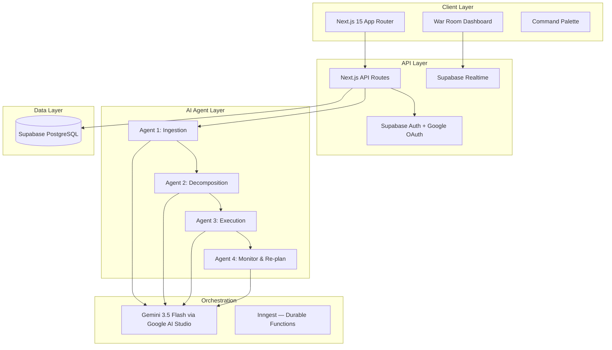

<div align="center">
  <h1>DELEGAT</h1>

  <p>
    <strong>The AI Execution Agent That Doesn't Just Remind You — It Does the Work.</strong>
  </p>

  <p>
    Most productivity tools tell you what you missed. Delegat makes sure you never miss it — by autonomously executing the grunt work for you.
  </p>

  <p>
    <a href="https://ai.google.dev/"></a>
    <a href="https://nextjs.org/"></a>
    <a href="https://supabase.com/"></a>
    <a href="https://vercel.com/"></a>
    <a href="LICENSE"></a>
    
  </p>
  
  <h4>Vibe2Ship 2026 · Coding Ninjas × Google for Developers · Track: The Last-Minute Life Saver</h4>

  <br />
</div>

## Table of Contents

- [The Vision](#the-vision)
- [The Problem vs. The Solution](#the-problem-vs-the-solution)
- [How It Works](#how-it-works)
- [Architecture Summary](#architecture-summary)
- [Technology Stack](#technology-stack)
- [Getting Started](#getting-started)
- [Development Workflow](#development-workflow)
- [Documentation Index](#documentation-index)
- [Contribution Guide](#contribution-guide)
- [License](#license)

---

## The Vision

A world where no commitment falls through the cracks. Delegat evolves from a personal execution agent into an AI Chief of Staff that manages the full lifecycle of commitments across individuals, teams, and organizations — turning every promise into a completed deliverable.

---

## The Problem vs. The Solution

People don't miss deadlines because they forgot. They miss them because of three invisible failure modes:

| Failure Mode | What Happens | Why Existing Tools Fail |
|---|---|---|
| **Cognitive Overload** | "Submit report" is actually 12 hidden sub-tasks nobody accounts for | Todoist, Notion, Google Tasks don't decompose — they just list |
| **Passive Reminders** | Every tool pushes a notification and stops | Reminders inform, they don't execute. More reminders != less procrastination |
| **No Recovery** | When you fall behind, there's no system to re-plan | No tool tells you the minimum viable path to still make it |

> The bottleneck is not awareness — it is **activation energy** and **execution scaffolding**.

**Delegat** is a multi-agent AI system powered by **Gemini 3.5 Flash**. You describe your commitments in plain language. Delegat doesn't show you a list — it starts executing.

---

## How It Works

When you add a commitment, Delegat springs into action behind the scenes:

```text
Input: "Reply to client about project scope by tomorrow"

Delegat autonomously:
├── Opens Gmail API -> reads original email
├── Drafts contextual reply in your writing style
├── Creates Google Doc skeleton if deliverable needed
│   ├── Section headers
│   ├── Word count targets
│   └── Starter prompts per section
├── Books focus time in Google Calendar
│   ├── Around existing meetings
│   └── With 40% buffer built in
└── Generates Google Slides outline if presentation involved
```

**The human only does the thinking work. Delegat handles everything else.**

---

## Architecture Summary

Delegat utilizes a sophisticated multi-agent architecture with a clean separation of concerns.



### The 4 Autonomous Agents

1. **Ingestion Agent**: Accepts natural language, pasted emails, or screenshots. Uses Gemini multimodal to extract commitments, deadlines, and dependencies.
2. **Decomposition Agent**: Breaks commitments into 15-30 min executable sub-tasks with calibrated time estimates.
3. **Execution Agent**: Auto-executes scaffolding (drafts Gmail replies, creates Google Docs skeletons, blocks Calendar focus time).
4. **Monitor & Re-plan Agent**: Detects deadline drift in real-time. Re-plans remaining tasks. Sends micro-commitment interventions.

---

## Technology Stack

<div align="center">

| Layer | Technology | Purpose |
|---|---|---|
| **AI Core** | Gemini 3.5 Flash | All agent reasoning, function calling, multimodal input |
| **Frontend** | Next.js 15.x | App Router, Server Components, streaming |
| **Styling** | Tailwind CSS 4.x & Radix UI | Utility-first responsive styling & Accessible primitives |
| **State** | Zustand & TanStack Query | War Room real-time state & API caching |
| **Database** | Supabase (PostgreSQL) | Primary data store with RLS & Realtime subscriptions |
| **Workers** | Inngest | Durable event-driven functions, retries |
| **Testing** | Vitest + Playwright | Unit + E2E testing |

</div>

---

## Getting Started

### Prerequisites
- **Node.js** 20.x LTS
- **pnpm** 9.x
- **Supabase CLI** 1.x
- **Google Cloud Console Project** (for OAuth & APIs)
- **Google AI Studio API Key**

### Installation

1. **Clone the Repository**
   ```bash
   git clone https://github.com/your-org/delegat.git
   cd delegat
   ```

2. **Install Dependencies**
   ```bash
   pnpm install
   ```

3. **Set Up Environment Variables**
   ```bash
   cp .env.example .env.local
   ```
   *Edit `.env.local` with your local Supabase, Google, and Gemini credentials.*

4. **Start Supabase Locally**
   ```bash
   supabase start
   supabase db push
   ```

5. **Start the Development Server**
   ```bash
   pnpm dev
   ```
   Your app will be live at `http://localhost:3000`.

6. **Start Inngest Dev Server (for background jobs)**
   ```bash
   npx inngest-cli@latest dev
   ```

---

## Development Workflow

- **Branch Strategy:** `main` (Production) <- `staging` (Preview) <- `feat/*` (Features).
- **Commit Convention:** We follow [Conventional Commits](https://www.conventionalcommits.org/).
- **Code Quality Commands:**
  ```bash
  pnpm lint          # Run ESLint + Prettier
  pnpm typecheck     # Verify TypeScript types
  pnpm test          # Run Vitest unit tests
  pnpm test:e2e      # Run Playwright end-to-end tests
  ```

---

## Documentation Index

Our documentation is structured for extreme clarity. Start here:

- [00_PROJECT_OVERVIEW.md](docs/00_PROJECT_OVERVIEW.md) - Business goals, market, philosophy
- [01_PRODUCT_REQUIREMENTS.md](docs/01_PRODUCT_REQUIREMENTS.md) - Core requirements and KPIs
- [08_FRONTEND_ARCHITECTURE.md](docs/08_FRONTEND_ARCHITECTURE.md) - Next.js 15 routing, state, performance
- [09_BACKEND_ARCHITECTURE.md](docs/09_BACKEND_ARCHITECTURE.md) - API routes, Edge Functions, Workers
- [10_AI_AGENT_ARCHITECTURE.md](docs/10_AI_AGENT_ARCHITECTURE.md) - Complete breakdown of the 4 autonomous agents
- [11_DATABASE_SCHEMA.md](docs/11_DATABASE_SCHEMA.md) - Full PostgreSQL schema with RLS

*(See the full `docs/` folder for 20+ detailed architectural references).*

---

## Contribution Guide

We welcome contributions from the community!

1. Fork the repository
2. Create your feature branch (`git checkout -b feat/amazing-feature`)
3. Commit your changes (`git commit -m 'feat(scope): add amazing feature'`)
4. Push to the branch (`git push origin feat/amazing-feature`)
5. Open a Pull Request targeting the `staging` branch

*Please ensure all tests pass and your code adheres to our styling guidelines before submitting.*

---

## License

This project is licensed under the MIT License — see the [LICENSE](LICENSE) file for details.

<br />
<p align="center">
  <strong>Built for Vibe2Ship 2026</strong><br/>
  Coding Ninjas x Google for Developers<br/>
  Track: The Last-Minute Life Saver
</p>
