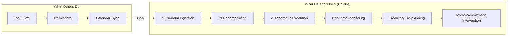
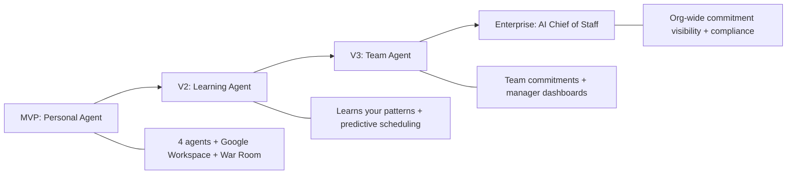

<
- [Business Goals](#business-goals)
- [Market Opportunity](#market-opportunity)
- [Target Audience](#target-audience)
- [Core Philosophy](#core-philosophy)
- [Competitive Advantages](#competitive-advantages)
- [Competitive Landscape](#competitive-landscape)
- [Success Metrics](#success-metrics)
- [Future Vision](#future-vision)
- [Hackathon Context](#hackathon-context)

---

## Executive Summary

Delegat is a multi-agent AI system powered by **Gemini 3.5 Flash** that transforms how people manage commitments. Unlike every existing productivity tool — which merely lists tasks and sends reminders — Delegat autonomously executes the repetitive setup work that sits between "deciding to do something" and "actually starting the thinking work."

When a user inputs a commitment like "Research paper due Wednesday," Delegat doesn't add it to a list. It:

1. **Decomposes** it into 15–30 minute executable sub-tasks with calibrated time estimates
2. **Drafts** relevant emails using Gmail API in the user's writing style
3. **Creates** Google Docs with section skeletons, word count targets, and starter prompts
4. **Books** focus time in Google Calendar around existing meetings with 40% buffer
5. **Generates** Google Slides outlines if presentations are involved
6. **Monitors** progress in real-time and automatically re-plans if the user falls behind
7. **Intervenes** with micro-commitment nudges to reduce activation energy

The result: humans focus on thinking. Delegat handles execution.

---

## Business Goals

### Primary Goals (MVP — Hackathon)

| # | Goal | Measurable Target | Timeline |
|---|---|---|---|
| BG-1 | Demonstrate autonomous execution across Google Workspace | ≥ 4 Google APIs integrated (Gmail, Calendar, Docs, Slides) | Hackathon demo |
| BG-2 | Show real-time drift detection and recovery | Recovery mode triggers when health < 70% | Hackathon demo |
| BG-3 | Prove the 4-agent architecture works end-to-end | Commitment → decomposition → execution → monitoring in one flow | Hackathon demo |
| BG-4 | Deliver a visually compelling War Room dashboard | Judges see live progress, risk radar, and NEXUS feed | Hackathon demo |

### Secondary Goals (Post-Hackathon)

| # | Goal | Measurable Target | Timeline |
|---|---|---|---|
| BG-5 | Acquire 1,000 beta users | 1,000 signups with Google OAuth | Month 1–3 |
| BG-6 | Demonstrate measurable productivity gains | Users self-report ≥ 2 hours saved per day | Month 3–6 |
| BG-7 | Achieve product-market fit | ≥ 40% of users say they'd be "very disappointed" without Delegat (Sean Ellis test) | Month 6 |
| BG-8 | Generate revenue | Launch Pro tier at $15/month | Month 6 |
| BG-9 | Expand to teams | Team dashboards, shared commitments, manager visibility | Month 9–12 |

---

## Market Opportunity

### Total Addressable Market (TAM)

The global productivity software market was valued at **$68.8 billion in 2025** and is projected to reach **$122.7 billion by 2030** (CAGR: 12.2%).

### Serviceable Addressable Market (SAM)

AI-powered productivity tools — the subset Delegat competes in — represent approximately **$12 billion** of the TAM, growing at 28% CAGR driven by the Gemini/GPT era of AI agents.

### Serviceable Obtainable Market (SOM)

Delegat targets **Google Workspace users who actively manage deadlines** — estimated at 50 million users globally. At 0.1% penetration with $15/month ARPU:

```
SOM = 50,000 users × $15/month × 12 months = $9M ARR
```

### Market Trends Supporting Delegat

| Trend | Impact on Delegat |
|---|---|
| **AI Agents era** (Google I/O 2026) | Gemini 3.5 Flash is purpose-built for agentic workflows. Delegat aligns with Google's strategic direction. |
| **Google Workspace dominance** | 3+ billion users. Delegat executes inside the tools people already use. |
| **Remote/hybrid work** | More self-directed work = more need for autonomous execution support. |
| **Task management fatigue** | Users are overwhelmed by tools (Todoist, Notion, Asana, Monday). They want fewer lists, more execution. |
| **Micro-SaaS for individuals** | Growing demand for AI tools that serve individual productivity, not just enterprise. |

### Why Now

1. **Gemini 3.5 Flash** makes function calling reliable enough for production-grade agent orchestration
2. **Google Workspace APIs** are mature, well-documented, and free for individual users
3. **No incumbent** has built autonomous execution across the full Google Workspace stack
4. **Google I/O 2026** announced Gemini Spark (personal agent) but it's not yet public — Delegat can establish first-mover advantage in the execution agent category

---

## Target Audience

### Primary Segments

| Segment | Population | Core Pain | Why Delegat |
|---|---|---|---|
| **University Students** | 200M+ globally | Juggling assignments, exams, part-time jobs with no system | Delegat decomposes "write essay" into timed sub-tasks and creates the doc skeleton |
| **Startup Founders** | 5M+ globally | Context-switching between 50 commitments with no execution support | Delegat handles the scaffolding — email drafts, doc skeletons, calendar blocking |
| **Researchers** | 10M+ globally | Long-horizon projects with poor progress visibility | Delegat tracks velocity, detects drift, and re-plans automatically |
| **Software Engineers** | 30M+ globally | Meetings, code reviews, docs, and side projects competing for limited focus time | Delegat books focus time and creates starter docs |
| **Managers** | 50M+ globally | Tracking team commitments while managing their own | Delegat provides a single view of all commitments with risk assessment |
| **Professionals** | 100M+ globally | Email overload, meeting prep, report deadlines | Delegat drafts replies, preps documents, and protects focus time |
| **Freelancers** | 70M+ globally | Self-managing all aspects of work with no backup system | Delegat is the operations layer freelancers can't afford to hire |

### User Archetype

The ideal Delegat user:
- Uses **Google Workspace** (Gmail, Calendar, Docs) daily
- Manages **5–20 active commitments** at any given time
- Has experienced **deadline failures** not from laziness but from poor execution scaffolding
- Is **willing to delegate grunt work** to an AI agent
- Values **autonomy with guardrails** — wants the AI to act but wants to review before sending

---

## Core Philosophy

### The Five Principles of Delegat

#### 1. Execution Over Notification

> Every other tool tells you what you missed. Delegat makes sure you never miss it.

Delegat does not add items to a list. It does not send reminders. It starts executing the moment a commitment is created. The output is not a notification — it is a drafted email, a created document, a booked calendar slot.

#### 2. Decomposition Is the Unlock

> "Submit report" is not a task. It's 12 hidden sub-tasks nobody accounts for.

The reason people procrastinate is not laziness — it's that the activation energy to start a complex commitment is too high. Delegat's Decomposition Agent (Agent 2) breaks every commitment into 15–30 minute executable chunks, each with calibrated time estimates. The time calibration factors are:

| Task Type | Multiplier | Rationale |
|---|---|---|
| Writing | 1.5× perceived | People underestimate writing time by ~50% |
| Coding | 2.0× perceived | Debugging and testing consistently double perceived time |
| Research | 1.8× perceived | Source evaluation and synthesis are slow |
| Administrative | 1.0× perceived | Emails, scheduling are predictable |
| Creative | 2.0× perceived | Iteration loops are underestimated |

#### 3. Recovery Is Not Optional

> When you fall behind, there must be a system that re-plans your remaining time and tells you the minimum viable path.

No productivity tool addresses the "falling behind" scenario. Delegat's Monitor Agent (Agent 4) continuously tracks velocity against commitments. When the Deadline Health Score drops below 70%, Recovery Mode activates:

- Remaining tasks are re-prioritized by deadline urgency
- Non-essential sub-tasks are deferred or eliminated
- New micro-commitments are generated: "Can you just do the intro paragraph in 15 minutes?"
- Calendar is re-blocked with the revised plan

#### 4. The Human Does the Thinking

> Delegat handles everything that isn't core intellectual work.

There is a clear boundary: **thinking work is human-only; scaffolding work is delegated**. Delegat never writes the essay — it creates the skeleton. Delegat never makes the decision — it provides the structured context for the human to decide. This boundary is enforced in the Decomposition Agent's classification system.

#### 5. Dramatic Visibility

> The War Room dashboard is designed to be dramatic and immediately legible.

Delegat's UI is not a calm, minimal task list. It is a War Room — a real-time command center that makes commitment status impossible to ignore. The Deadline Health Score, Risk Radar, and NEXUS Activity Feed create a visceral sense of progress or urgency that drives action.

---

## Competitive Advantages

### Moat Analysis



| Advantage | Description | Defensibility |
|---|---|---|
| **Autonomous execution across Google Workspace** | No competitor auto-executes across Gmail + Calendar + Docs + Slides | High — requires deep multi-API integration + AI orchestration |
| **4-agent architecture** | Specialized agents for ingestion, decomposition, execution, monitoring | Medium — architecture can be copied, but prompt engineering + tool definitions are non-trivial |
| **Recovery mode with micro-commitments** | Behavioral intervention system based on cognitive science | High — requires velocity tracking + dynamic re-planning + psychology-informed nudges |
| **Multimodal ingestion** | Commitments from text, email, screenshots, whiteboard photos | Medium — Gemini Vision makes this possible but integration work is significant |
| **Time calibration** | Domain-specific multipliers (writing 1.5×, coding 2×) | Low individually, but the calibration model improves with usage data |
| **War Room UX** | Dramatic, high-information-density dashboard unlike any task manager | Medium — design can be copied but the real-time data pipeline behind it is complex |

---

## Competitive Landscape

### Detailed Comparison

| Feature | Todoist | Notion AI | Motion | Reclaim.ai | Google Gemini Spark | **Delegat** |
|---|---|---|---|---|---|---|
| Task Management | ✅ | ✅ | ✅ | ❌ | ❌ | ✅ |
| AI Decomposition | ❌ | Partial | ❌ | ❌ | Unknown | ✅ Full |
| Gmail Integration | ❌ | ❌ | ❌ | ❌ | Unknown | ✅ Read + Draft |
| Calendar Auto-block | ❌ | ❌ | ✅ | ✅ | Unknown | ✅ With buffer |
| Google Docs Creation | ❌ | ❌ | ❌ | ❌ | Unknown | ✅ Skeletons |
| Google Slides Creation | ❌ | ❌ | ❌ | ❌ | Unknown | ✅ Outlines |
| Real-time Monitoring | ❌ | ❌ | Partial | Partial | Unknown | ✅ War Room |
| Drift Detection | ❌ | ❌ | ❌ | ❌ | Unknown | ✅ Health Score |
| Recovery Re-planning | ❌ | ❌ | ❌ | ❌ | Unknown | ✅ Auto |
| Micro-commitments | ❌ | ❌ | ❌ | ❌ | Unknown | ✅ Behavioral |
| Multimodal Input | ❌ | ❌ | ❌ | ❌ | ✅ | ✅ Gemini Vision |
| Open/Available | ✅ | ✅ | ✅ | ✅ | ❌ Not yet public | ✅ |

### Strategic Positioning

Delegat occupies a **new category**: the **AI Execution Agent**. It does not compete with task managers (Todoist, Notion) on list management. It does not compete with calendar optimizers (Motion, Reclaim) on scheduling. It competes on a dimension no one else operates in: **autonomous execution of commitment scaffolding across the full Google Workspace stack**.

---

## Success Metrics

### Hackathon Success Metrics

| Metric | Target | Measurement |
|---|---|---|
| Live demo completes without errors | 100% | Demo day |
| All 4 agents execute in sequence | Yes | Demo day |
| Google Workspace APIs respond in demo | ≤ 2s per action | Demo day |
| War Room renders with live data | Yes | Demo day |
| Recovery mode triggers visually | Yes | Demo day |
| Judge engagement | Positive questions | Demo day |

### Post-Launch Success Metrics

| Metric | Target | Timeframe | Measurement Method |
|---|---|---|---|
| **Signup rate** | 1,000 users | Month 1–3 | Supabase Auth count |
| **Activation rate** | ≥ 60% create first commitment | Month 1–3 | PostHog funnel |
| **Execution rate** | ≥ 3 autonomous actions per commitment | Month 1–3 | Database query |
| **Retention (D7)** | ≥ 30% | Month 3 | PostHog cohort |
| **Retention (D30)** | ≥ 15% | Month 6 | PostHog cohort |
| **Time saved** | ≥ 2 hours/day self-reported | Month 3 | In-app survey |
| **Health Score accuracy** | ≥ 80% correlation with actual completion | Month 6 | Model evaluation |
| **Recovery success rate** | ≥ 50% of at-risk commitments completed | Month 6 | Database query |
| **NPS** | ≥ 50 | Month 6 | In-app survey |
| **PMF (Sean Ellis)** | ≥ 40% "very disappointed" | Month 6 | In-app survey |

---

## Future Vision

### Evolution Roadmap



### Phase Details

| Phase | Name | Key Capabilities | Timeline |
|---|---|---|---|
| **MVP** | Personal Execution Agent | 4 agents, Google Workspace integration, War Room, Recovery Mode | Hackathon → Month 3 |
| **V2** | Learning Agent | Learns user patterns, predictive time estimates, personal tone model, Slack integration | Month 3–6 |
| **V3** | Team Agent | Shared commitments, team War Room, manager risk radar, delegation between team members | Month 6–12 |
| **V4** | Enterprise | Org-wide compliance, audit trails, SSO, custom integrations (Jira, Linear, Asana), SLA tracking | Year 2 |
| **V5** | AI Chief of Staff | Cross-organizational commitment visibility, executive dashboards, strategic resource allocation, meeting preparation | Year 2–3 |

### Potential Integrations (Post-MVP)

| Integration | Use Case | Priority |
|---|---|---|
| Slack | Team notifications, quick commitment input via slash commands | High |
| Linear / Jira | Engineering task sync, sprint tracking | High |
| Notion | Knowledge base sync, meeting notes | Medium |
| Zoom / Google Meet | Pre-meeting preparation, post-meeting action items | Medium |
| Figma | Design deliverable tracking | Low |
| GitHub | Code review deadlines, PR tracking | Medium |
| WhatsApp / Telegram | Mobile commitment input via chat | Low |

---

## Hackathon Context

### Vibe2Ship 2026

| Field | Value |
|---|---|
| **Hackathon** | Vibe2Ship 2026 |
| **Organizers** | Coding Ninjas × Google for Developers |
| **Track** | The Last-Minute Life Saver |
| **AI Platform** | Google AI Studio (required) |
| **AI Model** | Gemini 3.5 Flash |

### Evaluation Alignment

The hackathon challenge asks for a solution that demonstrates how AI can improve productivity by helping users make better decisions and complete tasks more effectively. Delegat addresses this at every layer:

| Evaluation Criterion | How Delegat Addresses It |
|---|---|
| **Better decisions** | Gemini's decomposition and time-calibration gives users a realistic picture of what is achievable, not an optimistic fantasy |
| **Complete tasks more effectively** | Delegat removes the friction of starting by doing the scaffolding automatically — the hardest part of any task is the first step |
| **AI as genuine co-worker** | Not a chat interface or notification system — an autonomous agent that takes real actions in tools you already use |
| **Novel use of Google AI** | Gemini 3.5 Flash powers all 4 agents with function calling, Gemini Vision processes multimodal inputs, managed agents architecture aligns with Google I/O 2026 direction |

### Demo Flow

The live demo tells a story rather than showing features:

```
1. User inputs: "Research paper due Wednesday, client email reply needed urgently,
   slides for Tuesday 3pm meeting"

2. Delegat decomposes live → 18 sub-tasks with time budgets appear on screen

3. Calendar shows 6 focus blocks auto-booked around existing meetings

4. Gmail shows client email drafted and ready to review — context-aware, not template

5. Google Doc appears — research paper skeleton with sections, word counts, starters

6. Simulate falling behind → Risk Radar turns amber → Delegat re-plans instantly

7. Micro-commitment fires: "You're 40 mins behind. Can you do just the intro
   paragraph right now?"
```

---

*Next: [01 — Product Requirements](01_PRODUCT_REQUIREMENTS.md)*
]]>
