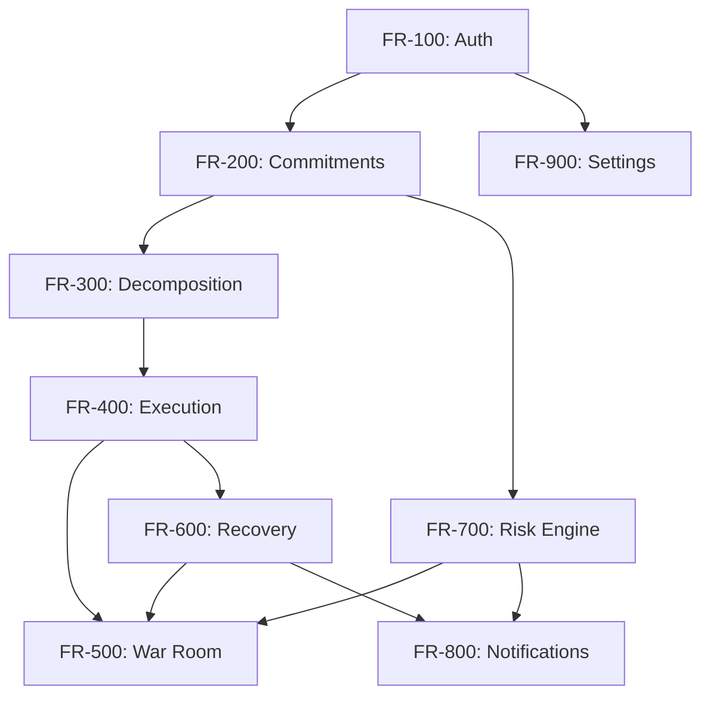

<
- [Objectives](#objectives)
- [Functional Requirements](#functional-requirements)
- [Non-Functional Requirements](#non-functional-requirements)
- [Constraints](#constraints)
- [Assumptions](#assumptions)
- [KPIs](#kpis)
- [Acceptance Criteria](#acceptance-criteria)
- [Release Goals](#release-goals)
- [Out of Scope (MVP)](#out-of-scope-mvp)
- [Dependencies](#dependencies)
- [Risks and Mitigations](#risks-and-mitigations)

---

## Problem Statement

### The Core Problem

People do not miss deadlines because they forgot. They miss them because of three invisible failure modes that no existing productivity tool addresses:

1. **Cognitive Overload**: A commitment like "Submit report" is actually 12 hidden sub-tasks — research, outline, draft, review, format, submit. Existing tools (Todoist, Notion, Google Tasks) don't decompose; they just list. The user is left to figure out the execution plan alone.

2. **Passive Reminders**: Every productivity tool operates on the same model: store a task, set a deadline, push a reminder. But more reminders do not reduce procrastination. The bottleneck is not awareness — it is **activation energy**. Users know what they need to do; they need help *starting*.

3. **No Recovery Mechanism**: When a user falls behind (which happens constantly), there is no system that re-plans the remaining time and identifies the minimum viable path to still meet the deadline. Users either panic and context-switch ineffectively, or give up entirely.

### The Root Cause

The fundamental flaw in every existing productivity tool is that they treat the user as the execution engine. They provide information (lists, reminders, calendars) but leave 100% of the execution work — drafting emails, creating documents, scheduling time, breaking down work — to the human.

Delegat inverts this model. The AI becomes the execution engine. The human becomes the thinking engine.

### Who Feels This Pain

| Segment | Frequency | Severity | Current Workaround |
|---|---|---|---|
| University Students | Daily | High — grades, degree | Manual todo lists, cramming |
| Startup Founders | Hourly | Critical — company survival | Multiple apps, context-switching |
| Researchers | Weekly | High — publications, grants | Spreadsheets, manual planning |
| Software Engineers | Daily | Medium — sprints, reviews | Jira, but no execution help |
| Managers | Daily | High — team deliverables | Delegation via meetings/emails |
| Professionals | Daily | Medium — reports, emails | Outlook rules, manual prep |
| Freelancers | Daily | Critical — income depends on delivery | Self-management, no safety net |

---

## Objectives

### Primary Objectives (MVP)

| ID | Objective | Success Criteria |
|---|---|---|
| OBJ-1 | Enable users to input commitments in natural language | Users can type, paste email, or upload screenshots and Delegat extracts structured commitments |
| OBJ-2 | Autonomously decompose commitments into executable sub-tasks | Every commitment is broken into 15–30 minute tasks with calibrated time estimates |
| OBJ-3 | Auto-execute scaffolding across Google Workspace | Delegat drafts Gmail replies, creates Docs, books Calendar slots, generates Slides outlines |
| OBJ-4 | Monitor progress and detect drift in real-time | War Room dashboard shows live health score, timeline gaps, and risk assessment |
| OBJ-5 | Automatically re-plan when user falls behind | Recovery mode activates at <70% health, generates micro-commitments |
| OBJ-6 | Provide a dramatic, high-information War Room dashboard | Real-time progress visualization with Deadline Health Score, Risk Radar, NEXUS feed |

### Secondary Objectives (Post-MVP)

| ID | Objective | Success Criteria |
|---|---|---|
| OBJ-7 | Learn user patterns over time | Time estimates improve with historical data; writing style model personalizes drafts |
| OBJ-8 | Support team commitments | Multiple users can share commitments, see team risk radar |
| OBJ-9 | Integrate with additional platforms | Slack, Linear, Jira, Notion |
| OBJ-10 | Monetize via subscription | Pro tier with advanced features at $15/month |

---

## Functional Requirements

### FR-100: Authentication & Authorization

| ID | Requirement | Priority | Details |
|---|---|---|---|
| FR-101 | Google OAuth 2.0 login | P0 | Single sign-on via Google. No email/password auth. Google is the only provider because Delegat requires Google Workspace API tokens. |
| FR-102 | OAuth scope consent | P0 | Request Gmail, Calendar, Docs, Slides, Drive scopes during onboarding. User can grant/revoke individual scopes. |
| FR-103 | Session management | P0 | JWT-based sessions via Supabase Auth. 7-day refresh token rotation. |
| FR-104 | Token storage | P0 | Google OAuth access + refresh tokens stored encrypted in Supabase. Auto-refresh before expiry. |
| FR-105 | Account deletion | P1 | User can delete account. All data (commitments, tasks, tokens, executions) are hard-deleted within 24 hours. |
| FR-106 | Multi-device session | P1 | User can be logged in on multiple devices simultaneously. |

### FR-200: Commitment Management

| ID | Requirement | Priority | Details |
|---|---|---|---|
| FR-201 | Create commitment via text | P0 | User types natural language. Gemini extracts: title, deadline, type, dependencies, stakeholders. |
| FR-202 | Create commitment via email paste | P0 | User pastes email text. Gemini extracts commitment context including sender, subject, required actions. |
| FR-203 | Create commitment via screenshot | P1 | User uploads image (screenshot, photo of whiteboard, assignment page). Gemini Vision extracts commitments. |
| FR-204 | Create commitment via command palette | P0 | `Cmd+K` opens command palette. User types commitment in the input field. |
| FR-205 | Edit commitment | P0 | User can edit title, deadline, priority, notes. Changes trigger re-decomposition. |
| FR-206 | Delete commitment | P0 | Soft delete with 7-day recovery. Associated tasks, executions are cascade soft-deleted. |
| FR-207 | View commitment details | P0 | Detail view shows: commitment info, sub-tasks, timeline, executions, health score, risk assessment. |
| FR-208 | List commitments | P0 | Dashboard shows all active commitments sorted by deadline. Filters: status, priority, deadline range. |
| FR-209 | Commitment status | P0 | Statuses: `draft`, `active`, `at_risk`, `recovery`, `completed`, `overdue`, `cancelled`. |
| FR-210 | Bulk commitment import | P2 | Import multiple commitments from a text block or document. |

### FR-300: AI Decomposition

| ID | Requirement | Priority | Details |
|---|---|---|---|
| FR-301 | Auto-decompose on creation | P0 | When a commitment is created, Agent 2 immediately breaks it into sub-tasks. |
| FR-302 | Sub-task generation | P0 | Each sub-task includes: title, description, estimated duration (15–30 min), type (human/auto), dependencies. |
| FR-303 | Time calibration | P0 | Apply domain-specific multipliers: writing 1.5×, coding 2.0×, research 1.8×, admin 1.0×, creative 2.0×. |
| FR-304 | Dependency graph | P0 | Sub-tasks have dependency relationships. Execution order is determined by the dependency DAG. |
| FR-305 | Human vs. auto classification | P0 | Each sub-task is classified as `human_only` (requires thinking) or `auto_executable` (scaffolding). |
| FR-306 | Re-decompose on edit | P1 | If user edits commitment scope or deadline, re-run decomposition with new parameters. |
| FR-307 | Manual sub-task add/edit | P1 | User can add custom sub-tasks or edit AI-generated ones. |
| FR-308 | Decomposition confidence | P1 | Each decomposition includes a confidence score (0–100). Low confidence triggers a user review prompt. |

### FR-400: Autonomous Execution

| ID | Requirement | Priority | Details |
|---|---|---|---|
| FR-401 | Draft Gmail reply | P0 | Agent 3 reads original email thread via Gmail API, drafts contextual reply in user's writing style. Draft is saved, not sent. User reviews before sending. |
| FR-402 | Create Google Doc | P0 | Agent 3 creates a new Google Doc with: title, section headers, word count targets per section, starter prompts. Shared with user via Drive. |
| FR-403 | Book Calendar focus time | P0 | Agent 3 reads existing calendar, identifies free slots, books focus blocks (minimum 30 min, maximum 2 hours) with 40% buffer between tasks. |
| FR-404 | Generate Slides outline | P1 | Agent 3 creates a Google Slides presentation with: title slide, section slides, content placeholders, speaker notes with talking points. |
| FR-405 | Execution queue | P0 | All executions are queued via Inngest with priority ordering. Executions run in dependency order. |
| FR-406 | Execution audit log | P0 | Every execution is logged: what was done, when, result, duration, tokens used. Displayed in NEXUS feed. |
| FR-407 | Execution approval flow | P0 | For sensitive actions (sending email, sharing docs), user must approve before execution completes. Default: auto-execute scaffolding, require approval for sends. |
| FR-408 | Execution retry | P0 | Failed executions retry up to 3 times with exponential backoff (1s, 5s, 25s). After 3 failures, mark as `failed` and notify user. |
| FR-409 | Undo execution | P1 | User can undo recent executions: delete created docs, remove calendar events, discard drafts. |

### FR-500: War Room Dashboard

| ID | Requirement | Priority | Details |
|---|---|---|---|
| FR-501 | Deadline Health Score | P0 | Real-time percentage (0–100%) indicating whether current velocity will meet all active commitments. Calculated from: tasks completed vs. total, time remaining vs. time required, historical velocity. |
| FR-502 | Today's War Room | P0 | Hour-by-hour timeline showing planned execution blocks vs. actual progress. Drift shown as visual gaps. |
| FR-503 | Risk Radar | P0 | All active commitments displayed in a priority matrix (urgency × importance). At-risk items (<70% health) are visually highlighted with cause and recovery suggestion. |
| FR-504 | NEXUS Activity Feed | P0 | Real-time feed of all autonomous actions: "✅ Drafted Gmail reply to John", "✅ Booked 3 focus blocks", "⚠️ Calendar conflict detected". |
| FR-505 | Command Palette | P0 | `Cmd+K` / `Ctrl+K` opens a command palette for quick commitment creation, navigation, and actions. |
| FR-506 | Dashboard refresh | P0 | Real-time updates via Supabase Realtime. No manual refresh needed. |
| FR-507 | Dashboard filters | P1 | Filter by: date range, commitment status, priority, tag. |

### FR-600: Recovery Engine

| ID | Requirement | Priority | Details |
|---|---|---|---|
| FR-601 | Velocity tracking | P0 | Track task completion rate over rolling 24-hour windows. Compare actual vs. planned velocity. |
| FR-602 | Drift detection | P0 | When actual velocity < planned velocity by > 30%, flag as "drifting". |
| FR-603 | Recovery mode activation | P0 | When Deadline Health Score drops below 70%, automatically activate recovery mode. |
| FR-604 | Re-plan generation | P0 | In recovery mode, Agent 4 generates a new plan: re-prioritize tasks, defer non-essential sub-tasks, compress timelines, generate micro-commitments. |
| FR-605 | Micro-commitment nudges | P0 | Push notifications with small, achievable tasks: "You're 40 mins behind. Can you do just the intro paragraph right now?" (15-min tasks). |
| FR-606 | Recovery success tracking | P1 | Track whether recovery interventions lead to completion. Use data to improve recovery algorithms. |

### FR-700: Risk Engine

| ID | Requirement | Priority | Details |
|---|---|---|---|
| FR-701 | Risk score calculation | P0 | Per-commitment risk score (0–100) based on: time remaining, tasks remaining, velocity, dependencies, complexity. |
| FR-702 | Priority matrix | P0 | Urgency (time-based) × Importance (user-defined) matrix. Four quadrants: do now, schedule, delegate, drop. |
| FR-703 | Visual risk indicators | P0 | Color coding: Green (≥70%), Amber (40–69%), Red (<40%). Animated transitions on state changes. |
| FR-704 | Risk notifications | P0 | Push notification when a commitment moves from Green → Amber or Amber → Red. |
| FR-705 | Risk cause analysis | P1 | Each at-risk commitment shows the specific cause: "3 tasks behind schedule", "dependency blocked", "no focus time available". |

### FR-800: Notifications

| ID | Requirement | Priority | Details |
|---|---|---|---|
| FR-801 | In-app notifications | P0 | Bell icon in header. Notification panel with read/unread state. |
| FR-802 | Push notifications | P1 | Browser push notifications for: risk changes, recovery nudges, execution completions. |
| FR-803 | Email notifications | P1 | Daily digest email via Resend: commitments due today, health score summary, at-risk items. |
| FR-804 | Micro-commitment notifications | P0 | Time-sensitive nudges with specific small tasks during recovery mode. |
| FR-805 | Notification preferences | P1 | User can configure: notification types, quiet hours, frequency. |

### FR-900: Settings & Profile

| ID | Requirement | Priority | Details |
|---|---|---|---|
| FR-901 | Profile management | P1 | View/edit name, avatar (from Google), timezone. |
| FR-902 | Google Workspace connection status | P0 | Show which Google APIs are connected. Allow disconnect/reconnect. |
| FR-903 | Notification settings | P1 | Toggle notification types. Set quiet hours. |
| FR-904 | Working hours | P1 | Define preferred working hours (e.g., 9am–6pm). Delegat only books calendar slots within these hours. |
| FR-905 | Buffer settings | P2 | Configure buffer percentage between tasks (default: 40%). |
| FR-906 | Theme selection | P2 | Toggle between dark mode and light mode. Default: dark. |
| FR-907 | Data export | P2 | Export all personal data as JSON. |

---

## Non-Functional Requirements

### NFR-100: Performance

| ID | Requirement | Target | Measurement |
|---|---|---|---|
| NFR-101 | Page load time (LCP) | < 2.5 seconds | Lighthouse CI |
| NFR-102 | Time to Interactive (TTI) | < 3.5 seconds | Lighthouse CI |
| NFR-103 | API response time (p50) | < 200ms | Sentry performance |
| NFR-104 | API response time (p99) | < 1 second | Sentry performance |
| NFR-105 | Gemini agent response time | < 5 seconds | Custom metrics |
| NFR-106 | War Room update latency | < 500ms | Supabase Realtime metrics |
| NFR-107 | Google API execution time | < 3 seconds per action | Custom metrics |
| NFR-108 | Bundle size (initial) | < 200KB gzipped | Build output |
| NFR-109 | Core Web Vitals — CLS | < 0.1 | Lighthouse CI |
| NFR-110 | Core Web Vitals — FID | < 100ms | Lighthouse CI |

### NFR-200: Reliability

| ID | Requirement | Target | Measurement |
|---|---|---|---|
| NFR-201 | Uptime | 99.5% | Vercel + Supabase SLA |
| NFR-202 | Error rate (5xx) | < 0.1% | Sentry |
| NFR-203 | Data durability | 99.99% | Supabase (managed Postgres) |
| NFR-204 | Agent execution success rate | > 95% | Custom metrics |
| NFR-205 | Zero data loss on failures | Guaranteed | Inngest durable functions |

### NFR-300: Security

| ID | Requirement | Details |
|---|---|---|
| NFR-301 | Encryption at rest | AES-256 via Supabase managed encryption |
| NFR-302 | Encryption in transit | TLS 1.3 on all connections |
| NFR-303 | OAuth token encryption | Google tokens encrypted before storage using application-level AES-256-GCM |
| NFR-304 | Row Level Security | Every table has RLS policies. Users can only access their own data. |
| NFR-305 | Rate limiting | 100 requests/minute per user for API. 20 requests/minute for agent operations. |
| NFR-306 | CSP headers | Strict Content Security Policy preventing XSS |
| NFR-307 | CSRF protection | SameSite cookies + CSRF tokens for mutations |
| NFR-308 | SQL injection prevention | Parameterized queries only. Supabase client enforces this. |
| NFR-309 | Audit logging | All data mutations logged with: user_id, action, timestamp, before/after state |
| NFR-310 | Input sanitization | All user inputs sanitized before storage and rendering |

### NFR-400: Scalability

| ID | Requirement | Target |
|---|---|---|
| NFR-401 | Concurrent users | 10,000 (MVP target) |
| NFR-402 | Commitments per user | Up to 100 active |
| NFR-403 | Tasks per commitment | Up to 50 |
| NFR-404 | Executions per day (system) | Up to 100,000 |
| NFR-405 | Database size | Up to 100GB |

### NFR-500: Accessibility

| ID | Requirement | Standard |
|---|---|---|
| NFR-501 | WCAG 2.1 Level AA compliance | All pages and components |
| NFR-502 | Keyboard navigation | Full keyboard support for all interactive elements |
| NFR-503 | Screen reader support | Proper ARIA labels, roles, and live regions |
| NFR-504 | Color contrast | Minimum 4.5:1 for normal text, 3:1 for large text |
| NFR-505 | Focus indicators | Visible focus rings on all interactive elements |
| NFR-506 | Reduced motion | Respect `prefers-reduced-motion` media query |

### NFR-600: Compatibility

| ID | Requirement | Details |
|---|---|---|
| NFR-601 | Browsers | Chrome 120+, Firefox 120+, Safari 17+, Edge 120+ |
| NFR-602 | Devices | Desktop (1280px+), Tablet (768px–1279px), Mobile (320px–767px) |
| NFR-603 | OS | Windows 10+, macOS 12+, iOS 16+, Android 13+ |

---

## Constraints

| ID | Constraint | Impact | Mitigation |
|---|---|---|---|
| C-1 | **Hackathon timeline** | Must be demo-ready within hackathon period | Focus on P0 requirements only for MVP. Defer P1/P2. |
| C-2 | **Google AI Studio required** | Must use Gemini via Google AI Studio, not other providers | Architecture is built around Gemini 3.5 Flash function calling. |
| C-3 | **Google OAuth only** | No email/password auth because Google Workspace tokens are required | Limits to Google users. This is acceptable — target audience uses Google Workspace. |
| C-4 | **Gemini rate limits** | Google AI Studio free tier has RPM limits | Implement request queuing, caching, and batch processing. |
| C-5 | **Google API quotas** | Gmail, Calendar, Docs APIs have daily quotas | Monitor usage, implement backoff, prioritize critical executions. |
| C-6 | **No sending without approval** | Emails must not be auto-sent; only drafted | Safety requirement. All send actions require explicit user confirmation. |
| C-7 | **Supabase free tier limits** | 500MB database, 2GB bandwidth, 50,000 monthly active users | Sufficient for MVP. Upgrade to Pro ($25/month) for production. |
| C-8 | **Vercel free tier limits** | 100GB bandwidth, 6,000 minutes build time | Sufficient for MVP. Upgrade to Pro ($20/month) for production. |

---

## Assumptions

| ID | Assumption | If Violated |
|---|---|---|
| A-1 | Users have a Google Workspace account (Gmail, Calendar, Docs) | Non-Google users cannot use Delegat. This is a deliberate product decision. |
| A-2 | Users will grant OAuth permissions for Gmail, Calendar, Docs | Users who decline will have a degraded experience. Show scope explanations. |
| A-3 | Gemini 3.5 Flash is available and reliable during demo | If Gemini is down, no agent functionality works. Have cached demo data as fallback. |
| A-4 | Users trust AI to draft emails and create documents | Some users may not trust AI. Provide approval flow for all actions and show AI reasoning. |
| A-5 | 15–30 minute task chunks are the right granularity | If too small: too many tasks. If too large: still overwhelming. Calibrate based on user feedback. |
| A-6 | Time calibration multipliers (1.5× writing, 2× coding) are reasonable starting points | These will be refined with real usage data. Allow user overrides. |
| A-7 | 70% is the right threshold for recovery mode | Too low: recovery activates too late. Too high: false alarms. Make configurable. |
| A-8 | Users want dramatic UI (War Room) not calm UI | Some users prefer minimal interfaces. Future: offer "Zen Mode" alternative. |

---

## KPIs

### Engagement KPIs

| KPI | Definition | Target | Measurement |
|---|---|---|---|
| **DAU/MAU** | Daily active users / Monthly active users | ≥ 30% | PostHog |
| **Commitments per user per week** | Average number of commitments created | ≥ 5 | Database query |
| **Executions per commitment** | Average number of auto-executions triggered | ≥ 3 | Database query |
| **War Room sessions per day** | Average number of War Room views per active user | ≥ 3 | PostHog |
| **Command palette usage** | % of users who use Cmd+K weekly | ≥ 40% | PostHog |

### Outcome KPIs

| KPI | Definition | Target | Measurement |
|---|---|---|---|
| **Completion rate** | % of commitments completed by deadline | ≥ 70% | Database query |
| **Recovery success rate** | % of at-risk commitments that recover to completion | ≥ 50% | Database query |
| **Time saved** | Self-reported hours saved per day | ≥ 2 hours | In-app survey |
| **Health score accuracy** | Correlation between health score and actual completion | ≥ 0.8 | Model evaluation |

### Business KPIs

| KPI | Definition | Target | Measurement |
|---|---|---|---|
| **Signup rate** | New users per week | ≥ 100/week | Supabase Auth |
| **Activation rate** | % of signups who create first commitment within 24 hours | ≥ 60% | PostHog funnel |
| **D7 retention** | % of users who return 7 days after signup | ≥ 30% | PostHog cohort |
| **D30 retention** | % of users who return 30 days after signup | ≥ 15% | PostHog cohort |
| **NPS** | Net Promoter Score | ≥ 50 | In-app survey |

---

## Acceptance Criteria

### AC-100: Authentication

```gherkin
Feature: Google OAuth Login

Scenario: Successful login
  Given a user with a Google account
  When they click "Sign in with Google"
  Then they are redirected to Google OAuth consent
  And upon granting permissions, they are redirected to the dashboard
  And their Google OAuth tokens are stored encrypted in Supabase
  And a session is created with 7-day expiry

Scenario: Login with insufficient scopes
  Given a user who denies Gmail scope during OAuth
  When they complete the OAuth flow
  Then they are redirected to the dashboard
  And a banner shows "Gmail not connected — some features unavailable"
  And Gmail-dependent features (email drafting) are disabled
  And they can re-authorize from Settings

Scenario: Token refresh
  Given a user with an expired Google access token
  When an agent attempts a Google API call
  Then the system uses the refresh token to obtain a new access token
  And the new token is stored encrypted
  And the API call proceeds without user intervention

Scenario: Token refresh failure
  Given a user whose refresh token has been revoked
  When an agent attempts a Google API call
  Then the system detects the auth failure
  And marks the Google connection as "disconnected"
  And notifies the user to re-authenticate
  And queues pending executions for retry after re-auth
```

### AC-200: Commitment Creation

```gherkin
Feature: Create Commitment

Scenario: Create from natural language
  Given a logged-in user on the dashboard
  When they type "Research paper on quantum computing due next Wednesday"
  And press Enter or click Create
  Then Gemini extracts: title="Research paper on quantum computing", deadline=next Wednesday 11:59pm
  And a commitment is created with status "active"
  And Agent 2 (Decomposition) is triggered automatically
  And sub-tasks appear within 5 seconds

Scenario: Create from pasted email
  Given a logged-in user
  When they paste email text: "Hi, please send the Q3 report by Friday. — Jane"
  Then Gemini extracts: title="Q3 Report", deadline=Friday 11:59pm, stakeholder=Jane, source=email
  And a commitment is created
  And Agent 3 is triggered to draft a Gmail reply to Jane

Scenario: Create from screenshot
  Given a logged-in user
  When they upload a screenshot of a Slack message with a deadline
  Then Gemini Vision processes the image
  And extracts commitment details from the visual content
  And creates a commitment with extracted deadline

Scenario: Ambiguous input
  Given a logged-in user
  When they type "finish the thing"
  Then Gemini assigns: title="finish the thing", deadline=null, type=unknown
  And the commitment is created in "draft" status
  And user is prompted: "When is this due?" and "What does 'the thing' involve?"
```

### AC-300: Autonomous Execution

```gherkin
Feature: Gmail Draft

Scenario: Draft reply to existing email
  Given a commitment created from an email context
  And the user has Gmail API permission
  When Agent 3 processes the commitment
  Then it reads the original email thread via Gmail API
  And uses Gemini to draft a contextual reply in the user's tone
  And saves the draft in Gmail (not sent)
  And logs the action in NEXUS: "✅ Drafted reply to [sender]"
  And the draft is reviewable from the commitment detail page

Feature: Google Doc Creation

Scenario: Create document skeleton
  Given a commitment that requires a written deliverable
  When Agent 3 determines a Google Doc is needed
  Then it creates a new Google Doc via Docs API
  And populates it with: title, section headers, word count targets, starter prompts
  And shares the doc with the user's Google account
  And logs the action in NEXUS: "✅ Created [doc title]"
  And links the doc in the commitment detail page

Feature: Calendar Booking

Scenario: Book focus time
  Given a commitment with decomposed tasks
  And the user has Calendar API permission
  When Agent 3 processes calendar-eligible tasks
  Then it reads the user's existing calendar for the next 7 days
  And identifies free slots during working hours
  And books focus blocks (30 min–2 hours) with 40% buffer
  And creates calendar events with task descriptions
  And logs the action in NEXUS: "✅ Booked [N] focus blocks"

Scenario: Calendar conflict
  Given no available free slots in the user's calendar
  When Agent 3 attempts to book focus time
  Then it notifies the user: "No free slots available for [task]"
  And suggests: "Would you like to extend your working hours or reschedule existing meetings?"
  And marks the task as "unscheduled"
```

### AC-400: Recovery Mode

```gherkin
Feature: Recovery Mode

Scenario: Health score drops below threshold
  Given a user with active commitments
  And the Deadline Health Score is at 68%
  When the Monitor Agent (Agent 4) evaluates velocity
  Then recovery mode is activated
  And the commitment status changes to "recovery"
  And remaining tasks are re-prioritized by deadline urgency
  And non-essential sub-tasks are deferred
  And new micro-commitments are generated
  And a push notification is sent: "Recovery mode activated for [commitment]"

Scenario: Micro-commitment nudge
  Given a user in recovery mode
  And they are 40 minutes behind schedule
  When the Monitor Agent generates an intervention
  Then a notification is sent: "You're 40 mins behind. Can you do just the intro paragraph right now?"
  And the suggested task is ≤ 15 minutes
  And completing the micro-task updates the health score immediately
```

---

## Release Goals

### MVP Release (Hackathon Demo)

| Feature | Status | Priority |
|---|---|---|
| Google OAuth login | Required | P0 |
| Natural language commitment input | Required | P0 |
| AI decomposition (Agent 2) | Required | P0 |
| Gmail draft execution (Agent 3) | Required | P0 |
| Google Doc creation (Agent 3) | Required | P0 |
| Calendar booking (Agent 3) | Required | P0 |
| War Room dashboard | Required | P0 |
| Deadline Health Score | Required | P0 |
| Risk Radar | Required | P0 |
| NEXUS Activity Feed | Required | P0 |
| Recovery mode | Required | P0 |
| Micro-commitment nudges | Required | P0 |
| Command Palette | Required | P0 |

### V1.1 Release (Post-Hackathon Polish)

| Feature | Priority |
|---|---|
| Screenshot/image input (Gemini Vision) | P1 |
| Google Slides generation | P1 |
| Notification preferences | P1 |
| Working hours configuration | P1 |
| Execution undo | P1 |
| Dashboard filters | P1 |

### V2.0 Release (Growth)

| Feature | Priority |
|---|---|
| Learning from user patterns | P1 |
| Improved time calibration | P1 |
| Slack integration | P1 |
| Mobile-responsive optimization | P1 |
| Pro subscription tier | P1 |

---

## Out of Scope (MVP)

The following are explicitly **not** in the MVP:

| Feature | Reason for Exclusion |
|---|---|
| Email/password authentication | Google OAuth required for Workspace integration |
| Team/shared commitments | MVP is personal-only |
| Slack, Linear, Jira integrations | MVP focuses on Google Workspace only |
| Mobile native app | Web app only; responsive design serves mobile needs |
| Offline mode | Requires local data sync infrastructure |
| Custom AI model fine-tuning | Use Gemini 3.5 Flash out-of-the-box with prompt engineering |
| Multi-language support | English only for MVP |
| White-labeling | No enterprise customization for MVP |
| Payment/billing | No monetization in MVP |

---

## Dependencies

### External Dependencies

| Dependency | Owner | Risk Level | Mitigation |
|---|---|---|---|
| Gemini 3.5 Flash availability | Google | Medium | Cache demo data; implement retry with backoff |
| Google Workspace APIs | Google | Low | Well-established, high-SLA APIs |
| Supabase availability | Supabase | Low | Managed service with 99.9% SLA |
| Vercel availability | Vercel | Low | Managed service with 99.99% SLA |
| Inngest availability | Inngest | Medium | Functions are durable; will resume on recovery |

### Internal Dependencies



---

## Risks and Mitigations

| Risk | Probability | Impact | Mitigation |
|---|---|---|---|
| **Gemini API rate limiting** | High | Medium — agent responses delayed | Request queuing, response caching, batch processing |
| **Google OAuth token expiry during demo** | Medium | High — demo failure | Pre-refresh tokens before demo; keep refresh token flow robust |
| **AI generates inappropriate email draft** | Low | High — user trust damage | Always save as draft (never send); show preview; add safety prompts |
| **Calendar overbooking** | Medium | Medium — user frustration | Read calendar thoroughly before booking; respect working hours; add buffers |
| **Decomposition quality varies** | Medium | Medium — poor sub-tasks | Few-shot examples in prompts; confidence scoring; user edit capability |
| **Recovery mode false positives** | Medium | Low — unnecessary alerts | Adjustable threshold (default 70%); require sustained velocity drop (not one-time) |
| **Supabase Realtime latency** | Low | Medium — stale War Room | Polling fallback every 10 seconds if WebSocket disconnects |
| **User distrust of autonomous actions** | Medium | High — low adoption | Default to "review before execute"; show reasoning; allow undo |
| **GDPR/privacy concerns with email reading** | Medium | High — legal risk | Only read emails user explicitly references; never store email content permanently; show clear data policy |

---

*Previous: [00 — Project Overview](00_PROJECT_OVERVIEW.md) · Next: [02 — User Personas](02_USER_PERSONAS.md)*
]]>
