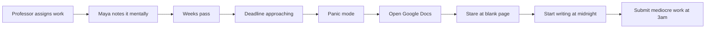
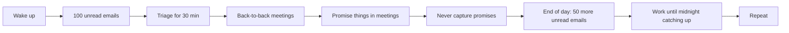

<
- [Persona 1: Maya — The Overwhelmed Student](#persona-1-maya--the-overwhelmed-student)
- [Persona 2: Arjun — The Multi-Tasking Founder](#persona-2-arjun--the-multi-tasking-founder)
- [Persona 3: Dr. Sarah — The Research Scientist](#persona-3-dr-sarah--the-research-scientist)
- [Persona 4: Dev — The Senior Software Engineer](#persona-4-dev--the-senior-software-engineer)
- [Persona 5: Linda — The Operations Manager](#persona-5-linda--the-operations-manager)
- [Persona 6: James — The Corporate Professional](#persona-6-james--the-corporate-professional)
- [Persona 7: Priya — The Independent Freelancer](#persona-7-priya--the-independent-freelancer)
- [Persona Comparison Matrix](#persona-comparison-matrix)

---

## Persona Framework

Each persona includes:

| Attribute | Description |
|---|---|
| **Demographics** | Age, role, location, tech proficiency |
| **Goals** | What they want to achieve with Delegat |
| **Pain Points** | Specific problems they face today |
| **Current Workflow** | How they manage commitments now |
| **Behavior Patterns** | How they work, when they struggle |
| **Needs from Delegat** | Specific features/capabilities they require |
| **Success Scenario** | What a great day with Delegat looks like |
| **Failure Scenario** | What happens if Delegat doesn't work |
| **Adoption Triggers** | What would make them try Delegat |
| **Adoption Barriers** | What would make them hesitate |

---

## Persona 1: Maya — The Overwhelmed Student

### Demographics

| Attribute | Value |
|---|---|
| **Age** | 21 |
| **Role** | Final-year Computer Science undergraduate |
| **Location** | Bangalore, India |
| **Tech Proficiency** | High — uses Google Workspace daily, familiar with AI tools |
| **Devices** | MacBook Pro (primary), Android phone |
| **Google Workspace Usage** | Gmail, Calendar, Docs, Slides — all day, every day |
| **Monthly Budget for Tools** | $0 — student, uses free tiers exclusively |

### Goals

1. **Complete assignments on time** without last-minute panic sessions
2. **Balance coursework** with a part-time internship and personal projects
3. **Reduce the cognitive load** of tracking 8–12 concurrent deadlines
4. **Produce better quality work** by starting earlier instead of cramming
5. **Build a portfolio** while managing academic obligations

### Pain Points

| Pain Point | Frequency | Severity | Current Workaround |
|---|---|---|---|
| Starts assignments the night before they're due | 3–4 times/month | Critical | Caffeine, all-nighters |
| Can't break "write 3000-word essay" into actionable steps | Every assignment | High | Stares at blank page for an hour |
| Forgets email replies to professors and group project members | Weekly | Medium | Marks emails as unread, forgets again |
| Calendar is empty despite being overwhelmed | Always | High | Keeps deadlines in head, not calendar |
| No visibility into whether she's on track for the week | Always | High | Only realizes she's behind when it's too late |
| Meeting prep for group projects takes 30+ minutes | 2–3 times/week | Medium | Scrambles to create slides/docs last minute |

### Current Workflow

### Behavior Patterns

- **Peak productivity**: 10am–1pm and 9pm–midnight
- **Procrastination trigger**: Large, ambiguous assignments with no clear starting point
- **Recovery behavior**: When behind, drops lowest-priority commitments entirely
- **Communication style**: Short, informal. Replies to emails with 1–2 sentences.
- **Planning tool**: Apple Notes with random lists. No structure, no follow-up.
- **Collaboration**: Google Docs for group projects, WhatsApp for coordination

### Needs from Delegat

| Need | Priority | Feature Mapping |
|---|---|---|
| Break assignments into small steps automatically | Critical | Agent 2 — Decomposition |
| Create Google Doc with section skeleton when assignment starts | Critical | Agent 3 — Execution (Docs) |
| Block study time in Calendar around classes | High | Agent 3 — Execution (Calendar) |
| Show whether she'll finish everything this week | High | War Room — Deadline Health Score |
| Nudge her when falling behind with tiny first step | High | Recovery Mode — Micro-commitments |
| Draft email replies to professors | Medium | Agent 3 — Execution (Gmail) |
| Accept assignments from screenshots of Slack/Canvas | Medium | Agent 1 — Ingestion (Multimodal) |

### Success Scenario

> It's Tuesday morning. Maya inputs: "Machine Learning assignment — implement CNN classifier, write 2000-word report, due Friday." Within 10 seconds, Delegat has: created a Google Doc with report sections (Introduction, Methodology, Results, Discussion), estimated 6 hours of work, booked three 2-hour focus blocks on Tuesday, Wednesday, Thursday afternoon, and broken the coding into 30-minute chunks. By Thursday evening, Maya has completed the classifier and half the report. Friday morning, she finishes the report and submits on time. She never felt overwhelmed because each step was pre-defined and small.

### Failure Scenario

> Maya doesn't trust the AI-generated sub-tasks and ignores them. She never opens the Google Doc skeleton. She continues her old pattern: opens a blank doc Thursday night and crams. Delegat becomes another unused app.

### Adoption Triggers

- Friend recommends it after seeing her struggle
- Professor mentions it in class as a productivity tool
- Sees it in a hackathon project showcase
- Discovers it during finals week panic

### Adoption Barriers

- $0 budget — must be free
- "I don't need another app telling me what to do"
- Privacy concerns about AI reading her email
- Worried the AI will create bad content with her name on it

---

## Persona 2: Arjun — The Multi-Tasking Founder

### Demographics

| Attribute | Value |
|---|---|
| **Age** | 29 |
| **Role** | Co-founder & CEO of a 5-person SaaS startup |
| **Location** | Delhi, India |
| **Tech Proficiency** | Very High — builds products, uses AI daily |
| **Devices** | MacBook (primary), iPhone, iPad |
| **Google Workspace Usage** | Gmail (100+ emails/day), Calendar (8+ meetings/day), Docs, Slides |
| **Monthly Budget for Tools** | $50–100 for productivity tools |

### Goals

1. **Stop context-switching** between investor emails, product decisions, and team management
2. **Never miss a stakeholder commitment** — investors, customers, advisors
3. **Reduce time spent on email** from 2 hours/day to 30 minutes/day
4. **Prepare for meetings** automatically — have docs/slides ready before every meeting
5. **Track 30+ simultaneous commitments** without anything falling through the cracks

### Pain Points

| Pain Point | Frequency | Severity | Current Workaround |
|---|---|---|---|
| Promises things in meetings and forgets | Daily | Critical | Takes notes in Apple Notes, loses them |
| Spends 2+ hours on email daily | Daily | High | Tries to batch but gets pulled in |
| No visibility into what's at risk vs. what's on track | Always | High | Gut feeling only |
| Meeting prep (creating slides/docs) takes 45+ min | 3–4 times/week | High | Does it during the meeting 😅 |
| Investor updates require manual compilation | Monthly | Medium | Spends 4 hours writing update email |
| Team members waiting on his replies blocks their work | Daily | High | Replies eventually, sometimes too late |

### Current Workflow

### Behavior Patterns

- **Peak productivity**: 6am–9am (before meetings start) and 10pm–midnight
- **Procrastination trigger**: Lengthy email replies that require diplomacy
- **Recovery behavior**: When behind, delegates to team (but often without context)
- **Communication style**: Direct, concise. Values speed over polish.
- **Planning tool**: Linear for engineering, nothing for personal commitments
- **Decision making**: Fast but needs information structured for quick decisions

### Needs from Delegat

| Need | Priority | Feature Mapping |
|---|---|---|
| Auto-draft email replies to investors/partners | Critical | Agent 3 — Execution (Gmail) |
| Capture commitments from meeting conversations | Critical | Agent 1 — Ingestion |
| Create meeting prep docs/slides automatically | High | Agent 3 — Execution (Docs, Slides) |
| Single view of all at-risk commitments | High | War Room — Risk Radar |
| Auto-block focus time for deep work | High | Agent 3 — Execution (Calendar) |
| Re-plan when schedule gets blown up | High | Agent 4 — Recovery Mode |
| See what Delegat did while he was in meetings | Medium | NEXUS Activity Feed |

### Success Scenario

> Arjun finishes a board meeting at 11am. During the meeting, he mentioned three things he'd do: "send the updated financials to Priya," "create a deck for the Series A pitch," "respond to the customer escalation." He inputs these into Delegat. Within 30 seconds, Delegat has: drafted a Gmail reply to Priya with the financials attached, created a Google Slides skeleton for the Series A pitch with standard VC-deck sections, and drafted a customer response based on the escalation email thread. Arjun reviews and sends in 5 minutes total. Then he looks at the War Room and sees that his Health Score is at 82% — he's ahead of schedule on everything.

### Failure Scenario

> Arjun finds the approval flow too slow. He wants emails sent instantly, not drafted. He doesn't have time to review every action. Delegat's safety-first approach frustrates his "move fast" mentality.

### Adoption Triggers

- Misses an investor deadline and faces consequences
- Sees a competitor founder using an AI execution tool
- ProductHunt launch catches his attention
- Friend/advisor recommends it

### Adoption Barriers

- "I don't have time to learn another tool"
- Wants to send emails directly, not review drafts
- Concerned about AI tone in investor communications
- Already using 10+ SaaS tools, tool fatigue

---

## Persona 3: Dr. Sarah — The Research Scientist

### Demographics

| Attribute | Value |
|---|---|
| **Age** | 35 |
| **Role** | Assistant Professor of Computational Biology |
| **Location** | Boston, USA |
| **Tech Proficiency** | High — codes daily (Python/R), uses LaTeX, familiar with AI |
| **Devices** | ThinkPad laptop (primary), iPhone |
| **Google Workspace Usage** | Gmail, Calendar, Docs (for collaboration), Drive |
| **Monthly Budget for Tools** | $20–30 for productivity tools |

### Goals

1. **Manage 3 concurrent research projects** without letting any stall
2. **Meet grant deadlines** — missing a grant deadline is career-impacting
3. **Balance research, teaching, mentoring, and admin** across a 50-hour week
4. **Track progress on long-horizon projects** (3–12 month timelines)
5. **Reduce admin overhead** — email, meeting scheduling, document prep

### Pain Points

| Pain Point | Frequency | Severity | Current Workaround |
|---|---|---|---|
| Grant deadlines are 6 months away → procrastinates until 2 weeks before | Per grant cycle | Critical | Panic writing |
| Can't see progress on 3-month research projects | Always | High | Gut feeling |
| Spends 1 hour/day on admin emails (IRB, department, collaborators) | Daily | Medium | Batches but still time-consuming |
| Meeting prep for lab meetings requires compiling scattered notes | Weekly | Medium | Manually creates slides from notes |
| Graduate students need feedback but she's always behind | Weekly | High | Delayed responses |

### Behavior Patterns

- **Peak productivity**: 6am–8am and 2pm–5pm
- **Procrastination trigger**: Large documents (grant proposals, papers) with no clear structure
- **Recovery behavior**: When behind on one project, deprioritizes others (creates cascading delays)
- **Communication style**: Detailed, precise. Academic tone in emails.
- **Planning tool**: Trello board (rarely updated), paper planner (actually used)

### Needs from Delegat

| Need | Priority | Feature Mapping |
|---|---|---|
| Decompose "write grant proposal" into weekly milestones | Critical | Agent 2 — Decomposition |
| Create Google Doc skeletons for papers/proposals | Critical | Agent 3 — Execution (Docs) |
| Track velocity on long-horizon projects | High | War Room — Deadline Health Score |
| Draft replies to collaborator emails | Medium | Agent 3 — Execution (Gmail) |
| Block research focus time in calendar | High | Agent 3 — Execution (Calendar) |
| Detect drift early (not 2 weeks before deadline) | High | Agent 4 — Monitor |

### Success Scenario

> Dr. Sarah inputs: "NSF grant proposal due in 4 months." Delegat decomposes this into 16 weekly milestones: literature review (weeks 1–3), methodology draft (weeks 4–6), preliminary data analysis (weeks 7–9), writing (weeks 10–14), revision (weeks 15–16). Each week gets specific sub-tasks. A Google Doc is created with NSF-format sections. Calendar blocks are booked for 2 hours every Monday and Thursday. After 6 weeks, her Health Score is at 85% — she's on track. She's never been this far ahead on a grant.

### Failure Scenario

> The decomposition doesn't understand academic workflows. The sub-tasks are too generic ("research stuff"). The time estimates are wrong for academic writing. Sarah loses confidence in the tool and goes back to her paper planner.

---

## Persona 4: Dev — The Senior Software Engineer

### Demographics

| Attribute | Value |
|---|---|
| **Age** | 27 |
| **Role** | Senior Frontend Engineer at a mid-size startup (50 people) |
| **Location** | Pune, India |
| **Tech Proficiency** | Expert — ships code daily, builds internal tools |
| **Devices** | MacBook Pro (primary), Android phone |
| **Google Workspace Usage** | Gmail, Calendar, Docs (for RFCs and design docs) |
| **Monthly Budget for Tools** | $15–20 |

### Goals

1. **Protect focus time** from meetings and Slack interruptions
2. **Track code review, RFC, and documentation commitments** alongside feature work
3. **Prepare design docs** and RFCs faster with pre-structured skeletons
4. **Never miss a sprint commitment** or leave PRs unreviewed
5. **Balance work commitments** with side project and open-source contributions

### Pain Points

| Pain Point | Frequency | Severity | Current Workaround |
|---|---|---|---|
| Meetings fragment focus time into unusable 30-minute gaps | Daily | High | Blocks "focus time" manually, gets overridden |
| Design docs take 3+ hours to write from scratch | 2–3 times/month | Medium | Copies from old docs, still slow |
| Code review requests pile up without tracking | Daily | Medium | Browser tabs left open as reminders |
| Sprint commitments compete with ad-hoc requests | Every sprint | High | Negotiates with PM, often overcommits |
| Side project progress stalls for weeks | Ongoing | Medium | Works on it sporadically on weekends |

### Behavior Patterns

- **Peak productivity**: 10am–1pm and 3pm–6pm (after meetings end)
- **Procrastination trigger**: Writing documentation (prefers coding)
- **Recovery behavior**: When behind, cuts scope on PRs (ships minimal) or skips docs
- **Communication style**: Technical, terse. Uses bullet points.
- **Planning tool**: Linear for work tasks, GitHub issues for side project

### Needs from Delegat

| Need | Priority | Feature Mapping |
|---|---|---|
| Auto-block focus time around meetings | Critical | Agent 3 — Execution (Calendar) |
| Create RFC/design doc skeletons | High | Agent 3 — Execution (Docs) |
| Track code review deadlines | High | Agent 2 — Decomposition |
| Show which commitments are at risk | Medium | War Room — Risk Radar |
| Quick input via command palette | High | Command Palette (Cmd+K) |

### Success Scenario

> Dev starts Monday morning. He opens Delegat and sees: 3 commitments this week. Health Score: 91%. Calendar shows 4 focus blocks auto-booked (total: 8 hours). A Google Doc skeleton for the "Auth Redesign RFC" is already created with sections: Problem, Proposal, Alternatives, Migration Plan, Rollback. He fills it in during his first focus block and has it ready for review by Tuesday.

### Failure Scenario

> Dev already uses Linear for task tracking. Delegat feels like a duplicate. He doesn't want another dashboard. He wants something that integrates with Linear, not replaces it.

---

## Persona 5: Linda — The Operations Manager

### Demographics

| Attribute | Value |
|---|---|
| **Age** | 42 |
| **Role** | Operations Manager at a 200-person company |
| **Location** | Mumbai, India |
| **Tech Proficiency** | Medium — proficient with Google Workspace, not a coder |
| **Devices** | Windows laptop (primary), iPhone |
| **Google Workspace Usage** | Gmail (primary tool), Calendar, Docs, Slides |
| **Monthly Budget for Tools** | $30–50 (company expense) |

### Goals

1. **Track team deliverables** without manually chasing people
2. **Prepare meeting decks** and reports efficiently
3. **Respond to 80+ emails/day** without spending 3 hours on it
4. **Identify at-risk projects** before they blow up
5. **Report progress** to leadership with minimal manual compilation

### Pain Points

| Pain Point | Frequency | Severity | Current Workaround |
|---|---|---|---|
| Spends 3 hours/day on email | Daily | Critical | Tries templates, still slow |
| Manually creates weekly status slides | Weekly | High | Copy-paste from last week's slides |
| No early warning system for at-risk deliverables | Always | Critical | Finds out in weekly standup (too late) |
| Chases team members for updates via email/Slack | Daily | High | Sends "gentle reminder" emails |
| Meeting prep requires compiling data from 5 sources | Before every leadership meeting | High | Spends 1 hour before each meeting |

### Behavior Patterns

- **Peak productivity**: 8am–10am (before meetings), 4pm–6pm
- **Procrastination trigger**: Slide decks and written reports
- **Recovery behavior**: When behind, works overtime. Rarely delegates.
- **Communication style**: Professional, structured. Uses bullet points and headers.
- **Planning tool**: Google Sheets with color-coded trackers

### Needs from Delegat

| Need | Priority | Feature Mapping |
|---|---|---|
| Auto-draft email replies with professional tone | Critical | Agent 3 — Execution (Gmail) |
| Create status report slides automatically | Critical | Agent 3 — Execution (Slides) |
| Risk radar for all tracked deliverables | High | War Room — Risk Radar |
| Decompose "Q3 planning" into concrete weekly tasks | High | Agent 2 — Decomposition |
| Book meeting prep time in calendar | Medium | Agent 3 — Execution (Calendar) |

### Success Scenario

> Linda adds: "Q3 Operations Review due in 3 weeks." Delegat creates a Google Slides deck with sections: Q2 Recap, Q3 Goals, Team Capacity, Risk Assessment, Action Items. It decomposes the review into weekly milestones: data collection (week 1), draft (week 2), review and finalize (week 3). Calendar blocks are booked. Linda fills in the data during her focus blocks and has the deck ready 2 days early. Her Health Score stayed above 85% the entire time.

---

## Persona 6: James — The Corporate Professional

### Demographics

| Attribute | Value |
|---|---|
| **Age** | 38 |
| **Role** | Senior Product Manager at a Fortune 500 company |
| **Location** | New York, USA |
| **Tech Proficiency** | Medium-High — uses Google Workspace, Jira, Confluence |
| **Devices** | MacBook Pro (primary), iPhone |
| **Google Workspace Usage** | Gmail (150+ emails/day), Calendar (10+ meetings/day), Docs, Slides |
| **Monthly Budget for Tools** | $50–100 (personal expense for productivity) |

### Goals

1. **Manage stakeholder commitments** across engineering, design, leadership, and customers
2. **Reduce email response time** from hours to minutes
3. **Prepare PRDs, strategy docs, and exec presentations** faster
4. **Track 20+ concurrent initiatives** without dropping balls
5. **Get early warning** on delayed projects before leadership asks

### Pain Points

| Pain Point | Frequency | Severity | Current Workaround |
|---|---|---|---|
| 10+ meetings/day leave zero time for deep work | Daily | Critical | Works after hours |
| Promises things in meetings without tracking them | Daily | High | Sometimes adds to Todoist, often doesn't |
| Email backlog grows to 100+ unread by end of week | Weekly | High | Weekend email marathon |
| Creating PRDs from scratch takes 4+ hours | 2–3 times/month | Medium | Templates help, but still slow |
| No single view of all commitments and their risk | Always | High | Keeps a mental model that fails |

### Behavior Patterns

- **Peak productivity**: 6am–8am (before meetings) and 9pm–11pm
- **Procrastination trigger**: Long-form writing (PRDs, strategy docs)
- **Recovery behavior**: When behind, prioritizes stakeholder-facing work over internal
- **Communication style**: Executive, structured. Uses frameworks (RICE, MoSCoW)

### Needs from Delegat

| Need | Priority | Feature Mapping |
|---|---|---|
| Capture commitments from meeting notes | Critical | Agent 1 — Ingestion |
| Auto-draft stakeholder email replies | Critical | Agent 3 — Execution (Gmail) |
| Create PRD/strategy doc skeletons | High | Agent 3 — Execution (Docs) |
| See all 20+ initiatives ranked by risk | High | War Room — Risk Radar |
| Re-plan when a meeting cancels or goes overtime | Medium | Agent 4 — Monitor & Re-plan |

### Success Scenario

> James pastes his meeting notes into Delegat: "Told Lisa we'd have the API spec by Thursday. Promised the board we'd present the mobile strategy next Tuesday. Need to reply to the customer escalation from Acme Corp." Three commitments are created in seconds. Two email drafts appear (API spec update to Lisa, customer escalation reply). A Google Doc skeleton for the mobile strategy presentation is created. Calendar shows the focus blocks. James reviews and sends everything in 10 minutes.

---

## Persona 7: Priya — The Independent Freelancer

### Demographics

| Attribute | Value |
|---|---|
| **Age** | 31 |
| **Role** | Freelance UX Designer & Brand Consultant |
| **Location** | Hyderabad, India |
| **Tech Proficiency** | Medium-High — uses Figma, Google Workspace, Notion |
| **Devices** | MacBook Air (primary), iPad (design), iPhone |
| **Google Workspace Usage** | Gmail (client communications), Calendar, Docs (proposals), Drive |
| **Monthly Budget for Tools** | $20–30 (tax-deductible) |

### Goals

1. **Never miss a client deadline** — reputation is everything for freelancers
2. **Reduce time on client communication** (email drafting, proposals)
3. **Manage 4–6 concurrent client projects** without any falling behind
4. **Prevent scope creep** by having clear deliverable tracking
5. **Maintain work-life boundaries** by blocking personal time

### Pain Points

| Pain Point | Frequency | Severity | Current Workaround |
|---|---|---|---|
| Juggles 4–6 client projects with different timelines | Always | High | Notion board (manually maintained) |
| Client emails require careful, professional responses | Daily | Medium | Writes each from scratch (20+ min per email) |
| No one to delegate admin work to | Always | Critical | Does everything herself |
| Doesn't know which project is most at risk | Always | High | Whichever client emails most |
| Proposals and scope documents take hours to create | Per project | High | Copies from old proposals |

### Behavior Patterns

- **Peak productivity**: 9am–12pm and 2pm–5pm
- **Procrastination trigger**: Proposals and scope documents (not "real design work")
- **Recovery behavior**: When behind, extends deadline if client allows, or works weekends
- **Communication style**: Warm, professional. Matches each client's communication style.

### Needs from Delegat

| Need | Priority | Feature Mapping |
|---|---|---|
| Track all client projects with risk visibility | Critical | War Room — Risk Radar |
| Auto-draft client email replies matching their tone | Critical | Agent 3 — Execution (Gmail) |
| Create proposal/scope doc skeletons | High | Agent 3 — Execution (Docs) |
| Block personal time so client work doesn't overflow | High | Agent 3 — Execution (Calendar) |
| Recovery planning when behind on a project | High | Agent 4 — Recovery Mode |
| Micro-commitments when she's procrastinating on proposals | Medium | Recovery Mode — Micro-commitments |

### Success Scenario

> Priya adds: "Brand guidelines deliverable for TechCo, due in 2 weeks." Delegat creates a Google Doc with sections: Brand Audit, Visual Identity, Typography System, Color Palette, Usage Guidelines. Decomposes into 10 work sessions. Books sessions in calendar around existing client meetings. Health Score: 92%. At the end of week 1, she's 60% done (right on track). A client email arrives asking for a status update — Delegat drafts a reply: "Hi, great progress on the brand guidelines. Currently finalizing the visual identity section. On track for delivery by [date]."

---

## Persona Comparison Matrix

| Attribute | Maya (Student) | Arjun (Founder) | Dr. Sarah (Researcher) | Dev (Engineer) | Linda (Manager) | James (PM) | Priya (Freelancer) |
|---|---|---|---|---|---|---|---|
| **Age** | 21 | 29 | 35 | 27 | 42 | 38 | 31 |
| **Active commitments** | 8–12 | 30+ | 10–15 | 5–8 | 15–20 | 20+ | 4–6 |
| **Email volume** | 10–20/day | 100+/day | 30–40/day | 20–30/day | 80+/day | 150+/day | 20–30/day |
| **Top pain** | Can't start | Can't track | Can't see progress | No focus time | No early warning | No single view | No delegation |
| **Most needed agent** | Decomposition | Execution | Monitor | Execution (Cal) | Execution (Email) | Ingestion | Execution (Gmail) |
| **Most needed view** | Timeline | Risk Radar | Health Score | Calendar | Risk Radar | Risk Radar | Risk Radar |
| **Budget** | $0 | $50–100 | $20–30 | $15–20 | $30–50 | $50–100 | $20–30 |
| **Trust in AI** | Medium | High | Medium-High | High | Medium | Medium-High | Medium |
| **Biggest fear** | AI creates bad content | AI is too slow/safe | AI doesn't understand academia | Yet another tool | AI makes mistakes | AI lacks exec polish | AI lacks personal touch |

---

*Previous: [01 — Product Requirements](01_PRODUCT_REQUIREMENTS.md) · Next: [03 — User Journeys](03_USER_JOURNEYS.md)*
]]>
