<
- [J1: Landing Page Discovery](#j1-landing-page-discovery)
- [J2: Authentication — Google OAuth](#j2-authentication--google-oauth)
- [J3: Onboarding](#j3-onboarding)
- [J4: Connecting Google Workspace](#j4-connecting-google-workspace)
- [J5: Creating a Commitment](#j5-creating-a-commitment)
- [J6: Viewing the Dashboard](#j6-viewing-the-dashboard)
- [J7: Using the War Room](#j7-using-the-war-room)
- [J8: Monitoring Progress](#j8-monitoring-progress)
- [J9: Recovery Mode](#j9-recovery-mode)
- [J10: Completing Work](#j10-completing-work)
- [J11: Reviewing Autonomous Actions](#j11-reviewing-autonomous-actions)
- [J12: Using Command Palette](#j12-using-command-palette)
- [J13: Managing Settings](#j13-managing-settings)
- [Error Scenarios](#error-scenarios)

---

## Journey Map Overview

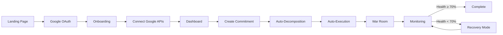

---

## J1: Landing Page Discovery

### Overview

| Attribute | Value |
|---|---|
| **Entry Points** | Direct URL, search, social share, hackathon page |
| **Goal** | Understand what Delegat does and sign up |
| **Success Metric** | Visitor → Google OAuth click (conversion rate) |
| **Target Time** | < 60 seconds from landing to clicking "Sign in" |

### User Flow

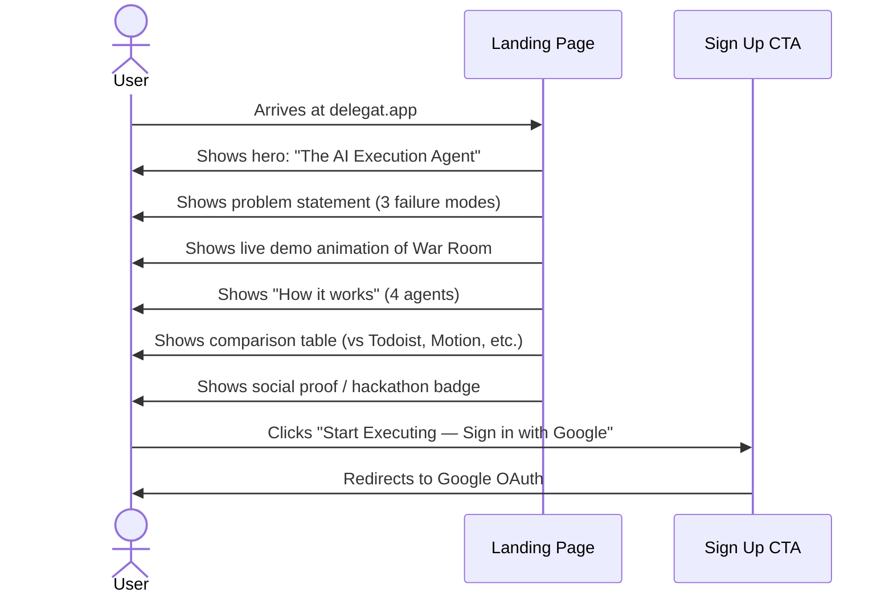

### Page Sections (Scroll Order)

| Section | Content | Purpose |
|---|---|---|
| **Hero** | "The AI Execution Agent" + tagline + CTA | Immediate hook |
| **Problem** | 3 failure modes with visual icons | Emotional resonance |
| **Solution** | 4-agent architecture with animations | Understanding |
| **Demo** | War Room screenshot/animation showing live data | Credibility |
| **How It Works** | Step-by-step: Input → Decompose → Execute → Monitor | Clarity |
| **Comparison** | Feature matrix vs. Todoist, Notion, Motion, Reclaim | Differentiation |
| **Testimonials** | Early user quotes or hackathon judge feedback | Social proof |
| **CTA** | "Start Executing — Sign in with Google" (repeated) | Conversion |
| **Footer** | Links to docs, GitHub, privacy policy, about | Trust |

### Edge Cases

| Scenario | Behavior |
|---|---|
| User visits on mobile | Responsive layout. CTA always visible. |
| User visits without JavaScript | Server-rendered content is readable. CTA works as standard link. |
| User visits from non-supported browser | Show browser requirement banner with specific versions. |
| User bookmarks the landing page | Opens to landing page. If already logged in, redirect to dashboard. |

---

## J2: Authentication — Google OAuth

### Overview

| Attribute | Value |
|---|---|
| **Flow** | Google OAuth 2.0 with PKCE via Supabase Auth |
| **Goal** | Authenticate user and obtain Google Workspace tokens |
| **Scopes Requested** | `email`, `profile`, `gmail.modify`, `calendar.events`, `documents`, `presentations`, `drive.file` |
| **Success Metric** | OAuth completion rate ≥ 80% |

### Sequence Diagram

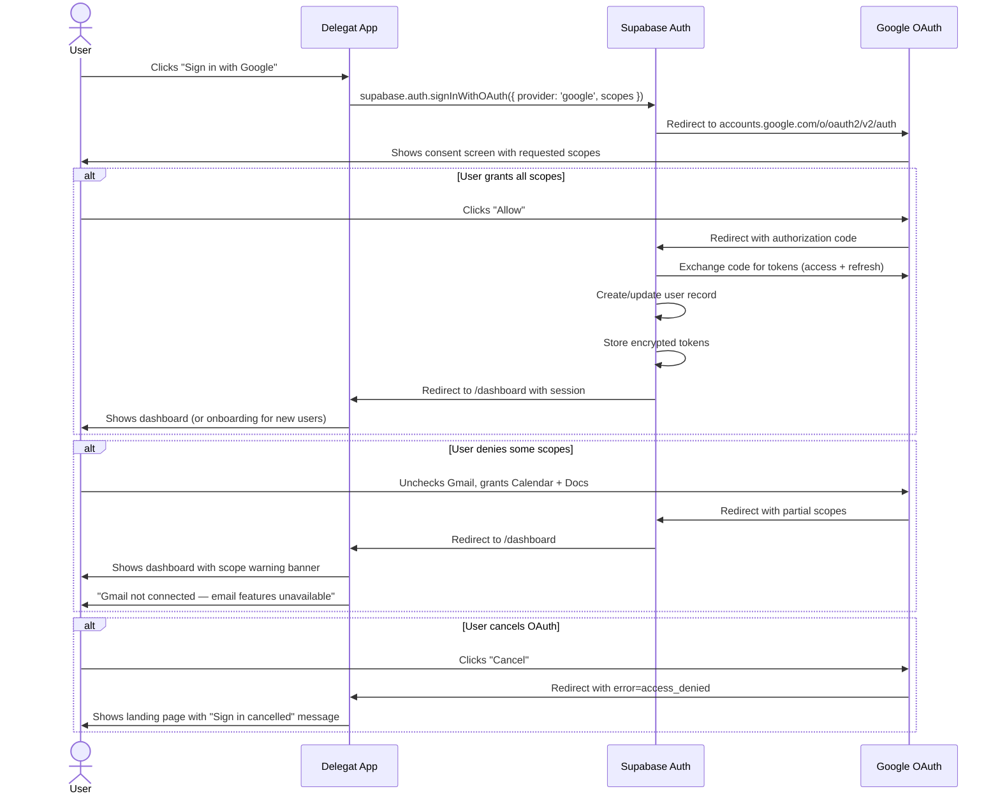

### Token Management

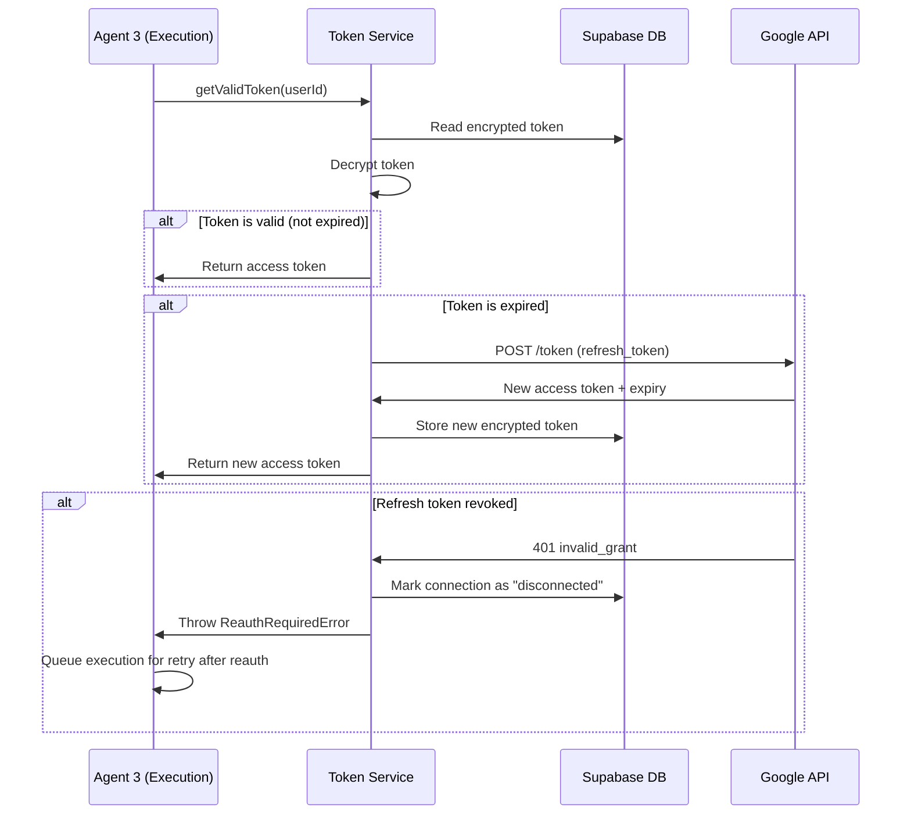

### Edge Cases

| Scenario | Behavior |
|---|---|
| User already has a Supabase account (repeat login) | Merge tokens, redirect to dashboard |
| User revokes access in Google Account settings | Next API call fails → mark as disconnected → show re-auth prompt |
| Access token expires mid-execution | Auto-refresh before each Google API call (5-minute buffer) |
| User signs in from a new device | New session created; existing sessions remain valid |
| Google OAuth is temporarily unavailable | Show error: "Google login unavailable. Please try again in a few minutes." |
| User's Google account is suspended | OAuth returns error → show: "Unable to sign in. Contact Google support." |

---

## J3: Onboarding

### Overview

| Attribute | Value |
|---|---|
| **Trigger** | First-time user completes OAuth |
| **Steps** | 4-step wizard |
| **Goal** | User creates their first commitment within 2 minutes |
| **Success Metric** | Onboarding completion rate ≥ 70% |
| **Skip Option** | Available at every step |

### Onboarding Flow

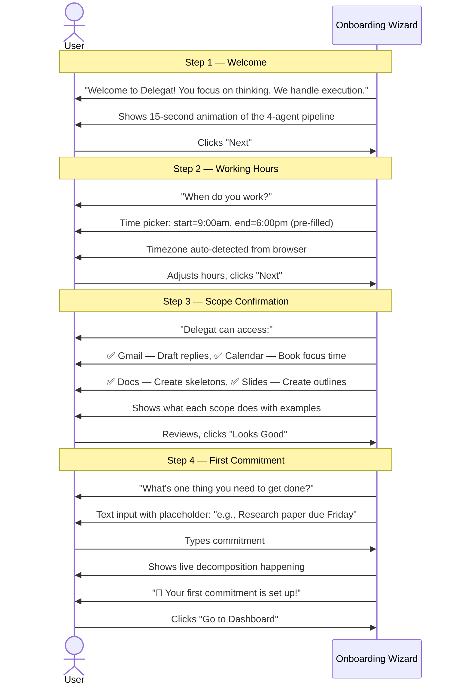

### Step Details

| Step | Required | Default | Skip Behavior |
|---|---|---|---|
| Welcome | No | — | Skip to Step 2 |
| Working Hours | Yes | 9am–6pm, browser timezone | Uses defaults |
| Scope Confirmation | No | All scopes granted during OAuth | Skip to Step 4 |
| First Commitment | No | — | Dashboard opens empty |

### Edge Cases

| Scenario | Behavior |
|---|---|
| User refreshes during onboarding | Resume at current step (state stored in localStorage) |
| User closes browser during onboarding | Next login resumes onboarding |
| User already completed onboarding (repeat login) | Skip onboarding, go directly to dashboard |
| User skips all steps | Dashboard opens with empty state + helpful prompt |

---

## J4: Connecting Google Workspace

### Overview

Google Workspace connections are established during the initial OAuth flow. This journey covers the management and re-authorization scenarios.

### Connection Status

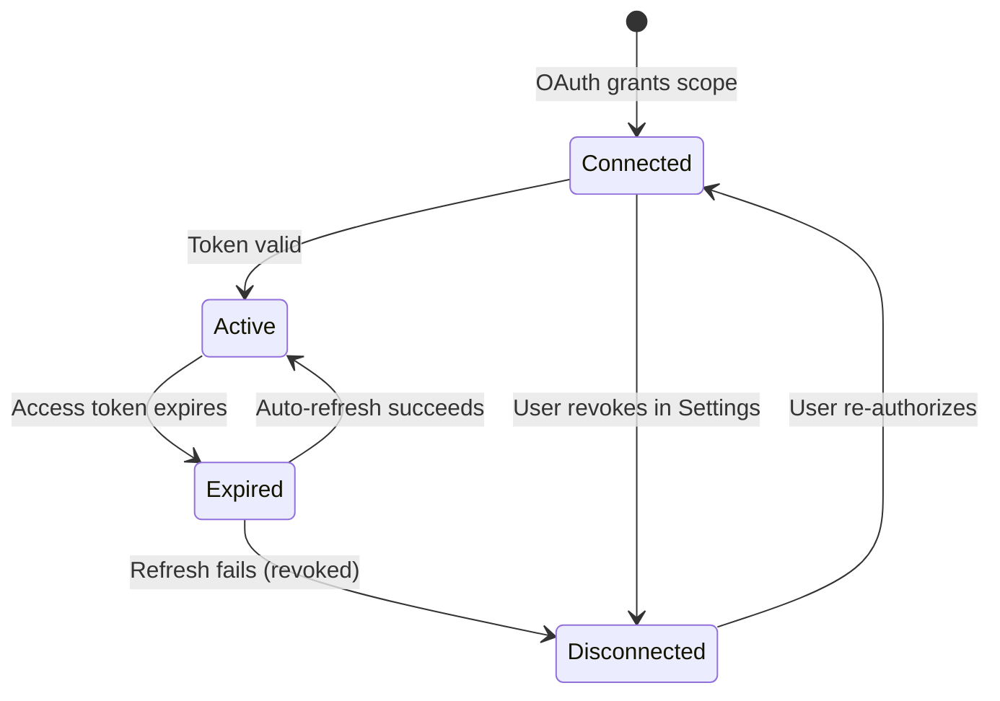

### Settings → Integrations Page

| API | Status Display | Actions |
|---|---|---|
| Gmail | `✅ Connected` or `❌ Not connected` | Disconnect / Reconnect |
| Calendar | `✅ Connected` or `❌ Not connected` | Disconnect / Reconnect |
| Google Docs | `✅ Connected` or `❌ Not connected` | Disconnect / Reconnect |
| Google Slides | `✅ Connected` or `❌ Not connected` | Disconnect / Reconnect |
| Google Drive | `✅ Connected` or `❌ Not connected` | Disconnect / Reconnect |

### Edge Cases

| Scenario | Behavior |
|---|---|
| User disconnects Gmail | Email-related features show "Gmail required" prompts. Existing drafts remain in Gmail. |
| User reconnects after disconnecting | Triggers re-auth flow for that specific scope. Resumes queued executions. |
| User's Google Workspace admin blocks the app | All Google APIs fail → show: "Your organization's admin has blocked Delegat. Contact your IT admin." |
| Token refresh rate-limited by Google | Queue refresh requests, use last valid token until limit resets |

---

## J5: Creating a Commitment

### Overview

| Attribute | Value |
|---|---|
| **Input Methods** | Text input, email paste, screenshot upload, command palette |
| **Processing** | Agent 1 (Ingestion) → Agent 2 (Decomposition) → Agent 3 (Execution) |
| **Success Metric** | Commitment created with ≥ 3 sub-tasks within 10 seconds |

### Primary Flow — Text Input

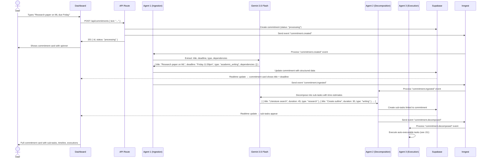

### Alternative Flow — Email Paste

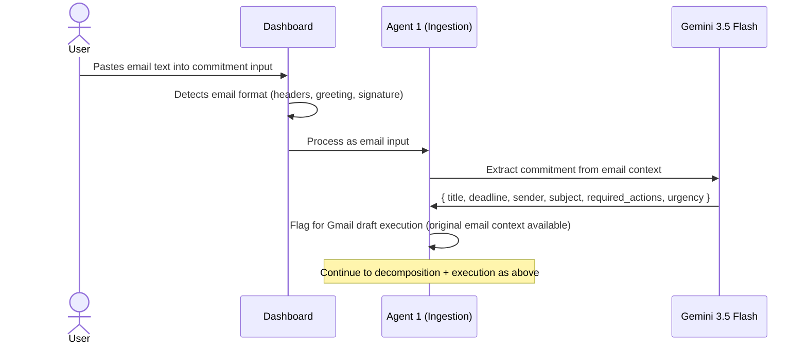

### Alternative Flow — Screenshot Upload

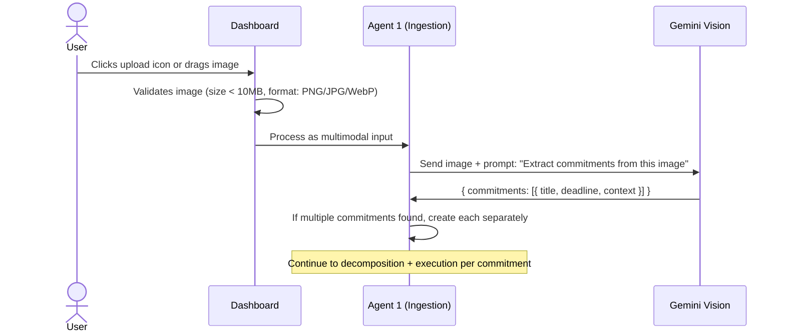

### Edge Cases

| Scenario | Behavior |
|---|---|
| **Ambiguous deadline** ("soon", "ASAP") | Gemini assigns `deadline: null`. User prompted: "When is this due?" |
| **No deadline mentioned** | Commitment created with no deadline. Shown in dashboard but not in timeline/risk. User prompted to add deadline. |
| **Past deadline** | Warning: "This deadline has passed. Would you like to set a new deadline?" |
| **Duplicate commitment** | Gemini compares against existing commitments. If >80% similar: "This looks similar to [existing]. Create anyway?" |
| **Very large commitment** | If decomposition yields >30 sub-tasks, suggest splitting: "This is a large commitment. Split into [X] and [Y]?" |
| **Gemini timeout** | After 10s, show: "AI is taking longer than usual. Commitment saved — we'll process it shortly." Queue for retry. |
| **Gemini rate limit hit** | Queue the request. Show: "Processing queued. You'll see sub-tasks shortly." |
| **Empty input** | Validation prevents submission. Input border turns red. |
| **Input > 5000 characters** | Truncate with warning: "Input shortened to 5000 characters." |

---

## J6: Viewing the Dashboard

### Overview

The dashboard is the primary view after login. It shows all active commitments, the health score summary, and quick-access actions.

### Layout

```
┌────────────────────────────────────────────────────────┐
│  Sidebar (240px)  │           Main Content             │
│                   │                                    │
│  🏠 Dashboard     │  ┌──────────────────────────────┐  │
│  ⚔️ War Room      │  │   Deadline Health Score: 84%  │  │
│  🎯 Risk Radar    │  │   ████████████░░░░  Overall   │  │
│  📅 Calendar      │  └──────────────────────────────┘  │
│  📊 Analytics     │                                    │
│  ⚙️ Settings      │  ┌──────────────────────────────┐  │
│                   │  │   Today's Commitments (3)     │  │
│                   │  │   ├── Research paper   🟢 92% │  │
│                   │  │   ├── Client email     🟢 85% │  │
│                   │  │   └── Slide deck       🟡 65% │  │
│                   │  └──────────────────────────────┘  │
│                   │                                    │
│                   │  ┌──────────────────────────────┐  │
│                   │  │   NEXUS Activity Feed         │  │
│                   │  │   ✅ Drafted reply to John     │  │
│                   │  │   ✅ Booked 3 focus blocks     │  │
│                   │  │   ✅ Created Research Doc       │  │
│                   │  └──────────────────────────────┘  │
│                   │                                    │
│  + New Commitment │  ┌──────────────────────────────┐  │
│                   │  │   Upcoming Deadlines           │  │
│    Cmd+K          │  │   Tomorrow: Client email      │  │
│                   │  │   Wednesday: Research paper    │  │
│                   │  │   Friday: Slide deck           │  │
│                   │  └──────────────────────────────┘  │
└────────────────────────────────────────────────────────┘
```

### States

| State | Condition | Display |
|---|---|---|
| **Loading** | Data fetching | Skeleton cards with pulse animation |
| **Empty** | No commitments | "No commitments yet. What do you need to get done?" + large input |
| **Active** | 1+ commitments | Full dashboard with health score, commitments, NEXUS |
| **All Complete** | 0 active, 1+ completed | "🎉 All caught up!" + completed commitments list |
| **Error** | API failure | "Something went wrong. Retrying..." + retry button |

---

## J7: Using the War Room

### Overview

The War Room is the real-time command center — designed to be dramatic and immediately legible.

### War Room Flow

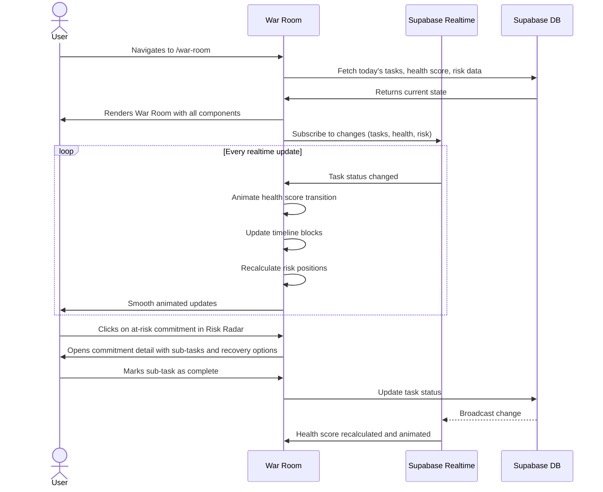

### War Room Components

| Component | Update Frequency | Data Source |
|---|---|---|
| **Deadline Health Score** | Real-time (on every task change) | Calculated from velocity + time remaining |
| **Today's Timeline** | Real-time | Tasks with today's schedule slots |
| **Risk Radar** | Real-time | All commitments with risk scores |
| **NEXUS Feed** | Real-time (append-only) | Execution logs from Agent 3 |

---

## J8: Monitoring Progress

### Progress Tracking Flow

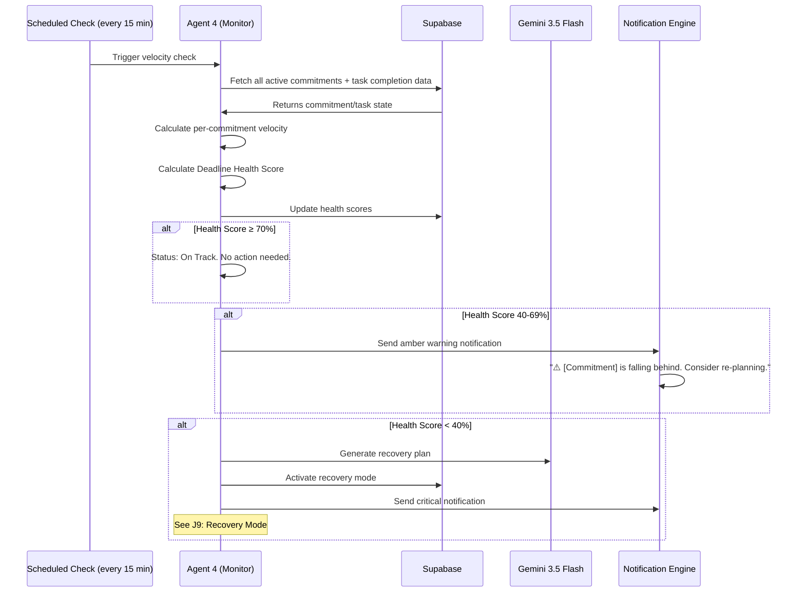

### Health Score Calculation

```
Health Score = weighted_average(
    time_factor     × 0.4,   // time_remaining / time_needed
    velocity_factor × 0.3,   // actual_velocity / planned_velocity
    completion_factor × 0.2, // tasks_completed / total_tasks
    dependency_factor × 0.1  // blocked_tasks / total_tasks (inverse)
)

Where:
  time_factor = max(0, min(100, (hours_remaining / hours_needed) × 100))
  velocity_factor = max(0, min(100, (tasks_completed_last_24h / tasks_planned_last_24h) × 100))
  completion_factor = (tasks_completed / total_tasks) × 100
  dependency_factor = max(0, 100 - (blocked_tasks / total_tasks) × 100)
```

---

## J9: Recovery Mode

### Overview

| Attribute | Value |
|---|---|
| **Trigger** | Deadline Health Score drops below 70% |
| **Goal** | Get the user back on track through re-planning and micro-commitments |
| **Exit** | Health Score rises above 70% for 2 consecutive checks |

### Recovery Flow

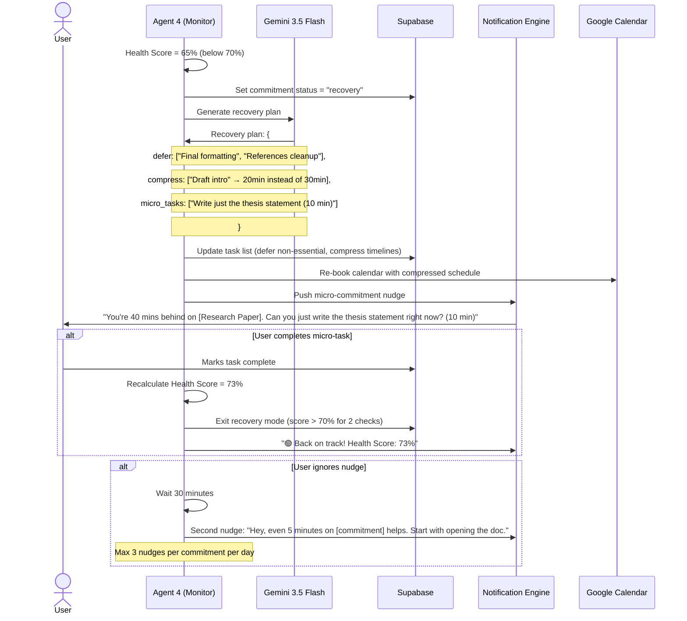

### Micro-Commitment Rules

| Rule | Value | Rationale |
|---|---|---|
| Maximum task duration | 15 minutes | Must feel achievable |
| Maximum nudges per commitment per day | 3 | Don't become annoying |
| Minimum interval between nudges | 30 minutes | Respect user's flow |
| Nudge during quiet hours | Never | Respect user's boundaries |
| Nudge tone | Supportive, not guilt-inducing | Behavioral science: positive framing works better |

---

## J10: Completing Work

### Completion Flow

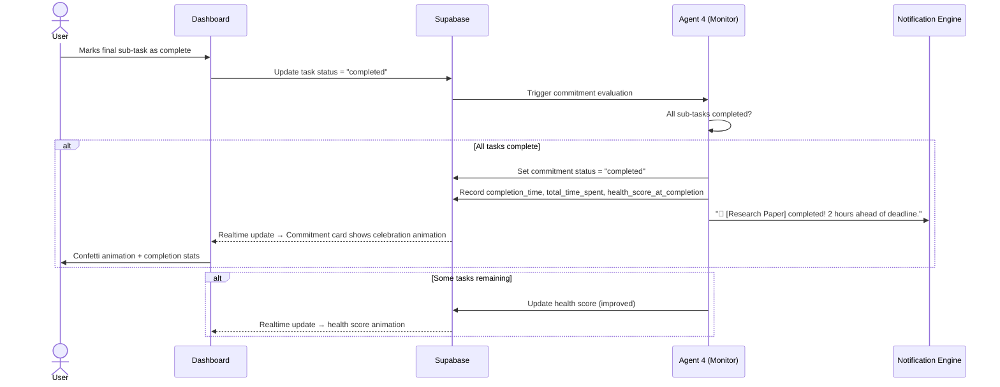

### Completion Stats Displayed

| Stat | Description |
|---|---|
| **Completed** | Date and time |
| **Total time spent** | Actual hours vs. estimated hours |
| **Ahead/behind schedule** | Hours ahead or behind the original deadline |
| **Tasks completed** | X of Y sub-tasks |
| **Autonomous executions** | N actions taken by Delegat |
| **Recovery episodes** | Number of times recovery mode activated |
| **Accuracy** | How close the AI time estimates were |

---

## J11: Reviewing Autonomous Actions

### Overview

Every action taken by Agent 3 (Execution) appears in the NEXUS Activity Feed and is reviewable.

### Review Flow

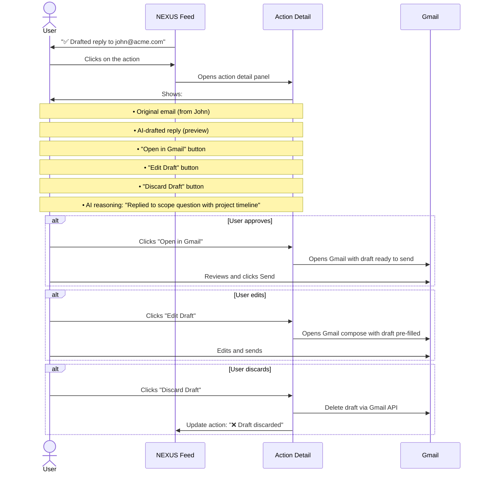

---

## J12: Using Command Palette

### Overview

| Attribute | Value |
|---|---|
| **Trigger** | `Cmd+K` (Mac) / `Ctrl+K` (Windows/Linux) |
| **Purpose** | Quick commitment creation, navigation, and actions |
| **Interaction** | Type-ahead fuzzy search |

### Commands

| Input Pattern | Action | Example |
|---|---|---|
| Free text | Create new commitment | "Prepare board deck by Monday" |
| `/war-room` | Navigate to War Room | — |
| `/dashboard` | Navigate to Dashboard | — |
| `/settings` | Navigate to Settings | — |
| `@commitment` | Search commitments by name | `@Research paper` |
| `/risk` | Show at-risk commitments | — |
| `/health` | Show current health score | — |

### Flow

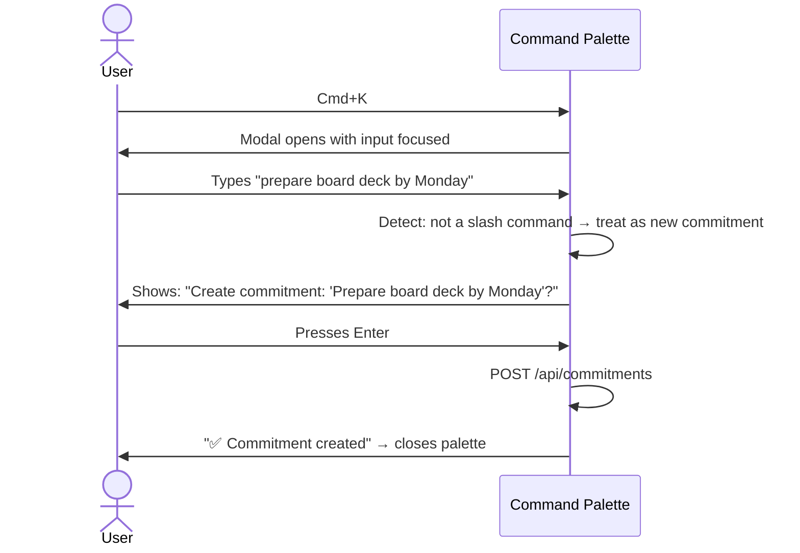

---

## J13: Managing Settings

### Settings Flow

```mermaid
graph TD
    SETTINGS[Settings Page] --> PROFILE[Profile]
    SETTINGS --> INTEGRATIONS[Integrations]
    SETTINGS --> NOTIFICATIONS[Notifications]
    SETTINGS --> WORK[Working Hours]
    SETTINGS --> THEME[Appearance]
    SETTINGS --> DATA[Data & Privacy]

    PROFILE --> P1[Name]
    PROFILE --> P2[Avatar from Google]
    PROFILE --> P3[Timezone]

    INTEGRATIONS --> I1[Gmail Status + Reconnect]
    INTEGRATIONS --> I2[Calendar Status + Reconnect]
    INTEGRATIONS --> I3[Docs Status + Reconnect]
    INTEGRATIONS --> I4[Slides Status + Reconnect]
    INTEGRATIONS --> I5[Drive Status + Reconnect]

    NOTIFICATIONS --> N1[In-app toggles]
    NOTIFICATIONS --> N2[Push notification toggles]
    NOTIFICATIONS --> N3[Email digest toggles]
    NOTIFICATIONS --> N4[Quiet hours]

    WORK --> W1[Start time]
    WORK --> W2[End time]
    WORK --> W3[Working days]
    WORK --> W4[Buffer percentage]

    THEME --> T1[Dark mode]
    THEME --> T2[Light mode]

    DATA --> D1[Export data as JSON]
    DATA --> D2[Delete account]
```

---

## Error Scenarios

### Comprehensive Error Handling

| Error | Trigger | User Message | System Action |
|---|---|---|---|
| **Gemini API timeout** | Agent response > 15 seconds | "AI is taking longer than usual. We'll process this shortly." | Queue for retry, show commitment as "processing" |
| **Gemini rate limit** | Exceeded RPM quota | "High demand — your request is queued." | Inngest queues with backoff |
| **Google API 401** | Token expired/revoked | "Google connection lost. Reconnect in Settings." | Mark connection as disconnected |
| **Google API 403** | Scope not granted | "[Feature] requires Gmail access. Connect in Settings." | Disable feature, show CTA |
| **Google API 429** | Quota exceeded | "Google API limit reached. We'll retry shortly." | Exponential backoff (max 5 retries) |
| **Google API 500** | Google service error | "Google services are temporarily unavailable." | Retry with backoff |
| **Supabase connection lost** | WebSocket disconnect | "Reconnecting..." (auto-retry) | Auto-reconnect with exponential backoff |
| **Network offline** | No internet | "You're offline. Changes will sync when you reconnect." | Queue mutations locally |
| **Database write failure** | Postgres constraint violation | "Unable to save. Please try again." | Log error to Sentry |
| **Invalid input** | Empty or malformed commitment text | "Please enter a description of your commitment." | Inline form validation |
| **File too large** | Screenshot > 10MB | "Image too large (max 10MB). Try a smaller file." | Client-side validation |
| **Unsupported format** | Non-image file uploaded | "Only PNG, JPG, and WebP images are supported." | Client-side validation |

---

*Previous: [02 — User Personas](02_USER_PERSONAS.md) · Next: [04 — Feature Specifications](04_FEATURE_SPECIFICATIONS.md)*
]]>
