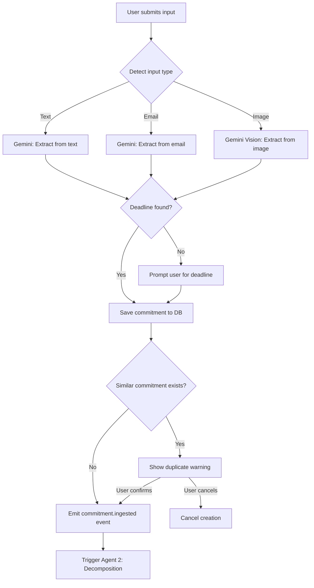

<
- [F-100: Commitment Ingestion](#f-100-commitment-ingestion)
- [F-200: AI Decomposition](#f-200-ai-decomposition)
- [F-300: Autonomous Gmail Execution](#f-300-autonomous-gmail-execution)
- [F-400: Autonomous Google Docs Execution](#f-400-autonomous-google-docs-execution)
- [F-500: Autonomous Calendar Execution](#f-500-autonomous-calendar-execution)
- [F-600: Autonomous Google Slides Execution](#f-600-autonomous-google-slides-execution)
- [F-700: War Room Dashboard](#f-700-war-room-dashboard)
- [F-800: Deadline Health Score](#f-800-deadline-health-score)
- [F-900: Risk Radar](#f-900-risk-radar)
- [F-1000: NEXUS Activity Feed](#f-1000-nexus-activity-feed)
- [F-1100: Recovery Engine](#f-1100-recovery-engine)
- [F-1200: Micro-Commitment Nudges](#f-1200-micro-commitment-nudges)
- [F-1300: Command Palette](#f-1300-command-palette)
- [F-1400: Notification System](#f-1400-notification-system)
- [F-1500: Settings & Profile](#f-1500-settings--profile)

---

## Feature Index

| ID | Feature | Agent | Priority | Status |
|---|---|---|---|---|
| F-100 | Commitment Ingestion | Agent 1 | P0 | MVP |
| F-200 | AI Decomposition | Agent 2 | P0 | MVP |
| F-300 | Gmail Execution | Agent 3 | P0 | MVP |
| F-400 | Google Docs Execution | Agent 3 | P0 | MVP |
| F-500 | Calendar Execution | Agent 3 | P0 | MVP |
| F-600 | Google Slides Execution | Agent 3 | P1 | V1.1 |
| F-700 | War Room Dashboard | — | P0 | MVP |
| F-800 | Deadline Health Score | Agent 4 | P0 | MVP |
| F-900 | Risk Radar | Agent 4 | P0 | MVP |
| F-1000 | NEXUS Activity Feed | — | P0 | MVP |
| F-1100 | Recovery Engine | Agent 4 | P0 | MVP |
| F-1200 | Micro-Commitment Nudges | Agent 4 | P0 | MVP |
| F-1300 | Command Palette | — | P0 | MVP |
| F-1400 | Notification System | — | P0 | MVP |
| F-1500 | Settings & Profile | — | P1 | MVP |

---

## F-100: Commitment Ingestion

### Purpose

Accept user commitments in any format — natural language, pasted emails, screenshots — and extract structured data (title, deadline, type, dependencies, stakeholders) using Gemini 3.5 Flash.

### Business Value

Eliminates the friction of manual data entry. Users describe commitments in their own words; the AI handles structuring. This is the entry point for all downstream execution.

### User Story

> As a user, I want to input my commitments in plain language (or paste an email, or upload a screenshot) so that Delegat can understand what I need to do and start executing immediately.

### Acceptance Criteria

| # | Criterion | Verification |
|---|---|---|
| 1 | User can create a commitment by typing natural language | E2E test |
| 2 | User can create a commitment by pasting email text | E2E test |
| 3 | User can create a commitment by uploading a screenshot (P1) | E2E test |
| 4 | Gemini extracts title, deadline, type, and stakeholders | Unit test on agent |
| 5 | If deadline is ambiguous, user is prompted to clarify | E2E test |
| 6 | Commitment appears in dashboard within 5 seconds | Performance test |
| 7 | Commitment triggers decomposition automatically | Integration test |
| 8 | Duplicate detection warns user of similar commitments | Unit test |

### Inputs

| Input | Type | Source | Required | Validation |
|---|---|---|---|---|
| `text` | `string` | User input field or command palette | Yes (unless image provided) | 1–5000 characters |
| `image` | `File` | File upload or drag-and-drop | No (P1) | PNG/JPG/WebP, max 10MB |
| `source_type` | `enum` | Auto-detected | Yes | `text`, `email`, `image` |

### Outputs

| Output | Type | Destination |
|---|---|---|
| Structured commitment | `Commitment` object | Supabase `commitments` table |
| Extracted metadata | `{ title, deadline, type, stakeholders, dependencies }` | Stored in commitment record |
| Ingestion event | `commitment.ingested` | Inngest event bus → triggers Agent 2 |

### Workflow



### Edge Cases

| Scenario | Handling |
|---|---|
| Input in non-English language | Gemini supports multilingual. Extract in detected language, store in original. |
| Multiple commitments in one input | Split into separate commitments. Show: "We found 3 commitments. Creating them separately." |
| Commitment with no actionable content ("feeling stressed") | Create with type: `note`. Don't decompose. Show: "This doesn't look like an actionable commitment. Save as a note?" |
| Extremely long input (>5000 chars) | Truncate at 5000 chars. Warn user. |
| Image with no text content | Show: "We couldn't find any commitments in this image. Try a clearer screenshot." |
| Gemini returns malformed JSON | Retry once. If still malformed, save raw text and prompt user to clarify manually. |

### Failure Handling

| Failure | Recovery |
|---|---|
| Gemini API timeout (>15s) | Save commitment as `processing`. Queue for retry via Inngest. Show: "Processing your commitment..." |
| Gemini rate limit | Queue with exponential backoff. Notify user: "High demand — queued for processing." |
| Invalid Gemini response | Retry with simplified prompt. If second failure, save raw text with `status: draft`. |
| Database write failure | Return 500. Retry once. Log to Sentry. |

### Permissions

| Permission | Required For |
|---|---|
| Authenticated user | Creating any commitment |
| `gmail.modify` scope | Email-based ingestion (to read original email for context) |
| None additional | Text and image ingestion |

### API Requirements

```
POST /api/commitments
Content-Type: application/json (or multipart/form-data for images)

Request Body:
{
  "text": "Research paper on ML due Friday",
  "source_type": "text"
}

Response (201):
{
  "id": "uuid",
  "title": "Research paper on ML",
  "deadline": "2026-07-04T23:59:00Z",
  "status": "active",
  "type": "academic_writing",
  "health_score": null,
  "created_at": "2026-06-29T12:00:00Z"
}
```

### Database Requirements

| Table | Fields Used |
|---|---|
| `commitments` | `id`, `user_id`, `title`, `raw_input`, `source_type`, `deadline`, `type`, `status`, `stakeholders`, `metadata`, `created_at`, `updated_at` |

### Analytics Events

| Event | Properties | Trigger |
|---|---|---|
| `commitment_created` | `source_type`, `type`, `has_deadline`, `input_length` | Commitment successfully saved |
| `commitment_creation_failed` | `error_type`, `source_type` | Any creation failure |
| `duplicate_detected` | `similar_commitment_id` | Duplicate warning shown |

### Future Improvements

- Voice input via Web Speech API
- Calendar event → commitment conversion
- Slack message → commitment via slash command
- Recurring commitment templates
- Batch import from CSV/Google Tasks

---

## F-200: AI Decomposition

### Purpose

Break every commitment into 15–30 minute executable sub-tasks with calibrated time estimates, dependency graphs, and human-vs-auto classification.

### Business Value

This is Delegat's core differentiator. No other tool decomposes ambiguous commitments into concrete, time-budgeted execution plans. This directly addresses the "cognitive overload" failure mode.

### User Story

> As a user, when I create a commitment, I want Delegat to automatically break it into small, manageable sub-tasks with realistic time estimates so that I know exactly what to do and how long each step takes.

### Acceptance Criteria

| # | Criterion | Verification |
|---|---|---|
| 1 | Every commitment is decomposed into ≥ 3 sub-tasks | Unit test |
| 2 | Each sub-task has a duration between 15–60 minutes | Unit test |
| 3 | Time estimates use domain-specific multipliers | Unit test |
| 4 | Sub-tasks have dependency relationships | Unit test |
| 5 | Each sub-task is classified as `human_only` or `auto_executable` | Unit test |
| 6 | Decomposition completes within 5 seconds | Performance test |
| 7 | User can edit or add sub-tasks after decomposition | E2E test |
| 8 | Confidence score (0–100) is assigned | Unit test |

### Time Calibration Model

| Task Type | Base Multiplier | Rationale |
|---|---|---|
| `writing` | 1.5× | People underestimate writing by ~50% |
| `coding` | 2.0× | Debugging and testing double perceived time |
| `research` | 1.8× | Source evaluation is slower than expected |
| `admin` | 1.0× | Emails and scheduling are predictable |
| `creative` | 2.0× | Iteration loops are consistently underestimated |
| `review` | 1.2× | Reading and feedback is slightly underestimated |
| `meeting_prep` | 1.3× | Slide/doc creation adds overhead |

### Inputs

| Input | Type | Source |
|---|---|---|
| `commitment` | `Commitment` object | Supabase DB (from Agent 1) |
| `user_context` | `{ working_hours, timezone, existing_tasks }` | Supabase DB |

### Outputs

| Output | Type | Destination |
|---|---|---|
| `tasks[]` | Array of `Task` objects | Supabase `tasks` table |
| `dependency_graph` | DAG of task IDs | Stored in `task_dependencies` table |
| `confidence_score` | `number (0–100)` | Stored in commitment record |
| `commitment.decomposed` event | Inngest event | Triggers Agent 3 |

### Sub-Task Object Structure

```typescript
interface Task {
  id: string;                          // UUID
  commitment_id: string;               // FK to commitments
  title: string;                       // "Write introduction paragraph"
  description: string;                 // Detailed instructions
  estimated_minutes: number;           // 15–60
  actual_minutes: number | null;       // Filled after completion
  type: TaskType;                      // 'writing' | 'coding' | 'research' | 'admin' | 'creative' | 'review' | 'meeting_prep'
  execution_type: 'human_only' | 'auto_executable';
  status: TaskStatus;                  // 'pending' | 'in_progress' | 'completed' | 'deferred' | 'cancelled'
  order: number;                       // Execution order
  dependencies: string[];             // Task IDs that must complete first
  scheduled_start: string | null;      // ISO datetime
  scheduled_end: string | null;        // ISO datetime
  created_at: string;
  updated_at: string;
}
```

### Edge Cases

| Scenario | Handling |
|---|---|
| Commitment too vague ("do stuff") | Return 2–3 generic sub-tasks + set confidence < 50. Prompt user: "This commitment is vague. Can you add more detail?" |
| Commitment too large (>30 sub-tasks) | Suggest splitting: "This is a large commitment. Consider breaking it into: [X] and [Y]." |
| Deadline is in < 2 hours | Compress all tasks. Flag: "Very tight deadline. Focus on essentials only." |
| Deadline is 6+ months away | Create weekly milestones instead of individual tasks. Decompose current week only. |
| User edits commitment after decomposition | Re-run decomposition. Keep user-edited sub-tasks. Merge new AI tasks. |
| Decomposition returns 0 tasks | Fallback: create 1 generic task "Complete [commitment title]". Set confidence = 0. |

### Failure Handling

| Failure | Recovery |
|---|---|
| Gemini timeout | Retry with shorter prompt (title only, no context). |
| Gemini returns invalid task structure | Parse what's valid, fill defaults for rest. Log warning. |
| Gemini returns tasks with 0 duration | Set minimum 15 minutes. |
| Total estimated time > time until deadline | Show warning: "This may not be completable by the deadline." Still decompose. |

### Analytics Events

| Event | Properties |
|---|---|
| `commitment_decomposed` | `task_count`, `total_estimated_minutes`, `confidence_score`, `commitment_type` |
| `decomposition_failed` | `error_type`, `commitment_id` |
| `task_manually_edited` | `task_id`, `field_changed` |
| `task_manually_added` | `commitment_id` |

---

## F-300: Autonomous Gmail Execution

### Purpose

Automatically draft contextual email replies using Gmail API, matching the user's writing style.

### Business Value

Email is the #1 time sink for professionals (2–3 hours/day). Auto-drafting saves 30–60 minutes daily while maintaining the user's voice.

### User Story

> As a user, when a commitment involves replying to an email, I want Delegat to read the original email thread and draft a contextual reply in my writing style, so I can review and send it in seconds instead of writing from scratch.

### Acceptance Criteria

| # | Criterion |
|---|---|
| 1 | Agent reads original email thread via Gmail API |
| 2 | Draft is generated in the user's writing style using Gemini |
| 3 | Draft is saved in Gmail as a draft (not sent) |
| 4 | Draft is reviewable from NEXUS feed and commitment detail |
| 5 | User can open draft in Gmail, edit, and send |
| 6 | User can discard draft from Delegat |
| 7 | Action is logged in NEXUS with sender and subject |
| 8 | If Gmail scope not granted, feature is disabled with CTA |

### Workflow

```mermaid
flowchart TD
    TRIGGER[Commitment involves email reply] --> CHECK{Gmail connected?}
    CHECK -->|No| DISABLE[Show: "Connect Gmail in Settings"]
    CHECK -->|Yes| READ[Read original email via Gmail API]
    READ --> STYLE[Analyze user's recent sent emails for tone]
    STYLE --> DRAFT[Gemini: Generate contextual reply]
    DRAFT --> SAVE[Save draft via Gmail API]
    SAVE --> LOG[Log in NEXUS: "✅ Drafted reply to [sender]"]
    LOG --> NOTIFY[Notify user: draft ready for review]
```

### Permissions

| Scope | Purpose |
|---|---|
| `gmail.modify` | Read email threads, create drafts |

### API Requirements

```
POST /api/agents/execute/gmail-draft
{
  "commitment_id": "uuid",
  "task_id": "uuid",
  "email_thread_id": "string"  // Gmail thread ID (optional — Agent looks up if not provided)
}

Response (200):
{
  "draft_id": "gmail_draft_id",
  "preview": "Hi John, Thanks for your email about the project scope...",
  "status": "drafted"
}
```

### Edge Cases

| Scenario | Handling |
|---|---|
| No original email found | Skip Gmail execution. Log: "No email thread found for context." |
| Email thread is very long (>50 messages) | Use last 10 messages for context. |
| User's sent history is empty (new account) | Use neutral professional tone. Note: "Using default tone — send more emails for personalization." |
| Draft creation fails (Gmail API error) | Retry up to 3 times. Log failure. Notify user. |
| Email contains sensitive content | Delegat never stores email body. Only uses it in-memory for Gemini context. |

---

## F-400: Autonomous Google Docs Execution

### Purpose

Automatically create Google Docs with structured skeletons — section headers, word count targets, and starter prompts — for commitments that require written deliverables.

### Business Value

The blank page is the biggest barrier to starting. Creating a structured skeleton reduces activation energy by 80%. Users start filling in sections instead of staring at emptiness.

### User Story

> As a user, when a commitment requires a written document, I want Delegat to create a Google Doc with the right structure, section headers, and starter prompts so that I can immediately start writing in the relevant sections.

### Acceptance Criteria

| # | Criterion |
|---|---|
| 1 | Google Doc is created via Docs API |
| 2 | Document includes: title, section headers, word count targets per section |
| 3 | Each section has 1–2 sentence starter prompts |
| 4 | Document is shared with the user's Google account |
| 5 | Document link appears in commitment detail and NEXUS |
| 6 | If Docs scope not granted, feature is disabled with CTA |

### Document Template Structure

```
[Commitment Title]
═══════════════════════════════════════

Section 1: [Section Name]
Target: ~[N] words
Start here: [Contextual starter prompt]

────────────────────────

Section 2: [Section Name]
Target: ~[N] words
Start here: [Contextual starter prompt]

────────────────────────

[Repeat for all sections]
```

### Example Output

For commitment: "Research paper on machine learning in healthcare"

```
Machine Learning in Healthcare: A Comprehensive Analysis
═══════════════════════════════════════════════════════════

1. Introduction (~300 words)
Start here: Machine learning has emerged as a transformative technology
in healthcare, offering unprecedented capabilities in...

────────────────────────────

2. Literature Review (~600 words)
Start here: Recent studies have explored various applications of ML in
clinical settings. Key areas include...

────────────────────────────

3. Methodology (~400 words)
Start here: This paper employs a systematic approach to analyzing...

────────────────────────────

4. Results and Discussion (~500 words)
Start here: The analysis reveals several significant findings...

────────────────────────────

5. Conclusion (~200 words)
Start here: In summary, machine learning's impact on healthcare...

────────────────────────────

References
[To be added as research progresses]
```

### Edge Cases

| Scenario | Handling |
|---|---|
| Commitment type doesn't need a document | Skip Docs execution. Only trigger for types: `writing`, `research`, `academic_writing`, `report`. |
| Google Docs API quota exceeded | Queue for retry. Notify user: "Document creation queued." |
| User already has a document for this topic | Don't create duplicate. Show: "Existing document found. Link it instead?" |

---

## F-500: Autonomous Calendar Execution

### Purpose

Automatically book focus time blocks in Google Calendar around existing meetings, with configurable buffer time.

### Business Value

Focus time is the #1 request from knowledge workers. Automatic calendar blocking removes the friction of manual scheduling and protects deep work time.

### User Story

> As a user, I want Delegat to automatically find free slots in my calendar and book focus time for my tasks, so that I have protected time to work on my commitments without conflicts.

### Acceptance Criteria

| # | Criterion |
|---|---|
| 1 | Agent reads existing calendar events for the next 7 days |
| 2 | Agent identifies free slots during working hours |
| 3 | Focus blocks are 30 min–2 hours (configurable) |
| 4 | 40% buffer is added between tasks (configurable) |
| 5 | Calendar events include task title and description |
| 6 | Events are created as tentative (user can modify/delete) |
| 7 | Conflicts are never created (always check before booking) |

### Scheduling Algorithm

```mermaid
flowchart TD
    START[Get tasks needing calendar time] --> FETCH[Fetch calendar events for next 7 days]
    FETCH --> FREE[Identify free slots during working hours]
    FREE --> FILTER[Filter slots ≥ 30 minutes]
    FILTER --> SORT[Sort tasks by deadline urgency]
    SORT --> ASSIGN[Assign tasks to slots]

    ASSIGN --> CHECK{Task fits in slot?}
    CHECK -->|Yes| BOOK[Book calendar event]
    CHECK -->|No| SPLIT{Can split task?}
    SPLIT -->|Yes| HALVE[Split into 2 sessions]
    SPLIT -->|No| NEXT[Try next available slot]

    BOOK --> BUFFER[Add 40% buffer after event]
    BUFFER --> REMAINING{More tasks?}
    REMAINING -->|Yes| ASSIGN
    REMAINING -->|No| DONE[Log in NEXUS: "Booked N focus blocks"]

    NEXT --> REMAINING2{More slots available?}
    REMAINING2 -->|Yes| ASSIGN
    REMAINING2 -->|No| WARN[Warn: "Not enough free time for all tasks"]
```

### Edge Cases

| Scenario | Handling |
|---|---|
| No free slots available | Notify: "No free slots available. Consider extending working hours or rescheduling meetings." |
| All-day events | Treat as free time unless marked as busy in Google Calendar. |
| Recurring meetings | Respect recurring events. Don't double-book. |
| User in multiple timezones during the week | Use the timezone set in Delegat settings, not Google Calendar timezone. |
| Weekend scheduling | Don't book on non-working days unless user has configured weekend work. |

---

## F-700: War Room Dashboard

### Purpose

Real-time command center displaying the user's commitment status, progress, risks, and autonomous agent activity.

### Business Value

The War Room is Delegat's signature experience — dramatic, high-information-density, impossible to ignore. It creates a visceral sense of progress or urgency that drives action.

### User Story

> As a user, I want a real-time dashboard that shows my current execution status, at-risk commitments, and what Delegat has done for me, so that I always know where I stand and can take action immediately.

### Layout Specification

```
┌─────────────────────────────────────────────────────────────────┐
│                    WAR ROOM — [Today's Date]                     │
├─────────────────────────────────────────────────────────────────┤
│                                                                  │
│  ┌──────────────────────────────────────────────────────────┐   │
│  │          DEADLINE HEALTH SCORE                            │   │
│  │          ████████████████░░░░░░  78%                       │   │
│  │          "On track — maintain current velocity"           │   │
│  └──────────────────────────────────────────────────────────┘   │
│                                                                  │
│  ┌────────────────────────┐  ┌───────────────────────────────┐  │
│  │   TODAY'S TIMELINE     │  │   RISK RADAR                  │  │
│  │                        │  │                               │  │
│  │  9:00  ▓▓▓ Focus       │  │  🔴 Client proposal   32%    │  │
│  │  10:00 ░░░ Meeting     │  │  🟡 Research paper    65%    │  │
│  │  11:00 ▓▓▓ Focus       │  │  🟢 Email replies     92%    │  │
│  │  12:00 ░░░ Lunch       │  │  🟢 Team standup doc  88%    │  │
│  │  13:00 ▓▓▓ Focus       │  │                               │  │
│  │  14:00 ▓▓▓ Focus       │  │  [Click to see details]      │  │
│  │  15:00 ░░░ Meeting     │  │                               │  │
│  │  16:00 ▓▓▓ Focus       │  │                               │  │
│  └────────────────────────┘  └───────────────────────────────┘  │
│                                                                  │
│  ┌──────────────────────────────────────────────────────────┐   │
│  │   NEXUS ACTIVITY FEED                                     │   │
│  │                                                            │   │
│  │   2 min ago   ✅ Drafted reply to john@acme.com           │   │
│  │   15 min ago  ✅ Booked 3 focus blocks for "Research"     │   │
│  │   32 min ago  ✅ Created "ML Healthcare" Google Doc       │   │
│  │   1 hour ago  ⚠️ Calendar conflict detected for 3pm      │   │
│  │   1 hour ago  ✅ Decomposed "Client Proposal" → 8 tasks  │   │
│  └──────────────────────────────────────────────────────────┘   │
└─────────────────────────────────────────────────────────────────┘
```

### Responsive Behavior

| Breakpoint | Layout Change |
|---|---|
| Desktop (≥1280px) | Full layout as shown above. Two-column middle section. |
| Tablet (768–1279px) | Single column. Timeline and Risk Radar stack vertically. |
| Mobile (320–767px) | Health Score on top. Tabs for Timeline / Risk Radar / NEXUS. |

### States

| State | Condition | Visual |
|---|---|---|
| **Loading** | Fetching data | Skeleton cards with pulse animation |
| **Empty** | No active commitments | "Your War Room is quiet. Create a commitment to get started." |
| **Green** | Health ≥ 70% | Green accent, calm animations |
| **Amber** | Health 40–69% | Amber accent, subtle pulse on health score |
| **Red** | Health < 40% | Red accent, warning animations, recovery mode banner |
| **All Complete** | 0 active commitments, 1+ completed today | "🎉 Mission accomplished today!" + completion stats |
| **Error** | API/Realtime failure | "Connection lost. Retrying..." + cached data shown |

### Animations

| Element | Animation | Duration | Trigger |
|---|---|---|---|
| Health Score bar | Smooth width transition | 800ms ease-out | Score change |
| Health Score number | Count-up/down animation | 600ms | Score change |
| Risk Radar items | Slide in from right | 300ms | New item |
| Risk color change | Smooth color transition | 500ms | Risk level change |
| NEXUS feed items | Fade + slide up | 200ms | New activity |
| Timeline blocks | Horizontal fill | 1000ms | Progress update |

### Analytics Events

| Event | Properties |
|---|---|
| `war_room_viewed` | `health_score`, `active_commitments`, `at_risk_count` |
| `risk_radar_item_clicked` | `commitment_id`, `health_score` |
| `nexus_action_clicked` | `action_type`, `action_id` |

---

## F-800: Deadline Health Score

### Purpose

A real-time percentage (0–100%) indicating the probability that the user will meet all active commitment deadlines given current velocity.

### Calculation Formula

```typescript
function calculateHealthScore(commitment: Commitment, tasks: Task[]): number {
  const totalTasks = tasks.length;
  const completedTasks = tasks.filter(t => t.status === 'completed').length;
  const hoursRemaining = differenceInHours(commitment.deadline, new Date());
  const hoursNeeded = tasks
    .filter(t => t.status !== 'completed')
    .reduce((sum, t) => sum + t.estimated_minutes / 60, 0);

  // Time factor: Do we have enough time?
  const timeFactor = Math.min(100, Math.max(0, (hoursRemaining / hoursNeeded) * 100));

  // Velocity factor: Are we completing tasks at the planned rate?
  const plannedVelocity = getPlannedVelocity(commitment); // tasks/day
  const actualVelocity = getActualVelocity(commitment);   // tasks/day (rolling 24h)
  const velocityFactor = Math.min(100, Math.max(0, (actualVelocity / plannedVelocity) * 100));

  // Completion factor: What % of tasks are done?
  const completionFactor = (completedTasks / totalTasks) * 100;

  // Dependency factor: Are tasks blocked?
  const blockedTasks = tasks.filter(t => isBlocked(t, tasks)).length;
  const dependencyFactor = Math.max(0, 100 - (blockedTasks / totalTasks) * 100);

  // Weighted average
  const healthScore = Math.round(
    timeFactor * 0.4 +
    velocityFactor * 0.3 +
    completionFactor * 0.2 +
    dependencyFactor * 0.1
  );

  return Math.min(100, Math.max(0, healthScore));
}
```

### Thresholds

| Range | Label | Color | Action |
|---|---|---|---|
| 70–100% | On Track | `#10B981` (Green) | No intervention |
| 40–69% | At Risk | `#F59E0B` (Amber) | Warning notification |
| 0–39% | Critical | `#EF4444` (Red) | Recovery mode activation |

---

## F-900: Risk Radar

### Purpose

Visual priority matrix displaying all active commitments ranked by urgency × importance, with at-risk items highlighted and recovery suggestions.

### Risk Score Calculation

```typescript
function calculateRiskScore(commitment: Commitment): number {
  const healthScore = commitment.health_score;
  const urgency = calculateUrgency(commitment.deadline); // 0-100 based on time remaining
  const importance = commitment.importance; // User-set: 1-5, normalized to 0-100

  // Risk = inverse of health, weighted by urgency and importance
  const risk = Math.round(
    (100 - healthScore) * 0.5 +
    urgency * 0.3 +
    (importance / 5 * 100) * 0.2
  );

  return Math.min(100, Math.max(0, risk));
}
```

### Visual Display

| Risk Level | Icon | Color | Behavior |
|---|---|---|---|
| Low (0–30) | 🟢 | Green | Static |
| Medium (31–60) | 🟡 | Amber | Subtle pulse |
| High (61–80) | 🟠 | Orange | Visible pulse |
| Critical (81–100) | 🔴 | Red | Animated alert glow |

---

## F-1000: NEXUS Activity Feed

### Purpose

Real-time feed of all autonomous actions taken by Agent 3 (Execution), providing visibility into what Delegat is doing on the user's behalf.

### Feed Item Types

| Type | Icon | Example |
|---|---|---|
| `gmail_draft` | ✉️ | "Drafted reply to john@acme.com" |
| `doc_created` | 📄 | "Created 'ML Healthcare Analysis' Google Doc" |
| `calendar_booked` | 📅 | "Booked 3 focus blocks for 'Research Paper'" |
| `slides_created` | 📊 | "Created 'Q3 Review' presentation outline" |
| `commitment_decomposed` | 🔧 | "Decomposed 'Board Deck' → 8 tasks" |
| `recovery_activated` | ⚠️ | "Recovery mode activated for 'Client Proposal'" |
| `health_changed` | 📈 | "Health Score improved: 65% → 78%" |
| `task_completed` | ✅ | "Completed: 'Write introduction paragraph'" |
| `error` | ❌ | "Failed to create Google Doc — retrying" |

### Feed Item Structure

```typescript
interface NexusItem {
  id: string;
  user_id: string;
  commitment_id: string | null;
  type: NexusItemType;
  title: string;           // Human-readable action description
  details: string | null;  // Additional context
  link: string | null;     // Link to Gmail draft, Doc, Calendar event
  status: 'success' | 'warning' | 'error';
  created_at: string;
}
```

---

## F-1100: Recovery Engine

*(Detailed in [16_RECOVERY_ENGINE.md](16_RECOVERY_ENGINE.md))*

### Summary

| Attribute | Value |
|---|---|
| **Trigger** | Health Score < 70% |
| **Agent** | Agent 4 (Monitor & Re-plan) |
| **Actions** | Re-prioritize tasks, defer non-essential, compress timelines, generate micro-commitments |
| **Exit Criteria** | Health Score ≥ 70% for 2 consecutive checks (30-minute intervals) |
| **Max nudges** | 3 per commitment per day |

---

## F-1200: Micro-Commitment Nudges

### Purpose

Small, achievable task suggestions (≤15 minutes) sent during recovery mode to reduce activation energy and get the user back on track.

### Nudge Templates

| Template | Example | When |
|---|---|---|
| **Time-based** | "You're 40 mins behind. Can you do just the intro paragraph right now?" | User behind schedule |
| **Smallest step** | "Just open the doc and write one sentence. That's it." | User hasn't started |
| **Progress anchoring** | "You've done 6 of 12 tasks. Just one more gets you past halfway!" | User near milestone |
| **Deadline urgency** | "4 hours until deadline. Focus on [most critical task]." | Close to deadline |

### Rules

| Rule | Value |
|---|---|
| Maximum task duration | ≤ 15 minutes |
| Maximum nudges per commitment per day | 3 |
| Minimum interval between nudges | 30 minutes |
| Nudge during quiet hours | Never |
| Tone | Supportive, not guilt-inducing |
| Channel | In-app notification + optional push |

---

## F-1300: Command Palette

### Purpose

Quick-access overlay (Cmd+K / Ctrl+K) for creating commitments, navigating pages, and executing actions without leaving the keyboard.

### Commands

| Input | Action | Response |
|---|---|---|
| Free text + Enter | Create new commitment | Commitment created, palette closes |
| `/war-room` | Navigate to War Room | Page navigation |
| `/dashboard` | Navigate to Dashboard | Page navigation |
| `/settings` | Navigate to Settings | Page navigation |
| `/risk` | Show at-risk commitments | List in palette |
| `/health` | Show health score | Score in palette |
| `@[name]` | Search commitments | Filtered list |
| `Esc` | Close palette | Palette closes |

### Keyboard Shortcuts (Global)

| Shortcut | Action |
|---|---|
| `Cmd+K` / `Ctrl+K` | Open command palette |
| `Cmd+N` / `Ctrl+N` | New commitment |
| `Cmd+1` / `Ctrl+1` | Go to Dashboard |
| `Cmd+2` / `Ctrl+2` | Go to War Room |
| `Cmd+3` / `Ctrl+3` | Go to Risk Radar |
| `Esc` | Close any modal/palette |

---

## F-1400: Notification System

*(Detailed in [15_NOTIFICATION_ENGINE.md](15_NOTIFICATION_ENGINE.md))*

### Channels

| Channel | Use Case | Priority |
|---|---|---|
| In-app bell | All notifications | P0 |
| Browser push | Risk changes, recovery nudges | P1 |
| Email digest | Daily summary | P1 |

---

## F-1500: Settings & Profile

### Settings Structure

| Section | Fields | Priority |
|---|---|---|
| **Profile** | Name, avatar (Google), timezone | P1 |
| **Integrations** | Gmail, Calendar, Docs, Slides, Drive — status + reconnect | P0 |
| **Working Hours** | Start time, end time, working days | P1 |
| **Notifications** | In-app, push, email toggles + quiet hours | P1 |
| **Buffer** | Buffer percentage between tasks (default: 40%) | P2 |
| **Appearance** | Dark/light mode toggle | P2 |
| **Data** | Export as JSON, delete account | P2 |

---

*Previous: [03 — User Journeys](03_USER_JOURNEYS.md) · Next: [05 — UI/UX System](05_UI_UX_SYSTEM.md)*
]]>
