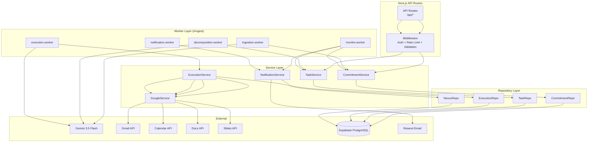
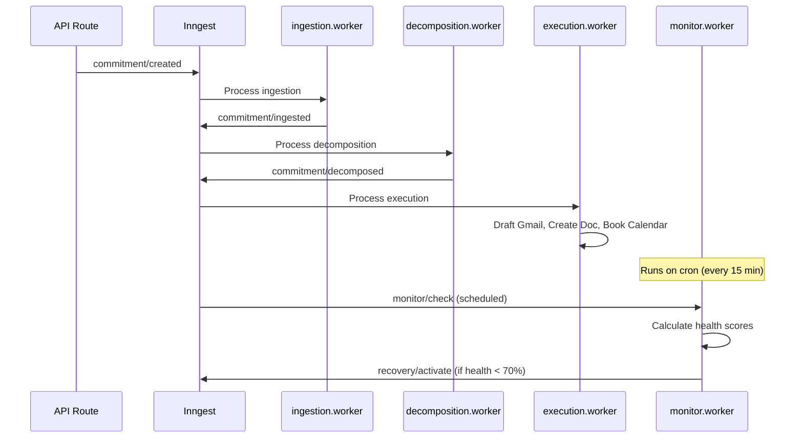

<
- [API Layer](#api-layer)
- [Service Layer](#service-layer)
- [Repository Layer](#repository-layer)
- [Worker Architecture (Inngest)](#worker-architecture-inngest)
- [Caching Strategy](#caching-strategy)
- [Logging](#logging)
- [Monitoring](#monitoring)
- [Error Handling](#error-handling)
- [Folder Structure](#folder-structure)

---

## Architecture Overview



### Design Principles

1. **Serverless-first**: All backend logic runs in Next.js API Routes or Inngest functions. No separate server.
2. **Layered architecture**: Routes → Services → Repositories → Database. Each layer has a single responsibility.
3. **Event-driven**: Agent operations are triggered via Inngest events, not synchronous API calls.
4. **Type-safe database**: Types auto-generated from Supabase schema. No raw SQL strings in application code.
5. **Idempotent workers**: All Inngest functions are idempotent and safe to retry.

---

## API Layer

### Route Convention

| Method | Route | Handler | Auth | Rate Limit |
|---|---|---|---|---|
| `GET` | `/api/commitments` | List commitments | Required | 100/min |
| `POST` | `/api/commitments` | Create commitment | Required | 20/min |
| `GET` | `/api/commitments/[id]` | Get commitment | Required | 100/min |
| `PATCH` | `/api/commitments/[id]` | Update commitment | Required | 20/min |
| `DELETE` | `/api/commitments/[id]` | Delete commitment | Required | 10/min |
| `GET` | `/api/tasks` | List tasks | Required | 100/min |
| `PATCH` | `/api/tasks/[id]` | Update task | Required | 50/min |
| `POST` | `/api/agents/execute` | Trigger agent | Required | 10/min |
| `GET` | `/api/activity` | Get NEXUS feed | Required | 100/min |
| `GET` | `/api/health` | Health check | None | None |
| `POST` | `/api/inngest` | Inngest webhook | Inngest signing | None |

### Route Handler Pattern

```typescript
// src/app/api/commitments/route.ts
import { NextRequest, NextResponse } from 'next/server';
import { createServerClient } from '@/lib/supabase/server';
import { CommitmentService } from '@/lib/services/commitment-service';
import { createCommitmentSchema } from '@/lib/validators/commitment';
import { withAuth } from '@/lib/middleware/auth';
import { withRateLimit } from '@/lib/middleware/rate-limit';
import { withValidation } from '@/lib/middleware/validation';

export const POST = withAuth(
  withRateLimit({ maxRequests: 20, windowMs: 60_000 },
    withValidation(createCommitmentSchema,
      async (req: NextRequest, { user, body }) => {
        const supabase = createServerClient();
        const service = new CommitmentService(supabase);
        const commitment = await service.create(user.id, body);
        return NextResponse.json(commitment, { status: 201 });
      }
    )
  )
);
```

---

## Service Layer

### CommitmentService

```typescript
// src/lib/services/commitment-service.ts
export class CommitmentService {
  constructor(private supabase: SupabaseClient) {}

  async create(userId: string, input: CreateCommitmentInput): Promise<Commitment> {
    // 1. Save commitment to DB
    const commitment = await this.repo.create({
      user_id: userId,
      raw_input: input.text,
      source_type: input.source_type,
      status: 'processing',
    });

    // 2. Emit event for Agent 1 (Ingestion)
    await inngest.send({
      name: 'commitment/created',
      data: { commitmentId: commitment.id, userId },
    });

    return commitment;
  }

  async list(userId: string, filters: CommitmentFilters): Promise<Commitment[]> {
    return this.repo.findByUser(userId, filters);
  }

  async getById(userId: string, id: string): Promise<Commitment> {
    const commitment = await this.repo.findById(id);
    if (!commitment || commitment.user_id !== userId) {
      throw new NotFoundError('Commitment not found');
    }
    return commitment;
  }

  async update(userId: string, id: string, updates: UpdateCommitmentInput): Promise<Commitment> {
    const commitment = await this.getById(userId, id);
    const updated = await this.repo.update(id, updates);

    if (updates.deadline || updates.title) {
      // Re-trigger decomposition if scope changed
      await inngest.send({
        name: 'commitment/updated',
        data: { commitmentId: id, userId, changes: Object.keys(updates) },
      });
    }

    return updated;
  }

  async delete(userId: string, id: string): Promise<void> {
    await this.getById(userId, id); // Verify ownership
    await this.repo.softDelete(id);
  }
}
```

### GoogleWorkspaceService

```typescript
// src/lib/services/google-service.ts
export class GoogleWorkspaceService {
  constructor(private tokenService: TokenService) {}

  async draftGmailReply(userId: string, threadId: string, body: string): Promise<string> {
    const token = await this.tokenService.getValidToken(userId, 'gmail');
    const gmail = google.gmail({ version: 'v1', auth: token });

    const draft = await gmail.users.drafts.create({
      userId: 'me',
      requestBody: {
        message: {
          threadId,
          raw: this.encodeEmail(body),
        },
      },
    });

    return draft.data.id!;
  }

  async createDocument(userId: string, title: string, sections: DocSection[]): Promise<string> {
    const token = await this.tokenService.getValidToken(userId, 'docs');
    const docs = google.docs({ version: 'v1', auth: token });

    const doc = await docs.documents.create({ requestBody: { title } });
    const docId = doc.data.documentId!;

    // Insert sections with formatting
    const requests = this.buildDocInsertRequests(sections);
    await docs.documents.batchUpdate({
      documentId: docId,
      requestBody: { requests },
    });

    return docId;
  }

  async bookCalendarSlots(userId: string, tasks: Task[]): Promise<CalendarEvent[]> {
    const token = await this.tokenService.getValidToken(userId, 'calendar');
    const calendar = google.calendar({ version: 'v3', auth: token });

    // 1. Get existing events
    const existing = await calendar.events.list({
      calendarId: 'primary',
      timeMin: new Date().toISOString(),
      timeMax: addDays(new Date(), 7).toISOString(),
      singleEvents: true,
      orderBy: 'startTime',
    });

    // 2. Find free slots
    const freeSlots = this.findFreeSlots(existing.data.items || [], tasks);

    // 3. Book focus blocks
    const booked: CalendarEvent[] = [];
    for (const slot of freeSlots) {
      const event = await calendar.events.insert({
        calendarId: 'primary',
        requestBody: {
          summary: `🎯 Focus: ${slot.task.title}`,
          description: `Delegat focus block for: ${slot.task.description}`,
          start: { dateTime: slot.start.toISOString() },
          end: { dateTime: slot.end.toISOString() },
          transparency: 'opaque',
          reminders: { useDefault: false },
        },
      });
      booked.push(event.data);
    }

    return booked;
  }
}
```

---

## Repository Layer

```typescript
// src/lib/repositories/commitment-repo.ts
export class CommitmentRepository {
  constructor(private supabase: SupabaseClient) {}

  async create(data: InsertCommitment): Promise<Commitment> {
    const { data: commitment, error } = await this.supabase
      .from('commitments')
      .insert(data)
      .select()
      .single();

    if (error) throw new DatabaseError('Failed to create commitment', error);
    return commitment;
  }

  async findByUser(userId: string, filters: CommitmentFilters): Promise<Commitment[]> {
    let query = this.supabase
      .from('commitments')
      .select('*, tasks(*)')
      .eq('user_id', userId)
      .is('deleted_at', null)
      .order('deadline', { ascending: true });

    if (filters.status) query = query.eq('status', filters.status);
    if (filters.deadline_before) query = query.lte('deadline', filters.deadline_before);

    const { data, error } = await query;
    if (error) throw new DatabaseError('Failed to fetch commitments', error);
    return data || [];
  }

  async softDelete(id: string): Promise<void> {
    const { error } = await this.supabase
      .from('commitments')
      .update({ deleted_at: new Date().toISOString() })
      .eq('id', id);

    if (error) throw new DatabaseError('Failed to delete commitment', error);
  }
}
```

---

## Worker Architecture (Inngest)

### Inngest Client Setup

```typescript
// src/lib/inngest/client.ts
import { Inngest } from 'inngest';

export const inngest = new Inngest({
  id: 'delegat',
  schemas: new EventSchemas().fromRecord<{
    'commitment/created': { data: { commitmentId: string; userId: string } };
    'commitment/ingested': { data: { commitmentId: string; userId: string } };
    'commitment/decomposed': { data: { commitmentId: string; userId: string } };
    'monitor/check': { data: { userId: string } };
    'recovery/activate': { data: { commitmentId: string; userId: string } };
  }>(),
});
```

### Worker Functions

```typescript
// src/lib/inngest/functions/ingestion.ts
export const ingestionWorker = inngest.createFunction(
  {
    id: 'agent-1-ingestion',
    retries: 3,
    concurrency: { limit: 10 },
  },
  { event: 'commitment/created' },
  async ({ event, step }) => {
    const { commitmentId, userId } = event.data;

    // Step 1: Fetch commitment
    const commitment = await step.run('fetch-commitment', async () => {
      return commitmentRepo.findById(commitmentId);
    });

    // Step 2: Extract structured data via Gemini
    const extracted = await step.run('extract-with-gemini', async () => {
      return geminiClient.extractCommitment(commitment.raw_input);
    });

    // Step 3: Update commitment with extracted data
    await step.run('update-commitment', async () => {
      return commitmentRepo.update(commitmentId, {
        title: extracted.title,
        deadline: extracted.deadline,
        type: extracted.type,
        stakeholders: extracted.stakeholders,
        status: 'active',
      });
    });

    // Step 4: Emit event for Agent 2
    await step.sendEvent('trigger-decomposition', {
      name: 'commitment/ingested',
      data: { commitmentId, userId },
    });
  }
);
```

### Worker Event Flow



### Scheduled Jobs

| Job | Schedule | Function | Purpose |
|---|---|---|---|
| Health check | Every 15 minutes | `monitor.worker` | Recalculate all health scores |
| Token refresh | Every 45 minutes | `token-refresh.worker` | Proactively refresh Google tokens |
| Daily digest | 8:00 AM user timezone | `digest.worker` | Send daily commitment summary email |
| Cleanup | Daily at 3:00 AM UTC | `cleanup.worker` | Hard-delete soft-deleted records > 7 days |

---

## Caching Strategy

| Data | Cache Location | TTL | Invalidation |
|---|---|---|---|
| User session | Supabase Auth (cookie) | 7 days | On logout |
| Commitment list | TanStack Query (client) | 30 seconds | On mutation |
| Health scores | TanStack Query (client) | 10 seconds | On realtime update |
| NEXUS feed | TanStack Query (client) | 30 seconds | On realtime insert |
| Google Calendar events | Server memory | 5 minutes | On calendar booking |
| User preferences | TanStack Query (client) | 10 minutes | On settings change |

---

## Logging

### Log Levels

| Level | Usage | Example |
|---|---|---|
| `error` | Failures requiring attention | `"Failed to create Gmail draft"` |
| `warn` | Recoverable issues | `"Gemini rate limit hit, retrying"` |
| `info` | Significant operations | `"Commitment decomposed: 8 tasks"` |
| `debug` | Development details | `"Gemini prompt tokens: 450"` |

### Structured Log Format

```json
{
  "level": "info",
  "message": "Commitment decomposed",
  "timestamp": "2026-06-29T12:00:00Z",
  "service": "decomposition-worker",
  "userId": "uuid",
  "commitmentId": "uuid",
  "taskCount": 8,
  "totalEstimatedMinutes": 240,
  "confidenceScore": 85,
  "durationMs": 3200
}
```

---

## Error Handling

### Error Hierarchy

```typescript
// src/lib/errors.ts
export class AppError extends Error {
  constructor(
    message: string,
    public statusCode: number = 500,
    public code: string = 'INTERNAL_ERROR'
  ) { super(message); }
}

export class NotFoundError extends AppError {
  constructor(message = 'Resource not found') { super(message, 404, 'NOT_FOUND'); }
}

export class ValidationError extends AppError {
  constructor(message: string, public errors: ZodError) { super(message, 400, 'VALIDATION_ERROR'); }
}

export class AuthorizationError extends AppError {
  constructor(message = 'Unauthorized') { super(message, 401, 'UNAUTHORIZED'); }
}

export class RateLimitError extends AppError {
  constructor() { super('Too many requests', 429, 'RATE_LIMIT_EXCEEDED'); }
}

export class GoogleAPIError extends AppError {
  constructor(message: string, public googleError: any) { super(message, 502, 'GOOGLE_API_ERROR'); }
}

export class GeminiError extends AppError {
  constructor(message: string) { super(message, 502, 'GEMINI_ERROR'); }
}
```

### Error Response Format

```json
{
  "error": {
    "code": "VALIDATION_ERROR",
    "message": "Invalid commitment input",
    "details": [
      { "field": "deadline", "message": "Deadline must be in the future" }
    ]
  }
}
```

---

## Folder Structure

```
src/lib/
├── services/
│   ├── commitment-service.ts
│   ├── task-service.ts
│   ├── execution-service.ts
│   ├── google-service.ts
│   ├── notification-service.ts
│   └── token-service.ts
├── repositories/
│   ├── commitment-repo.ts
│   ├── task-repo.ts
│   ├── execution-repo.ts
│   └── nexus-repo.ts
├── agents/
│   ├── ingestion.ts
│   ├── decomposition.ts
│   ├── execution.ts
│   └── monitor.ts
├── engines/
│   ├── recovery.ts
│   ├── risk.ts
│   ├── execution.ts
│   └── notification.ts
├── gemini/
│   ├── client.ts
│   ├── prompts.ts
│   └── tools.ts
├── inngest/
│   ├── client.ts
│   └── functions/
│       ├── ingestion.ts
│       ├── decomposition.ts
│       ├── execution.ts
│       ├── monitor.ts
│       ├── digest.ts
│       └── cleanup.ts
├── middleware/
│   ├── auth.ts
│   ├── rate-limit.ts
│   └── validation.ts
├── errors.ts
└── logger.ts
```

---

*Previous: [08 — Frontend Architecture](08_FRONTEND_ARCHITECTURE.md) · Next: [10 — AI Agent Architecture](10_AI_AGENT_ARCHITECTURE.md)*
]]>
