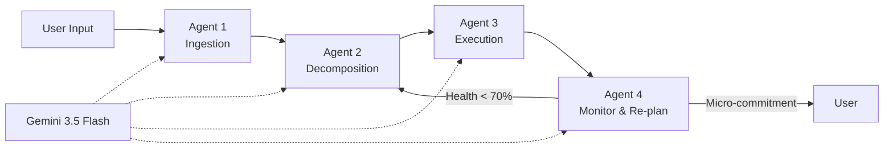
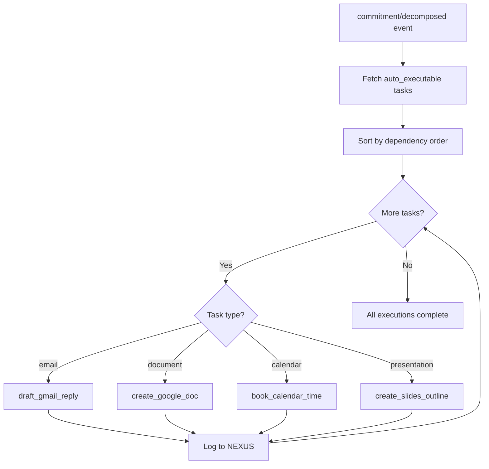
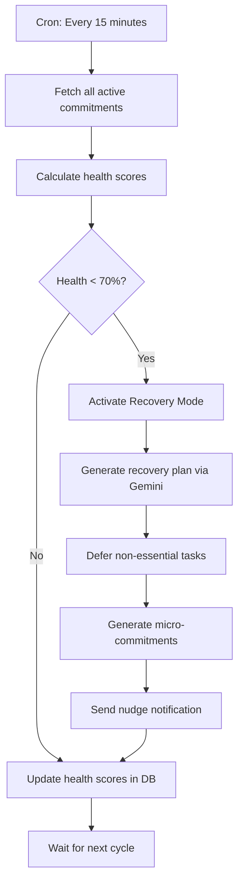

<
- [Agent 1: Ingestion](#agent-1-ingestion)
- [Agent 2: Decomposition](#agent-2-decomposition)
- [Agent 3: Execution](#agent-3-execution)
- [Agent 4: Monitor & Re-plan](#agent-4-monitor--re-plan)
- [Gemini Integration](#gemini-integration)
- [Safety & Guardrails](#safety--guardrails)
- [Monitoring & Metrics](#monitoring--metrics)

---

## Agent System Overview



### Agent Communication

Agents communicate **asynchronously** via Inngest events and the database. There are no direct function calls between agents.

| From | Event | To | Payload |
|---|---|---|---|
| API | `commitment/created` | Agent 1 | `{ commitmentId, userId }` |
| Agent 1 | `commitment/ingested` | Agent 2 | `{ commitmentId, userId }` |
| Agent 2 | `commitment/decomposed` | Agent 3 | `{ commitmentId, userId }` |
| Scheduler | `monitor/check` (cron) | Agent 4 | `{ userId }` |
| Agent 4 | `recovery/activate` | Agent 2 | `{ commitmentId, userId }` |

---

## Agent 1: Ingestion

### Responsibilities

Accept any input format (text, email, screenshot) and extract a structured commitment: title, deadline, type, stakeholders, dependencies.

### Input/Output

| Direction | Data | Source/Destination |
|---|---|---|
| **Input** | Raw user text, pasted email, or image | `commitments.raw_input` |
| **Output** | Structured commitment data | `commitments` table (updated) |
| **Event Out** | `commitment/ingested` | Inngest → Agent 2 |

### Gemini Function Calling

```typescript
const ingestionTools = [
  {
    name: 'extract_commitment',
    description: 'Extract structured commitment data from user input',
    parameters: {
      type: 'object',
      properties: {
        title: {
          type: 'string',
          description: 'Clear, concise title for the commitment'
        },
        deadline: {
          type: 'string',
          description: 'ISO 8601 datetime for the deadline. Null if not specified.',
          nullable: true
        },
        type: {
          type: 'string',
          enum: ['writing', 'coding', 'research', 'admin', 'creative', 'meeting_prep', 'review', 'communication', 'unknown'],
          description: 'Category of work involved'
        },
        stakeholders: {
          type: 'array',
          items: { type: 'string' },
          description: 'People mentioned or involved'
        },
        urgency: {
          type: 'string',
          enum: ['low', 'medium', 'high', 'critical'],
          description: 'How urgent this commitment appears'
        },
        requires_email: {
          type: 'boolean',
          description: 'Whether this commitment involves replying to an email'
        },
        requires_document: {
          type: 'boolean',
          description: 'Whether this commitment requires creating a written document'
        },
        requires_presentation: {
          type: 'boolean',
          description: 'Whether this commitment involves creating slides'
        }
      },
      required: ['title', 'type', 'urgency']
    }
  }
];
```

### System Prompt

```
You are the Ingestion Agent for Delegat, an AI execution agent. Your job is to extract structured commitment data from user input.

Rules:
1. Extract the most specific title possible. "Reply to John about project scope" is better than "Reply to email".
2. Parse deadlines relative to the current date: {{current_date}}. "Tomorrow" = {{tomorrow_date}}. "Next Friday" = {{next_friday_date}}.
3. If no deadline is mentioned, set deadline to null. Do NOT invent deadlines.
4. Identify stakeholders by name when mentioned.
5. Set requires_email=true only if the input clearly mentions replying to or sending an email.
6. Set requires_document=true if a report, paper, essay, or written deliverable is needed.
7. Set requires_presentation=true if slides, a deck, or a presentation is needed.
8. If the input is vague, extract what you can and set type="unknown".

Always call the extract_commitment function with your analysis.
```

### Retry & Fallback

| Scenario | Retry | Fallback |
|---|---|---|
| Gemini timeout (>10s) | 3 retries, exponential backoff | Save raw input, set status="draft", notify user |
| Gemini rate limit | Queue via Inngest with backoff | Same as above |
| Malformed Gemini response | 1 retry with simplified prompt | Manual extraction: title=raw_input, type="unknown" |
| Image processing fails | 1 retry | Show: "Couldn't read this image. Try typing instead." |

---

## Agent 2: Decomposition

### Responsibilities

Break a commitment into 15–30 minute executable sub-tasks with calibrated time estimates, dependency graphs, and human/auto classification.

### Input/Output

| Direction | Data | Source/Destination |
|---|---|---|
| **Input** | Structured commitment from Agent 1 | `commitments` table |
| **Output** | Array of tasks with estimates and dependencies | `tasks` table |
| **Event Out** | `commitment/decomposed` | Inngest → Agent 3 |

### Gemini Function Calling

```typescript
const decompositionTools = [
  {
    name: 'create_task_plan',
    description: 'Decompose a commitment into executable sub-tasks',
    parameters: {
      type: 'object',
      properties: {
        tasks: {
          type: 'array',
          items: {
            type: 'object',
            properties: {
              title: { type: 'string' },
              description: { type: 'string' },
              estimated_minutes: { type: 'number', minimum: 15, maximum: 60 },
              type: {
                type: 'string',
                enum: ['writing', 'coding', 'research', 'admin', 'creative', 'review', 'meeting_prep']
              },
              execution_type: {
                type: 'string',
                enum: ['human_only', 'auto_executable'],
                description: 'human_only: requires thinking. auto_executable: scaffolding that Delegat can do.'
              },
              depends_on: {
                type: 'array',
                items: { type: 'number' },
                description: 'Indices of tasks this depends on (0-based)'
              }
            },
            required: ['title', 'description', 'estimated_minutes', 'type', 'execution_type']
          }
        },
        confidence_score: {
          type: 'number',
          minimum: 0,
          maximum: 100,
          description: 'How confident you are in this decomposition (0-100)'
        }
      },
      required: ['tasks', 'confidence_score']
    }
  }
];
```

### System Prompt

```
You are the Decomposition Agent for Delegat. Your job is to break commitments into small, executable sub-tasks.

Rules:
1. Each task must be 15-60 minutes. Target 15-30 minutes for most tasks.
2. Apply time calibration multipliers:
   - writing: 1.5x (people underestimate writing by 50%)
   - coding: 2.0x (debugging doubles perceived time)
   - research: 1.8x (source evaluation is slow)
   - admin: 1.0x (emails, scheduling are predictable)
   - creative: 2.0x (iteration loops are underestimated)
   - review: 1.2x
   - meeting_prep: 1.3x
3. Classify each task:
   - human_only: Requires thinking, decision-making, creative work. Examples: "Write introduction", "Review code", "Make design decisions"
   - auto_executable: Scaffolding that can be automated. Examples: "Create document skeleton", "Draft email reply", "Book calendar time", "Create presentation outline"
4. Order tasks logically. Set depends_on for tasks that require earlier tasks to complete first.
5. The FIRST task should always be the easiest to start (reduce activation energy).
6. Include preparation tasks: "Gather references", "Read source material", etc.
7. Do NOT include tasks like "Submit" or "Upload" — those are trivial and assumed.
8. Set confidence_score based on how well you understand the commitment.

Current date: {{current_date}}
Commitment deadline: {{deadline}}
Time available: {{hours_available}} hours
```

### Memory

Agent 2 does not have persistent memory in MVP. Each decomposition is independent. In V2, it will learn from:
- User's historical task completion times (actual vs. estimated)
- User's editing patterns (which AI tasks get modified)
- Domain-specific calibration improvements

---

## Agent 3: Execution

### Responsibilities

Auto-execute scaffolding tasks across Google Workspace: draft emails, create documents, book calendar time, generate presentation outlines.

### Available Tools

```typescript
const executionTools = [
  {
    name: 'draft_gmail_reply',
    description: 'Read an email thread and draft a contextual reply',
    parameters: {
      type: 'object',
      properties: {
        thread_id: { type: 'string', description: 'Gmail thread ID' },
        tone: { type: 'string', enum: ['professional', 'casual', 'formal'], description: 'Reply tone' },
        key_points: { type: 'array', items: { type: 'string' }, description: 'Key points to address' },
        max_length: { type: 'number', description: 'Maximum word count' }
      },
      required: ['tone', 'key_points']
    }
  },
  {
    name: 'create_google_doc',
    description: 'Create a Google Doc with structured sections',
    parameters: {
      type: 'object',
      properties: {
        title: { type: 'string' },
        sections: {
          type: 'array',
          items: {
            type: 'object',
            properties: {
              heading: { type: 'string' },
              target_words: { type: 'number' },
              starter_prompt: { type: 'string' }
            }
          }
        }
      },
      required: ['title', 'sections']
    }
  },
  {
    name: 'book_calendar_time',
    description: 'Book focus time blocks in Google Calendar',
    parameters: {
      type: 'object',
      properties: {
        tasks: {
          type: 'array',
          items: {
            type: 'object',
            properties: {
              title: { type: 'string' },
              duration_minutes: { type: 'number' }
            }
          }
        },
        working_hours: {
          type: 'object',
          properties: {
            start: { type: 'string' },
            end: { type: 'string' }
          }
        },
        buffer_percentage: { type: 'number' }
      },
      required: ['tasks']
    }
  },
  {
    name: 'create_slides_outline',
    description: 'Create a Google Slides presentation outline',
    parameters: {
      type: 'object',
      properties: {
        title: { type: 'string' },
        slides: {
          type: 'array',
          items: {
            type: 'object',
            properties: {
              title: { type: 'string' },
              bullet_points: { type: 'array', items: { type: 'string' } },
              speaker_notes: { type: 'string' }
            }
          }
        }
      },
      required: ['title', 'slides']
    }
  }
];
```

### Execution Pipeline



### Safety Rules

1. **Never send emails** — only create drafts. User must review and send.
2. **Never delete** anything — only create.
3. **Never modify** existing documents — only create new ones.
4. **Always log** every action to the NEXUS feed with reversibility info.
5. **Respect scope** — if a Google API scope isn't granted, skip that execution silently and log it.

---

## Agent 4: Monitor & Re-plan

### Responsibilities

Continuously monitor commitment progress, detect deadline drift, and activate recovery mode when health drops below 70%.

### Monitoring Cycle



### Recovery Plan Generation

```typescript
const monitorTools = [
  {
    name: 'generate_recovery_plan',
    description: 'Create a recovery plan for a commitment that is falling behind',
    parameters: {
      type: 'object',
      properties: {
        defer_tasks: {
          type: 'array',
          items: { type: 'string' },
          description: 'Task IDs to defer (non-essential tasks)'
        },
        compress_tasks: {
          type: 'array',
          items: {
            type: 'object',
            properties: {
              task_id: { type: 'string' },
              new_duration_minutes: { type: 'number' }
            }
          },
          description: 'Tasks to compress with new time estimates'
        },
        micro_commitments: {
          type: 'array',
          items: {
            type: 'object',
            properties: {
              message: { type: 'string' },
              task_title: { type: 'string' },
              duration_minutes: { type: 'number', maximum: 15 }
            }
          },
          description: 'Small, achievable tasks (≤15 min) to send as nudges'
        }
      },
      required: ['micro_commitments']
    }
  }
];
```

---

## Gemini Integration

### Client Configuration

```typescript
// src/lib/gemini/client.ts
import { GoogleGenAI } from '@google/genai';

const ai = new GoogleGenAI({ apiKey: process.env.GEMINI_API_KEY });

export async function callGemini(params: {
  systemPrompt: string;
  userMessage: string;
  tools?: Tool[];
  temperature?: number;
  maxTokens?: number;
}) {
  const response = await ai.models.generateContent({
    model: 'gemini-2.0-flash',  // Gemini 3.5 Flash
    contents: [{ role: 'user', parts: [{ text: params.userMessage }] }],
    systemInstruction: params.systemPrompt,
    tools: params.tools ? [{ functionDeclarations: params.tools }] : undefined,
    generationConfig: {
      temperature: params.temperature ?? 0.3,
      maxOutputTokens: params.maxTokens ?? 4096,
    },
  });

  return response;
}
```

### Model Configuration Per Agent

| Agent | Temperature | Max Tokens | Rationale |
|---|---|---|---|
| Agent 1 (Ingestion) | 0.1 | 1024 | Extraction needs precision |
| Agent 2 (Decomposition) | 0.4 | 4096 | Creative decomposition needs variety |
| Agent 3 (Execution) | 0.3 | 4096 | Drafts need some creativity but consistency |
| Agent 4 (Monitor) | 0.2 | 2048 | Recovery plans need reliability |

---

## Safety & Guardrails

| Guardrail | Implementation |
|---|---|
| **Content filtering** | Gemini's built-in safety filters enabled |
| **Output validation** | All Gemini responses validated against Zod schemas |
| **Token limits** | Max 4096 output tokens per call |
| **Rate limiting** | Max 20 Gemini calls per user per minute |
| **Prompt injection defense** | User input wrapped in XML tags within system prompt |
| **PII handling** | Email content used in-memory only, never stored in Delegat's DB |
| **Audit trail** | Every Gemini call logged: prompt hash, token count, duration, agent |
| **Human-in-the-loop** | All email sends require explicit user approval |
| **Scope enforcement** | Agent 3 checks Google API scopes before every execution |

---

## Monitoring & Metrics

| Metric | Type | Agent | Alert Threshold |
|---|---|---|---|
| `agent.latency` | Histogram | All | p99 > 15 seconds |
| `agent.success_rate` | Counter | All | < 90% over 5 minutes |
| `agent.gemini_tokens` | Counter | All | > 100K tokens/hour |
| `agent.gemini_cost` | Gauge | All | > $10/hour |
| `agent.retries` | Counter | All | > 50 retries/hour |
| `agent.fallbacks` | Counter | All | > 10 fallbacks/hour |
| `recovery.activations` | Counter | Agent 4 | Informational |
| `recovery.success_rate` | Gauge | Agent 4 | < 30% |
| `execution.gmail_drafts` | Counter | Agent 3 | Informational |
| `execution.docs_created` | Counter | Agent 3 | Informational |
| `execution.calendar_events` | Counter | Agent 3 | Informational |

---

*Previous: [09 — Backend Architecture](09_BACKEND_ARCHITECTURE.md) · Next: [11 — Database Schema](11_DATABASE_SCHEMA.md)*
]]>
