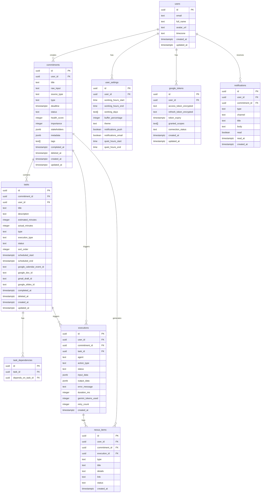

<
- [Tables](#tables)
- [Indexes](#indexes)
- [Row Level Security (RLS)](#row-level-security-rls)
- [Triggers](#triggers)
- [Migrations](#migrations)
- [Seed Data](#seed-data)
- [Optimization](#optimization)

---

## ER Diagram



---

## Tables

### users

Extends Supabase `auth.users`. This is a public profile table synced via trigger.

```sql
CREATE TABLE public.users (
    id UUID PRIMARY KEY REFERENCES auth.users(id) ON DELETE CASCADE,
    email TEXT NOT NULL UNIQUE,
    full_name TEXT,
    avatar_url TEXT,
    timezone TEXT NOT NULL DEFAULT 'UTC',
    onboarding_completed BOOLEAN NOT NULL DEFAULT false,
    created_at TIMESTAMPTZ NOT NULL DEFAULT now(),
    updated_at TIMESTAMPTZ NOT NULL DEFAULT now()
);
```

### user_settings

```sql
CREATE TABLE public.user_settings (
    id UUID PRIMARY KEY DEFAULT gen_random_uuid(),
    user_id UUID NOT NULL UNIQUE REFERENCES public.users(id) ON DELETE CASCADE,
    working_hours_start TIME NOT NULL DEFAULT '09:00',
    working_hours_end TIME NOT NULL DEFAULT '18:00',
    working_days TEXT[] NOT NULL DEFAULT ARRAY['monday','tuesday','wednesday','thursday','friday'],
    buffer_percentage INTEGER NOT NULL DEFAULT 40 CHECK (buffer_percentage BETWEEN 0 AND 100),
    theme TEXT NOT NULL DEFAULT 'dark' CHECK (theme IN ('dark', 'light')),
    notifications_push BOOLEAN NOT NULL DEFAULT true,
    notifications_email BOOLEAN NOT NULL DEFAULT true,
    quiet_hours_start TIME DEFAULT '22:00',
    quiet_hours_end TIME DEFAULT '07:00',
    created_at TIMESTAMPTZ NOT NULL DEFAULT now(),
    updated_at TIMESTAMPTZ NOT NULL DEFAULT now()
);
```

### google_tokens

```sql
CREATE TABLE public.google_tokens (
    id UUID PRIMARY KEY DEFAULT gen_random_uuid(),
    user_id UUID NOT NULL UNIQUE REFERENCES public.users(id) ON DELETE CASCADE,
    access_token_encrypted TEXT NOT NULL,
    refresh_token_encrypted TEXT NOT NULL,
    token_expiry TIMESTAMPTZ NOT NULL,
    granted_scopes TEXT[] NOT NULL DEFAULT ARRAY[]::TEXT[],
    connection_status TEXT NOT NULL DEFAULT 'connected'
        CHECK (connection_status IN ('connected', 'disconnected', 'expired')),
    created_at TIMESTAMPTZ NOT NULL DEFAULT now(),
    updated_at TIMESTAMPTZ NOT NULL DEFAULT now()
);
```

### commitments

```sql
CREATE TABLE public.commitments (
    id UUID PRIMARY KEY DEFAULT gen_random_uuid(),
    user_id UUID NOT NULL REFERENCES public.users(id) ON DELETE CASCADE,
    title TEXT,
    raw_input TEXT NOT NULL,
    source_type TEXT NOT NULL DEFAULT 'text'
        CHECK (source_type IN ('text', 'email', 'image')),
    type TEXT DEFAULT 'unknown'
        CHECK (type IN ('writing', 'coding', 'research', 'admin', 'creative',
                        'meeting_prep', 'review', 'communication', 'unknown')),
    deadline TIMESTAMPTZ,
    status TEXT NOT NULL DEFAULT 'processing'
        CHECK (status IN ('processing', 'draft', 'active', 'at_risk',
                          'recovery', 'completed', 'overdue', 'cancelled')),
    health_score INTEGER CHECK (health_score BETWEEN 0 AND 100),
    importance INTEGER NOT NULL DEFAULT 3 CHECK (importance BETWEEN 1 AND 5),
    stakeholders JSONB DEFAULT '[]'::JSONB,
    metadata JSONB DEFAULT '{}'::JSONB,
    tags TEXT[] DEFAULT ARRAY[]::TEXT[],
    confidence_score INTEGER CHECK (confidence_score BETWEEN 0 AND 100),
    completed_at TIMESTAMPTZ,
    deleted_at TIMESTAMPTZ,
    created_at TIMESTAMPTZ NOT NULL DEFAULT now(),
    updated_at TIMESTAMPTZ NOT NULL DEFAULT now()
);
```

### tasks

```sql
CREATE TABLE public.tasks (
    id UUID PRIMARY KEY DEFAULT gen_random_uuid(),
    commitment_id UUID NOT NULL REFERENCES public.commitments(id) ON DELETE CASCADE,
    user_id UUID NOT NULL REFERENCES public.users(id) ON DELETE CASCADE,
    title TEXT NOT NULL,
    description TEXT,
    estimated_minutes INTEGER NOT NULL CHECK (estimated_minutes > 0),
    actual_minutes INTEGER,
    type TEXT NOT NULL
        CHECK (type IN ('writing', 'coding', 'research', 'admin', 'creative',
                        'review', 'meeting_prep')),
    execution_type TEXT NOT NULL
        CHECK (execution_type IN ('human_only', 'auto_executable')),
    status TEXT NOT NULL DEFAULT 'pending'
        CHECK (status IN ('pending', 'in_progress', 'completed', 'deferred', 'cancelled')),
    sort_order INTEGER NOT NULL DEFAULT 0,
    scheduled_start TIMESTAMPTZ,
    scheduled_end TIMESTAMPTZ,
    google_calendar_event_id TEXT,
    google_doc_id TEXT,
    gmail_draft_id TEXT,
    google_slides_id TEXT,
    completed_at TIMESTAMPTZ,
    deleted_at TIMESTAMPTZ,
    created_at TIMESTAMPTZ NOT NULL DEFAULT now(),
    updated_at TIMESTAMPTZ NOT NULL DEFAULT now()
);
```

### task_dependencies

```sql
CREATE TABLE public.task_dependencies (
    id UUID PRIMARY KEY DEFAULT gen_random_uuid(),
    task_id UUID NOT NULL REFERENCES public.tasks(id) ON DELETE CASCADE,
    depends_on_task_id UUID NOT NULL REFERENCES public.tasks(id) ON DELETE CASCADE,
    UNIQUE (task_id, depends_on_task_id),
    CHECK (task_id != depends_on_task_id)
);
```

### executions

```sql
CREATE TABLE public.executions (
    id UUID PRIMARY KEY DEFAULT gen_random_uuid(),
    user_id UUID NOT NULL REFERENCES public.users(id) ON DELETE CASCADE,
    commitment_id UUID NOT NULL REFERENCES public.commitments(id) ON DELETE CASCADE,
    task_id UUID REFERENCES public.tasks(id) ON DELETE SET NULL,
    agent TEXT NOT NULL
        CHECK (agent IN ('ingestion', 'decomposition', 'execution', 'monitor')),
    action_type TEXT NOT NULL
        CHECK (action_type IN ('extract', 'decompose', 'gmail_draft', 'doc_create',
                               'calendar_book', 'slides_create', 'health_check',
                               'recovery_plan', 'micro_commitment')),
    status TEXT NOT NULL DEFAULT 'pending'
        CHECK (status IN ('pending', 'running', 'success', 'failed', 'retrying')),
    input_data JSONB DEFAULT '{}'::JSONB,
    output_data JSONB DEFAULT '{}'::JSONB,
    error_message TEXT,
    duration_ms INTEGER,
    gemini_tokens_used INTEGER DEFAULT 0,
    retry_count INTEGER NOT NULL DEFAULT 0,
    created_at TIMESTAMPTZ NOT NULL DEFAULT now()
);
```

### nexus_items

```sql
CREATE TABLE public.nexus_items (
    id UUID PRIMARY KEY DEFAULT gen_random_uuid(),
    user_id UUID NOT NULL REFERENCES public.users(id) ON DELETE CASCADE,
    commitment_id UUID REFERENCES public.commitments(id) ON DELETE SET NULL,
    execution_id UUID REFERENCES public.executions(id) ON DELETE SET NULL,
    type TEXT NOT NULL
        CHECK (type IN ('gmail_draft', 'doc_created', 'calendar_booked',
                        'slides_created', 'commitment_decomposed',
                        'recovery_activated', 'health_changed',
                        'task_completed', 'error')),
    title TEXT NOT NULL,
    details TEXT,
    link TEXT,
    status TEXT NOT NULL DEFAULT 'success'
        CHECK (status IN ('success', 'warning', 'error')),
    created_at TIMESTAMPTZ NOT NULL DEFAULT now()
);
```

### notifications

```sql
CREATE TABLE public.notifications (
    id UUID PRIMARY KEY DEFAULT gen_random_uuid(),
    user_id UUID NOT NULL REFERENCES public.users(id) ON DELETE CASCADE,
    commitment_id UUID REFERENCES public.commitments(id) ON DELETE SET NULL,
    type TEXT NOT NULL
        CHECK (type IN ('risk_change', 'recovery_nudge', 'micro_commitment',
                        'execution_complete', 'daily_digest', 'system')),
    channel TEXT NOT NULL DEFAULT 'in_app'
        CHECK (channel IN ('in_app', 'push', 'email')),
    title TEXT NOT NULL,
    body TEXT NOT NULL,
    read BOOLEAN NOT NULL DEFAULT false,
    read_at TIMESTAMPTZ,
    created_at TIMESTAMPTZ NOT NULL DEFAULT now()
);
```

---

## Indexes

```sql
-- Users
CREATE INDEX idx_users_email ON public.users(email);

-- Commitments
CREATE INDEX idx_commitments_user_id ON public.commitments(user_id);
CREATE INDEX idx_commitments_user_status ON public.commitments(user_id, status) WHERE deleted_at IS NULL;
CREATE INDEX idx_commitments_user_deadline ON public.commitments(user_id, deadline) WHERE deleted_at IS NULL AND status NOT IN ('completed', 'cancelled');
CREATE INDEX idx_commitments_health ON public.commitments(health_score) WHERE status = 'active';

-- Tasks
CREATE INDEX idx_tasks_commitment_id ON public.tasks(commitment_id);
CREATE INDEX idx_tasks_user_id ON public.tasks(user_id);
CREATE INDEX idx_tasks_user_status ON public.tasks(user_id, status) WHERE deleted_at IS NULL;
CREATE INDEX idx_tasks_scheduled ON public.tasks(scheduled_start, scheduled_end) WHERE scheduled_start IS NOT NULL;

-- Executions
CREATE INDEX idx_executions_user_id ON public.executions(user_id);
CREATE INDEX idx_executions_commitment_id ON public.executions(commitment_id);
CREATE INDEX idx_executions_status ON public.executions(status) WHERE status IN ('pending', 'running', 'retrying');

-- NEXUS Items
CREATE INDEX idx_nexus_user_id ON public.nexus_items(user_id);
CREATE INDEX idx_nexus_user_created ON public.nexus_items(user_id, created_at DESC);

-- Notifications
CREATE INDEX idx_notifications_user_unread ON public.notifications(user_id) WHERE read = false;
CREATE INDEX idx_notifications_user_created ON public.notifications(user_id, created_at DESC);
```

---

## Row Level Security (RLS)

Every table has RLS enabled. Users can only access their own data.

```sql
-- Enable RLS on all tables
ALTER TABLE public.users ENABLE ROW LEVEL SECURITY;
ALTER TABLE public.user_settings ENABLE ROW LEVEL SECURITY;
ALTER TABLE public.google_tokens ENABLE ROW LEVEL SECURITY;
ALTER TABLE public.commitments ENABLE ROW LEVEL SECURITY;
ALTER TABLE public.tasks ENABLE ROW LEVEL SECURITY;
ALTER TABLE public.task_dependencies ENABLE ROW LEVEL SECURITY;
ALTER TABLE public.executions ENABLE ROW LEVEL SECURITY;
ALTER TABLE public.nexus_items ENABLE ROW LEVEL SECURITY;
ALTER TABLE public.notifications ENABLE ROW LEVEL SECURITY;

-- Users: can read/update own profile
CREATE POLICY "users_select_own" ON public.users FOR SELECT USING (auth.uid() = id);
CREATE POLICY "users_update_own" ON public.users FOR UPDATE USING (auth.uid() = id);

-- User Settings: full CRUD on own settings
CREATE POLICY "settings_all_own" ON public.user_settings FOR ALL USING (auth.uid() = user_id);

-- Google Tokens: only own tokens (service role bypasses for token refresh)
CREATE POLICY "tokens_select_own" ON public.google_tokens FOR SELECT USING (auth.uid() = user_id);
CREATE POLICY "tokens_update_own" ON public.google_tokens FOR UPDATE USING (auth.uid() = user_id);

-- Commitments: full CRUD on own commitments
CREATE POLICY "commitments_all_own" ON public.commitments FOR ALL USING (auth.uid() = user_id);

-- Tasks: full CRUD on own tasks
CREATE POLICY "tasks_all_own" ON public.tasks FOR ALL USING (auth.uid() = user_id);

-- Task Dependencies: access via task ownership
CREATE POLICY "deps_select" ON public.task_dependencies FOR SELECT
    USING (EXISTS (SELECT 1 FROM public.tasks WHERE tasks.id = task_dependencies.task_id AND tasks.user_id = auth.uid()));
CREATE POLICY "deps_insert" ON public.task_dependencies FOR INSERT
    WITH CHECK (EXISTS (SELECT 1 FROM public.tasks WHERE tasks.id = task_dependencies.task_id AND tasks.user_id = auth.uid()));

-- Executions: read own executions
CREATE POLICY "executions_select_own" ON public.executions FOR SELECT USING (auth.uid() = user_id);

-- NEXUS Items: read own items
CREATE POLICY "nexus_select_own" ON public.nexus_items FOR SELECT USING (auth.uid() = user_id);

-- Notifications: read and update own
CREATE POLICY "notifications_select_own" ON public.notifications FOR SELECT USING (auth.uid() = user_id);
CREATE POLICY "notifications_update_own" ON public.notifications FOR UPDATE USING (auth.uid() = user_id);
```

---

## Triggers

### Auto-update `updated_at`

```sql
CREATE OR REPLACE FUNCTION public.update_updated_at()
RETURNS TRIGGER AS $$
BEGIN
    NEW.updated_at = now();
    RETURN NEW;
END;
$$ LANGUAGE plpgsql;

-- Apply to all tables with updated_at
CREATE TRIGGER trg_users_updated_at BEFORE UPDATE ON public.users
    FOR EACH ROW EXECUTE FUNCTION public.update_updated_at();
CREATE TRIGGER trg_commitments_updated_at BEFORE UPDATE ON public.commitments
    FOR EACH ROW EXECUTE FUNCTION public.update_updated_at();
CREATE TRIGGER trg_tasks_updated_at BEFORE UPDATE ON public.tasks
    FOR EACH ROW EXECUTE FUNCTION public.update_updated_at();
CREATE TRIGGER trg_settings_updated_at BEFORE UPDATE ON public.user_settings
    FOR EACH ROW EXECUTE FUNCTION public.update_updated_at();
CREATE TRIGGER trg_tokens_updated_at BEFORE UPDATE ON public.google_tokens
    FOR EACH ROW EXECUTE FUNCTION public.update_updated_at();
```

### Auto-create user profile on signup

```sql
CREATE OR REPLACE FUNCTION public.handle_new_user()
RETURNS TRIGGER AS $$
BEGIN
    INSERT INTO public.users (id, email, full_name, avatar_url)
    VALUES (
        NEW.id,
        NEW.email,
        NEW.raw_user_meta_data->>'full_name',
        NEW.raw_user_meta_data->>'avatar_url'
    );
    INSERT INTO public.user_settings (user_id) VALUES (NEW.id);
    RETURN NEW;
END;
$$ LANGUAGE plpgsql SECURITY DEFINER;

CREATE TRIGGER on_auth_user_created
    AFTER INSERT ON auth.users
    FOR EACH ROW EXECUTE FUNCTION public.handle_new_user();
```

### Auto-set `completed_at` on task completion

```sql
CREATE OR REPLACE FUNCTION public.handle_task_completion()
RETURNS TRIGGER AS $$
BEGIN
    IF NEW.status = 'completed' AND OLD.status != 'completed' THEN
        NEW.completed_at = now();
    END IF;
    RETURN NEW;
END;
$$ LANGUAGE plpgsql;

CREATE TRIGGER trg_task_completion BEFORE UPDATE ON public.tasks
    FOR EACH ROW EXECUTE FUNCTION public.handle_task_completion();
```

---

## Migrations

```
supabase/migrations/
├── 20260629000001_create_users.sql
├── 20260629000002_create_user_settings.sql
├── 20260629000003_create_google_tokens.sql
├── 20260629000004_create_commitments.sql
├── 20260629000005_create_tasks.sql
├── 20260629000006_create_task_dependencies.sql
├── 20260629000007_create_executions.sql
├── 20260629000008_create_nexus_items.sql
├── 20260629000009_create_notifications.sql
├── 20260629000010_create_indexes.sql
├── 20260629000011_create_rls_policies.sql
├── 20260629000012_create_triggers.sql
└── 20260629000013_seed_data.sql
```

---

## Seed Data

```sql
-- supabase/seed.sql
-- Demo user (for development and hackathon demo)
INSERT INTO auth.users (id, email, raw_user_meta_data) VALUES (
    '00000000-0000-0000-0000-000000000001',
    'demo@delegat.app',
    '{"full_name": "Demo User", "avatar_url": "https://avatar.vercel.sh/demo"}'
) ON CONFLICT DO NOTHING;

-- Demo commitments
INSERT INTO public.commitments (id, user_id, title, raw_input, source_type, type, deadline, status, health_score, importance) VALUES
    ('c0000001-0000-0000-0000-000000000001', '00000000-0000-0000-0000-000000000001',
     'Research paper on ML in healthcare', 'Research paper on ML in healthcare due Wednesday',
     'text', 'writing', now() + interval '3 days', 'active', 85, 4),
    ('c0000002-0000-0000-0000-000000000001', '00000000-0000-0000-0000-000000000001',
     'Reply to client about project scope', 'Reply to client about project scope by tomorrow',
     'email', 'communication', now() + interval '1 day', 'active', 92, 5),
    ('c0000003-0000-0000-0000-000000000001', '00000000-0000-0000-0000-000000000001',
     'Slides for Tuesday 3pm meeting', 'Create presentation slides for Tuesday 3pm meeting',
     'text', 'meeting_prep', now() + interval '2 days', 'at_risk', 55, 3);
```

---

## Optimization

| Optimization | Implementation |
|---|---|
| **Partial indexes** | Only index active records (`WHERE deleted_at IS NULL`) |
| **JSONB indexing** | GIN index on `metadata` if queried frequently (deferred to V2) |
| **Connection pooling** | Supabase uses PgBouncer by default |
| **Query optimization** | Use `select()` with specific columns, never `select('*')` in production |
| **Soft deletes** | `deleted_at` column instead of hard deletes for data recovery |
| **Cascade deletes** | Foreign keys cascade on user deletion for GDPR compliance |
| **Batch inserts** | Tasks created in batch after decomposition |
| **Realtime filter** | Subscribe only to user's own records (`filter: user_id=eq.X`) |

---

*Previous: [10 — AI Agent Architecture](10_AI_AGENT_ARCHITECTURE.md) · Next: [12 — API Specification](12_API_SPECIFICATION.md)*
]]>
