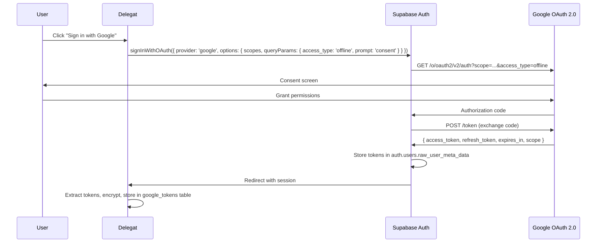
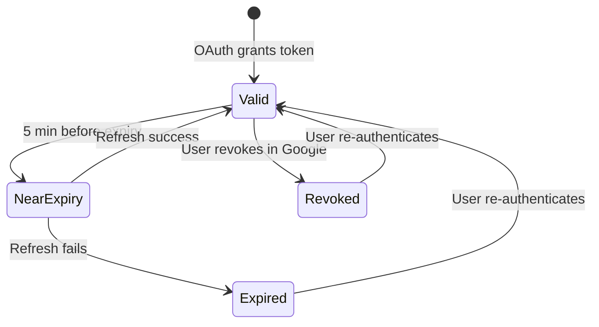

<
- [Scopes](#scopes)
- [Token Management](#token-management)
- [Gmail API Integration](#gmail-api-integration)
- [Calendar API Integration](#calendar-api-integration)
- [Google Docs API Integration](#google-docs-api-integration)
- [Google Slides API Integration](#google-slides-api-integration)
- [Drive API Integration](#drive-api-integration)
- [Error Recovery](#error-recovery)
- [Rate Limits & Quotas](#rate-limits--quotas)

---

## OAuth 2.0 Flow

### Flow Type

**Authorization Code Flow with PKCE** via Supabase Auth's Google provider.

### Sequence



### Critical Configuration

```typescript
// Token extraction after OAuth callback
const { data: { session } } = await supabase.auth.getSession();
const providerToken = session?.provider_token;    // Access token
const providerRefreshToken = session?.provider_refresh_token;  // Refresh token

// Encrypt and store
await supabase.from('google_tokens').upsert({
  user_id: session.user.id,
  access_token_encrypted: encrypt(providerToken),
  refresh_token_encrypted: encrypt(providerRefreshToken),
  token_expiry: addSeconds(new Date(), 3600),
  granted_scopes: session.user.app_metadata.provider_scopes?.split(' ') || [],
  connection_status: 'connected',
});
```

---

## Scopes

| Scope | API | Purpose | Required |
|---|---|---|---|
| `openid` | Auth | Authentication | Yes |
| `email` | Auth | User email | Yes |
| `profile` | Auth | User name + avatar | Yes |
| `https://www.googleapis.com/auth/gmail.modify` | Gmail | Read threads, create drafts | Yes (MVP) |
| `https://www.googleapis.com/auth/calendar.events` | Calendar | Read/write calendar events | Yes (MVP) |
| `https://www.googleapis.com/auth/documents` | Docs | Create and edit documents | Yes (MVP) |
| `https://www.googleapis.com/auth/presentations` | Slides | Create presentations | P1 |
| `https://www.googleapis.com/auth/drive.file` | Drive | Access files created by Delegat | Yes (MVP) |

### Scope Request Strategy

Request **all scopes upfront** during initial OAuth to avoid multiple consent screens. If user denies specific scopes, gracefully degrade.

---

## Token Management

### Token Lifecycle



### Token Refresh Logic

```typescript
// src/lib/services/token-service.ts
export class TokenService {
  async getValidToken(userId: string, scope: string): Promise<string> {
    const record = await this.repo.getByUserId(userId);

    if (!record) throw new ReauthRequiredError('No token found');
    if (record.connection_status === 'disconnected') throw new ReauthRequiredError('Token revoked');
    if (!record.granted_scopes.includes(scope)) throw new ScopeNotGrantedError(scope);

    // If token expires within 5 minutes, refresh proactively
    if (isWithinMinutes(record.token_expiry, 5)) {
      return this.refreshToken(userId, record);
    }

    return decrypt(record.access_token_encrypted);
  }

  private async refreshToken(userId: string, record: GoogleToken): Promise<string> {
    try {
      const response = await fetch('https://oauth2.googleapis.com/token', {
        method: 'POST',
        headers: { 'Content-Type': 'application/x-www-form-urlencoded' },
        body: new URLSearchParams({
          client_id: process.env.GOOGLE_CLIENT_ID!,
          client_secret: process.env.GOOGLE_CLIENT_SECRET!,
          refresh_token: decrypt(record.refresh_token_encrypted),
          grant_type: 'refresh_token',
        }),
      });

      if (!response.ok) {
        if (response.status === 400) {
          // Refresh token revoked
          await this.repo.update(userId, { connection_status: 'disconnected' });
          throw new ReauthRequiredError('Refresh token revoked');
        }
        throw new GoogleAPIError('Token refresh failed');
      }

      const { access_token, expires_in } = await response.json();

      await this.repo.update(userId, {
        access_token_encrypted: encrypt(access_token),
        token_expiry: addSeconds(new Date(), expires_in),
        connection_status: 'connected',
      });

      return access_token;
    } catch (error) {
      if (error instanceof ReauthRequiredError) throw error;
      throw new GoogleAPIError('Token refresh failed');
    }
  }
}
```

---

## Gmail API Integration

### Capabilities

| Operation | Endpoint | Purpose |
|---|---|---|
| Read thread | `GET /gmail/v1/users/me/threads/{id}` | Get email context for reply drafting |
| List messages | `GET /gmail/v1/users/me/messages` | Search for relevant emails |
| Create draft | `POST /gmail/v1/users/me/drafts` | Save AI-generated reply as draft |
| Delete draft | `DELETE /gmail/v1/users/me/drafts/{id}` | Remove discarded drafts |
| Get user profile | `GET /gmail/v1/users/me/profile` | Get user's email address |

### Draft Creation Flow

```typescript
async draftReply(userId: string, params: {
  threadId: string;
  to: string;
  subject: string;
  body: string;
}): Promise<{ draftId: string; messageId: string }> {
  const token = await this.tokenService.getValidToken(userId, 'gmail.modify');

  // Build RFC 2822 email
  const email = [
    `To: ${params.to}`,
    `Subject: Re: ${params.subject}`,
    `In-Reply-To: ${params.threadId}`,
    `Content-Type: text/plain; charset=utf-8`,
    '',
    params.body,
  ].join('\r\n');

  const encodedEmail = Buffer.from(email).toString('base64url');

  const response = await fetch('https://gmail.googleapis.com/gmail/v1/users/me/drafts', {
    method: 'POST',
    headers: {
      Authorization: `Bearer ${token}`,
      'Content-Type': 'application/json',
    },
    body: JSON.stringify({
      message: {
        raw: encodedEmail,
        threadId: params.threadId,
      },
    }),
  });

  const draft = await response.json();
  return { draftId: draft.id, messageId: draft.message.id };
}
```

---

## Calendar API Integration

### Capabilities

| Operation | Endpoint | Purpose |
|---|---|---|
| List events | `GET /calendar/v3/calendars/primary/events` | Read existing schedule |
| Create event | `POST /calendar/v3/calendars/primary/events` | Book focus blocks |
| Delete event | `DELETE /calendar/v3/calendars/primary/events/{id}` | Remove rescheduled blocks |
| Get free/busy | `POST /calendar/v3/freeBusy` | Check availability |

### Free Slot Detection Algorithm

```typescript
function findFreeSlots(
  existingEvents: CalendarEvent[],
  workingHours: { start: string; end: string },
  days: number = 7
): TimeSlot[] {
  const slots: TimeSlot[] = [];

  for (let d = 0; d < days; d++) {
    const date = addDays(new Date(), d);
    const dayStart = setTime(date, workingHours.start);
    const dayEnd = setTime(date, workingHours.end);

    // Get events for this day, sorted by start time
    const dayEvents = existingEvents
      .filter(e => isSameDay(parseISO(e.start.dateTime), date))
      .sort((a, b) => compareAsc(parseISO(a.start.dateTime), parseISO(b.start.dateTime)));

    // Find gaps between events
    let cursor = dayStart;
    for (const event of dayEvents) {
      const eventStart = parseISO(event.start.dateTime);
      const eventEnd = parseISO(event.end.dateTime);

      if (differenceInMinutes(eventStart, cursor) >= 30) {
        slots.push({ start: cursor, end: eventStart, durationMinutes: differenceInMinutes(eventStart, cursor) });
      }
      cursor = max([cursor, eventEnd]);
    }

    // Gap after last event until end of day
    if (differenceInMinutes(dayEnd, cursor) >= 30) {
      slots.push({ start: cursor, end: dayEnd, durationMinutes: differenceInMinutes(dayEnd, cursor) });
    }
  }

  return slots;
}
```

---

## Google Docs API Integration

### Document Creation

```typescript
async createDocument(userId: string, params: {
  title: string;
  sections: { heading: string; targetWords: number; starterPrompt: string }[];
}): Promise<{ docId: string; docUrl: string }> {
  const token = await this.tokenService.getValidToken(userId, 'documents');

  // Step 1: Create empty document
  const createRes = await fetch('https://docs.googleapis.com/v1/documents', {
    method: 'POST',
    headers: { Authorization: `Bearer ${token}`, 'Content-Type': 'application/json' },
    body: JSON.stringify({ title: params.title }),
  });
  const doc = await createRes.json();
  const docId = doc.documentId;

  // Step 2: Build batch update requests to insert sections
  const requests = [];
  let insertIndex = 1; // Start after document title

  for (const section of params.sections.reverse()) {
    // Insert in reverse order because each insert shifts content down
    requests.push(
      // Section heading
      { insertText: { location: { index: insertIndex }, text: `\n${section.heading}\n` } },
      { updateParagraphStyle: {
        range: { startIndex: insertIndex + 1, endIndex: insertIndex + 1 + section.heading.length },
        paragraphStyle: { namedStyleType: 'HEADING_2' },
        fields: 'namedStyleType',
      }},
      // Target and starter
      { insertText: {
        location: { index: insertIndex + section.heading.length + 2 },
        text: `Target: ~${section.targetWords} words\n${section.starterPrompt}\n\n`,
      }},
    );
  }

  // Step 3: Apply batch update
  await fetch(`https://docs.googleapis.com/v1/documents/${docId}:batchUpdate`, {
    method: 'POST',
    headers: { Authorization: `Bearer ${token}`, 'Content-Type': 'application/json' },
    body: JSON.stringify({ requests }),
  });

  return { docId, docUrl: `https://docs.google.com/document/d/${docId}/edit` };
}
```

---

## Google Slides API Integration

### Presentation Creation

```typescript
async createPresentation(userId: string, params: {
  title: string;
  slides: { title: string; bulletPoints: string[]; speakerNotes: string }[];
}): Promise<{ presentationId: string; url: string }> {
  const token = await this.tokenService.getValidToken(userId, 'presentations');

  // Step 1: Create presentation
  const createRes = await fetch('https://slides.googleapis.com/v1/presentations', {
    method: 'POST',
    headers: { Authorization: `Bearer ${token}`, 'Content-Type': 'application/json' },
    body: JSON.stringify({ title: params.title }),
  });
  const presentation = await createRes.json();
  const presentationId = presentation.presentationId;

  // Step 2: Create slides with content
  const requests = params.slides.map((slide, index) => ([
    { createSlide: { objectId: `slide_${index}`, slideLayoutReference: { predefinedLayout: 'TITLE_AND_BODY' } } },
    { insertText: { objectId: `slide_${index}_title`, text: slide.title } },
    { insertText: { objectId: `slide_${index}_body`, text: slide.bulletPoints.map(b => `• ${b}`).join('\n') } },
  ])).flat();

  await fetch(`https://slides.googleapis.com/v1/presentations/${presentationId}:batchUpdate`, {
    method: 'POST',
    headers: { Authorization: `Bearer ${token}`, 'Content-Type': 'application/json' },
    body: JSON.stringify({ requests }),
  });

  return { presentationId, url: `https://docs.google.com/presentation/d/${presentationId}/edit` };
}
```

---

## Error Recovery

| Error Code | Cause | Recovery |
|---|---|---|
| `401` | Token expired | Auto-refresh via TokenService |
| `403` | Scope not granted | Disable feature, show "Connect in Settings" |
| `403` | Insufficient permissions | Check if user has edit access to the resource |
| `404` | Resource not found | Log warning, skip execution |
| `429` | Rate limit exceeded | Exponential backoff: 1s, 2s, 4s, 8s, 16s (max 5 retries) |
| `500` | Google server error | Retry up to 3 times with backoff |
| `503` | Service unavailable | Queue for retry in 5 minutes |
| Network error | Connectivity issue | Retry with backoff, mark as pending |

---

## Rate Limits & Quotas

| API | Quota | Per |
|---|---|---|
| Gmail | 250 quota units/second | User |
| Calendar | 500 requests/100 seconds | User |
| Docs | 300 requests/minute | Project |
| Slides | 500 requests/100 seconds | Project |
| Drive | 12,000 requests/minute | Project |

### Mitigation

1. **Request queuing** via Inngest ensures serial execution per user
2. **Batch operations** where possible (Docs batchUpdate, Slides batchUpdate)
3. **Caching** calendar events for 5 minutes to avoid repeated reads
4. **Graceful degradation** — if quota exceeded, queue for later and notify user

---

*Previous: [12 — API Specification](12_API_SPECIFICATION.md) · Next: [14 — Security Architecture](14_SECURITY_ARCHITECTURE.md)*
]]>
