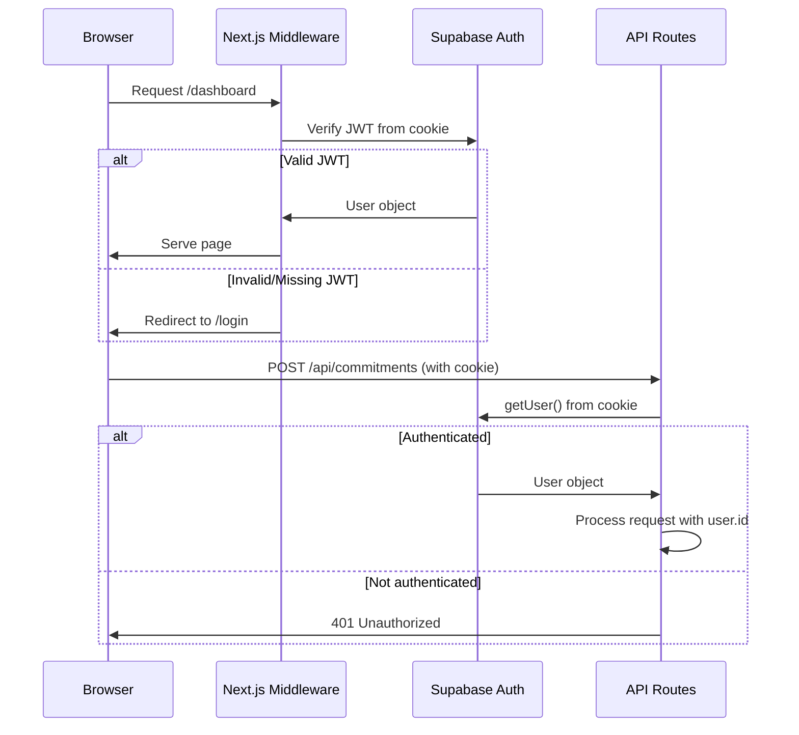

<
- [Authorization Model](#authorization-model)
- [Data Encryption](#data-encryption)
- [Token Security](#token-security)
- [API Security](#api-security)
- [Database Security](#database-security)
- [Infrastructure Security](#infrastructure-security)
- [GDPR Compliance](#gdpr-compliance)
- [Security Monitoring](#security-monitoring)
- [Threat Model](#threat-model)

---

## Authentication Architecture

### Provider

**Supabase Auth** with Google OAuth 2.0 as the sole identity provider (MVP).

### Session Management

| Property | Value |
|---|---|
| Session type | JWT (JSON Web Token) |
| Storage | HTTP-only, Secure, SameSite=Lax cookie |
| Expiry | 1 hour (access token), 7 days (refresh token) |
| Refresh | Automatic via Supabase client |
| Invalidation | On sign out, server-side token revocation |

### Authentication Flow



---

## Authorization Model

### Row Level Security (RLS)

All data access is enforced at the database level via Supabase RLS. Application code never bypasses RLS.

| Principle | Implementation |
|---|---|
| Users can only access their own data | `WHERE user_id = auth.uid()` on all policies |
| Service role bypasses RLS | Used only for: Inngest workers, admin operations, token refresh |
| No cross-user data leakage | Even with a compromised JWT, RLS prevents access to other users' data |

### Service Role Usage

| Context | Client Type | RLS |
|---|---|---|
| Browser requests | `createBrowserClient` | RLS enforced |
| Server Components | `createServerClient` | RLS enforced (user context) |
| API Routes | `createServerClient` | RLS enforced (user context) |
| Inngest Workers | `createClient` with service_role key | RLS bypassed |
| Token Refresh | `createClient` with service_role key | RLS bypassed |

---

## Data Encryption

### At Rest

| Data | Encryption | Method |
|---|---|---|
| Database | AES-256 | Supabase manages (encrypted volumes) |
| Google access tokens | AES-256-GCM | Application-level encryption before DB storage |
| Google refresh tokens | AES-256-GCM | Application-level encryption before DB storage |
| User PII (email, name) | AES-256 | Supabase managed |

### Token Encryption

```typescript
// src/lib/crypto.ts
import { createCipheriv, createDecipheriv, randomBytes } from 'crypto';

const ALGORITHM = 'aes-256-gcm';
const KEY = Buffer.from(process.env.TOKEN_ENCRYPTION_KEY!, 'hex'); // 32 bytes

export function encrypt(plaintext: string): string {
  const iv = randomBytes(16);
  const cipher = createCipheriv(ALGORITHM, KEY, iv);
  let encrypted = cipher.update(plaintext, 'utf8', 'hex');
  encrypted += cipher.final('hex');
  const authTag = cipher.getAuthTag().toString('hex');
  return `${iv.toString('hex')}:${authTag}:${encrypted}`;
}

export function decrypt(ciphertext: string): string {
  const [ivHex, authTagHex, encrypted] = ciphertext.split(':');
  const iv = Buffer.from(ivHex, 'hex');
  const authTag = Buffer.from(authTagHex, 'hex');
  const decipher = createDecipheriv(ALGORITHM, KEY, iv);
  decipher.setAuthTag(authTag);
  let decrypted = decipher.update(encrypted, 'hex', 'utf8');
  decrypted += decipher.final('utf8');
  return decrypted;
}
```

### In Transit

| Connection | Protocol |
|---|---|
| Browser ↔ Vercel | TLS 1.3 (HTTPS enforced) |
| Vercel ↔ Supabase | TLS 1.3 |
| Vercel ↔ Google APIs | TLS 1.3 |
| Vercel ↔ Inngest | TLS 1.3 |
| Vercel ↔ Resend | TLS 1.3 |

---

## API Security

### Rate Limiting

```typescript
// src/lib/middleware/rate-limit.ts
import { Ratelimit } from '@upstash/ratelimit';
import { Redis } from '@upstash/redis';

const redis = new Redis({ url: process.env.UPSTASH_REDIS_URL!, token: process.env.UPSTASH_REDIS_TOKEN! });

export function withRateLimit(config: { maxRequests: number; windowMs: number }) {
  const limiter = new Ratelimit({
    redis,
    limiter: Ratelimit.slidingWindow(config.maxRequests, `${config.windowMs}ms`),
  });

  return (handler: NextHandler) => async (req: NextRequest, context: any) => {
    const userId = context.user?.id || req.headers.get('x-forwarded-for') || 'anonymous';
    const { success, remaining, reset } = await limiter.limit(userId);

    if (!success) {
      return NextResponse.json(
        { error: { code: 'RATE_LIMIT_EXCEEDED', message: 'Too many requests' } },
        {
          status: 429,
          headers: {
            'X-RateLimit-Remaining': remaining.toString(),
            'X-RateLimit-Reset': reset.toString(),
          },
        }
      );
    }

    return handler(req, context);
  };
}
```

### Input Validation

All API inputs validated with Zod schemas before processing:

```typescript
// src/lib/middleware/validation.ts
export function withValidation<T>(schema: ZodSchema<T>) {
  return (handler: (req: NextRequest, ctx: { body: T }) => Promise<NextResponse>) =>
    async (req: NextRequest, context: any) => {
      const body = await req.json();
      const result = schema.safeParse(body);

      if (!result.success) {
        return NextResponse.json(
          {
            error: {
              code: 'VALIDATION_ERROR',
              message: 'Invalid request body',
              details: result.error.issues,
            },
          },
          { status: 400 }
        );
      }

      return handler(req, { ...context, body: result.data });
    };
}
```

### Security Headers

```typescript
// next.config.ts
const securityHeaders = [
  { key: 'X-Frame-Options', value: 'DENY' },
  { key: 'X-Content-Type-Options', value: 'nosniff' },
  { key: 'X-XSS-Protection', value: '1; mode=block' },
  { key: 'Referrer-Policy', value: 'strict-origin-when-cross-origin' },
  { key: 'Permissions-Policy', value: 'camera=(), microphone=(), geolocation=()' },
  { key: 'Strict-Transport-Security', value: 'max-age=63072000; includeSubDomains; preload' },
  {
    key: 'Content-Security-Policy',
    value: [
      "default-src 'self'",
      "script-src 'self' 'unsafe-eval' 'unsafe-inline'",
      "style-src 'self' 'unsafe-inline' https://fonts.googleapis.com",
      "font-src 'self' https://fonts.gstatic.com",
      "img-src 'self' https://*.googleusercontent.com data: blob:",
      "connect-src 'self' https://*.supabase.co wss://*.supabase.co https://generativelanguage.googleapis.com https://www.googleapis.com",
      "frame-ancestors 'none'",
    ].join('; '),
  },
];
```

---

## GDPR Compliance

| Requirement | Implementation |
|---|---|
| **Right to access** | `/api/settings/export` — export all user data as JSON |
| **Right to erasure** | `/api/settings/delete-account` — cascade delete all user data |
| **Data minimization** | Store only necessary data. Email bodies never stored (in-memory only). |
| **Consent** | OAuth consent screen clearly states data usage |
| **Data portability** | JSON export includes all commitments, tasks, and activity |
| **Breach notification** | Sentry alerts + automated incident response |

### Account Deletion Flow

```mermaid
flowchart TD
    USER[User clicks "Delete Account"] --> CONFIRM[Confirmation dialog with email verification]
    CONFIRM --> CASCADE[Cascade delete all data]
    CASCADE --> D1[Delete commitments + tasks]
    CASCADE --> D2[Delete google_tokens]
    CASCADE --> D3[Delete user_settings]
    CASCADE --> D4[Delete executions + nexus_items]
    CASCADE --> D5[Delete notifications]
    CASCADE --> D6[Delete auth.users record]
    D1 --> REVOKE[Revoke Google OAuth token]
    D6 --> DONE[Return 204, redirect to landing]
```

---

## Threat Model

| Threat | Likelihood | Impact | Mitigation |
|---|---|---|---|
| **JWT theft** | Medium | High | HTTP-only cookies, short expiry, HTTPS only |
| **CSRF** | Low | Medium | SameSite=Lax cookies, CSRF tokens on forms |
| **XSS** | Medium | High | CSP headers, React's built-in escaping, no `dangerouslySetInnerHTML` |
| **SQL Injection** | Very Low | Critical | Supabase parameterized queries, no raw SQL |
| **IDOR** | Low | High | RLS at database level, ownership checks in services |
| **Token leakage** | Low | Critical | AES-256-GCM encryption, never logged, never in responses |
| **Prompt injection** | Medium | Medium | User input wrapped in XML tags, output validated against schemas |
| **Google token abuse** | Low | High | Minimum scopes, drafts only (never send), token rotation |
| **Rate limit bypass** | Low | Medium | IP + user-based rate limiting, Vercel WAF |

---

*Previous: [13 — Google Workspace Integration](13_GOOGLE_WORKSPACE_INTEGRATION.md) · Next: [15 — Notification Engine](15_NOTIFICATION_ENGINE.md)*
]]>
