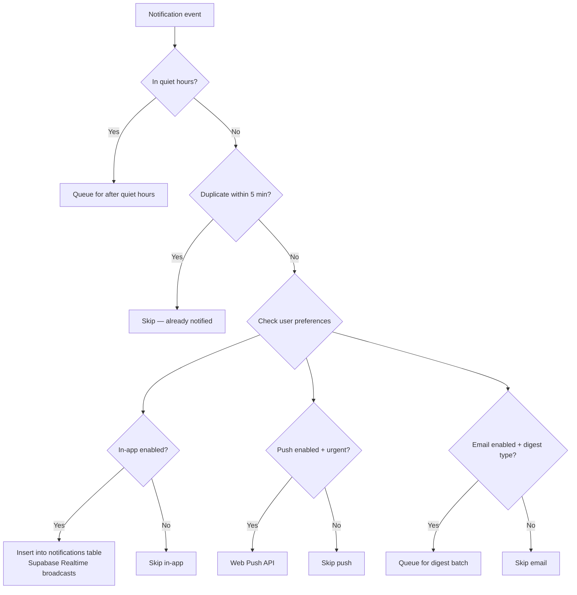

<
- [Notification Types](#notification-types)
- [Delivery Logic](#delivery-logic)
- [Templates](#templates)
- [Quiet Hours](#quiet-hours)
- [Deduplication](#deduplication)
- [Preferences](#preferences)

---

## Notification Channels

| Channel | Technology | Priority | Latency |
|---|---|---|---|
| **In-app** | Supabase Realtime + Zustand store | P0 (MVP) | < 1 second |
| **Browser push** | Web Push API + Service Worker | P1 | < 5 seconds |
| **Email** | Resend API | P1 | < 30 seconds |

---

## Notification Types

| Type | Channel(s) | Trigger | Urgency |
|---|---|---|---|
| `execution_complete` | In-app | Agent 3 completes an action | Low |
| `risk_change` | In-app, Push | Health Score changes threshold (green→amber, amber→red) | High |
| `recovery_nudge` | In-app, Push | Agent 4 generates micro-commitment | High |
| `micro_commitment` | In-app, Push | Recovery engine sends actionable nudge | High |
| `daily_digest` | Email | 8:00 AM in user's timezone | Medium |
| `system` | In-app | System announcements, errors | Low |

---

## Delivery Logic



### Implementation

```typescript
// src/lib/engines/notification-engine.ts
export class NotificationEngine {
  async send(params: {
    userId: string;
    type: NotificationType;
    title: string;
    body: string;
    commitmentId?: string;
  }) {
    const settings = await this.settingsRepo.getByUserId(params.userId);

    // Check quiet hours
    if (this.isQuietHours(settings)) {
      await this.queue(params, settings.quiet_hours_end);
      return;
    }

    // Check deduplication
    if (await this.isDuplicate(params)) return;

    // In-app notification (always, if enabled)
    if (settings.notifications_push) {
      await this.notificationRepo.create({
        user_id: params.userId,
        type: params.type,
        channel: 'in_app',
        title: params.title,
        body: params.body,
        commitment_id: params.commitmentId,
        read: false,
      });
    }

    // Browser push (for urgent notifications)
    if (settings.notifications_push && this.isUrgent(params.type)) {
      await this.sendPushNotification(params);
    }

    // Email (queued for digest)
    if (settings.notifications_email && params.type === 'daily_digest') {
      await this.sendDigestEmail(params);
    }
  }

  private isUrgent(type: NotificationType): boolean {
    return ['risk_change', 'recovery_nudge', 'micro_commitment'].includes(type);
  }

  private isQuietHours(settings: UserSettings): boolean {
    const now = utcToZonedTime(new Date(), settings.timezone);
    const currentTime = format(now, 'HH:mm');
    return currentTime >= settings.quiet_hours_start || currentTime <= settings.quiet_hours_end;
  }
}
```

---

## Templates

### In-App Notification

```json
{
  "execution_complete": {
    "icon": "✅",
    "title": "Draft ready for review",
    "body": "Drafted reply to {{recipientEmail}}"
  },
  "risk_change": {
    "icon": "⚠️",
    "title": "{{commitmentTitle}} is now at risk",
    "body": "Health dropped to {{healthScore}}%. {{suggestion}}"
  },
  "recovery_nudge": {
    "icon": "💪",
    "title": "Quick win available",
    "body": "Can you do {{taskTitle}} right now? It's only {{duration}} minutes."
  }
}
```

### Daily Digest Email (via Resend)

```
Subject: Your Delegat Daily Briefing — {{date}}

Hi {{name}},

🎯 TODAY'S COMMITMENTS
{{#each commitments}}
  {{statusIcon}} {{title}} — {{healthScore}}% health
  Due: {{deadline}} · Tasks: {{completedTasks}}/{{totalTasks}}
{{/each}}

⚠️ AT RISK
{{#each atRiskCommitments}}
  🔴 {{title}} — {{healthScore}}% · Recovery: {{recoverySuggestion}}
{{/each}}

✅ YESTERDAY'S WINS
{{#each completedYesterday}}
  ✅ {{title}}
{{/each}}

📊 STATS
  Health Score: {{overallHealth}}%
  Tasks completed: {{tasksCompletedToday}}
  Focus time: {{focusHours}} hours
```

---

## Quiet Hours

| Rule | Default | Configurable |
|---|---|---|
| Start time | 22:00 | Yes |
| End time | 07:00 | Yes |
| Apply to in-app | No (always deliver, but silently) | No |
| Apply to push | Yes | Yes |
| Apply to email | Yes (digest time configurable) | Yes |

During quiet hours, notifications are **queued** and delivered when quiet hours end.

---

## Deduplication

| Rule | Window | Key |
|---|---|---|
| Same type + same commitment | 5 minutes | `${type}:${commitmentId}` |
| Same type + same user | 2 minutes | `${type}:${userId}` (for system notifications) |

---

## Preferences

Stored in `user_settings` table. Editable via `/settings/notifications`.

| Setting | Default | Type |
|---|---|---|
| `notifications_push` | `true` | Boolean |
| `notifications_email` | `true` | Boolean |
| `quiet_hours_start` | `22:00` | Time |
| `quiet_hours_end` | `07:00` | Time |

---

*Previous: [14 — Security Architecture](14_SECURITY_ARCHITECTURE.md) · Next: [16 — Recovery Engine](16_RECOVERY_ENGINE.md)*
]]>
